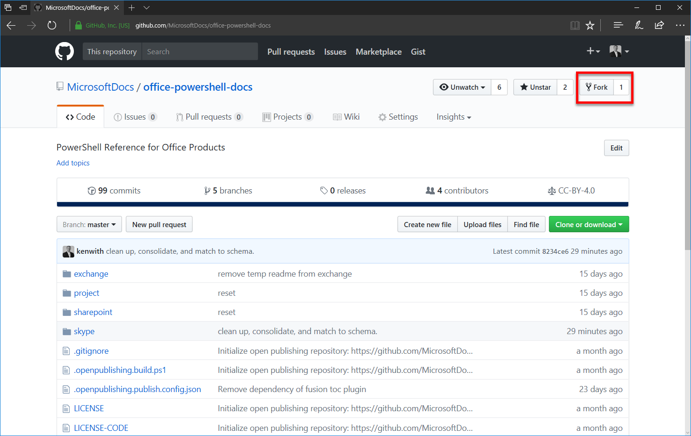
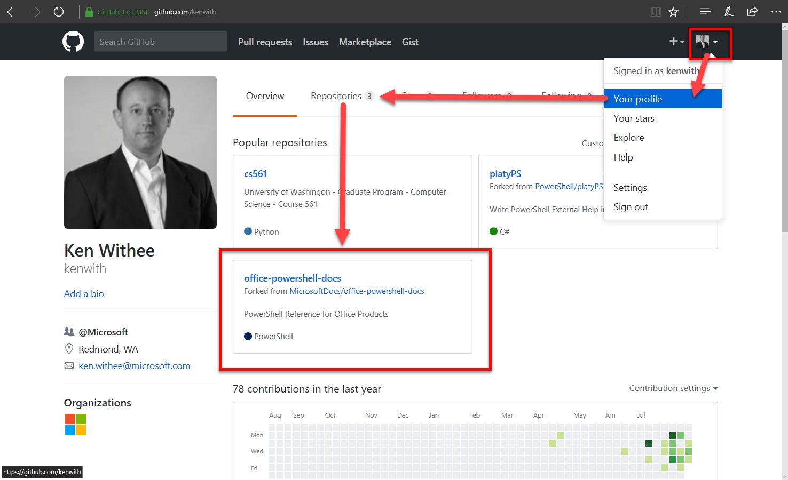
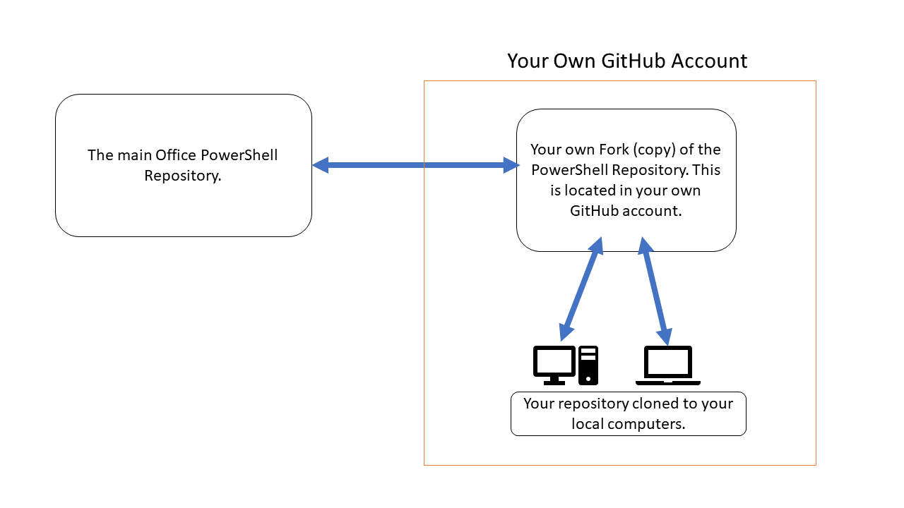

A repository to hold the help reference content for Office PowerShell cmdlets.


# Learn How To Contribute
Anyone who is interested can contribute to the Microsoft Office PowerShell reference topics. 
When you contribute your work will go directly into the Microsoft Office products and show up in Get-Help for the given Office cmdlet.

# Contribute using the GitHub website (simplest)

## The easiest way to make a quick change is to use the GitHub website
1. Open your browser, login to GitHub, and then navigate to https://github.com/microsoftdocs/office-docs-powershell
2. Browse to the file you want to edit. In this example we will edit https://github.com/MicrosoftDocs/office-docs-powershell/blob/master/teams/teams-ps/teams/New-Team.md and add a link in the Related Links section.
3. Click the Edit icon which looks like a pencil in the upper right corner. 


4. Your browser will then open the file in an edit window. We want to add a link so we scroll down to the Related Links section and add the link in the correct format.


**Note** that since you are likely not a maintainer of the Git repository GitHub will automatically 'Fork' the project into your personal GitHub account. A fork is just an exact copy of the repository in your own account so that you have total access to make edits. You are now 'editing' a copy of the project in your own GitHub account. You can always find it again by looking at your GitHub Repositories in your GitHub Profile (drop-down from your name in top right).


5. You can click the Preview changes link to see what the changes will look like. 
6. Once you are satisified with your work you submit a Pull Request which asks the maintainer of the main repository (known as Upstream) to pull your edits up. To submit a Pull Request you navigate back to the main repository, https://github.com/microsoftdocs/office-docs-powershell, and click the '''New pull request''' button. You will then request your edits to be pulled up into the main repo. Make sure to click the **compare across forks** link since you are request a pull from the edits you made that reside in your own personal repsitory. To learn more about pull requests and forking, see https://help.github.com/articles/creating-a-pull-request-from-a-fork/.


# Contribute using tools such as Git and Visual Studio Code (advanced)

## Steps in a nutshell
1. Fork Office PowerShell repo to your own account.
2. Clone your repo to your local development computer.
```
git clone [URL to your forked repo]
```
3. Keep your forked repo up-to-date with upstream repo.
```
git remote add upstream https://github.com/MicrosoftDocs/office-docs-powershell.git
```
```
git fetch upstream
```
4. Create your own working branch.
```
git checkout -b [name of your branch]
```
5. Work on content in your favorite Markdown editor.
6. Test to make sure your work matches the correct schema (use PlatyPS tool for this).
7. Merge the Master branch with your working branch (in your forked repo) and resolve any issues.
```
git merge master [name of your branch]
```
8. Submit a Pull Request to move your work upstream.

## Steps in more detail

### Sign In or Join GitHub
To sign in to GitHub, point your web browser to https://github.com/login.

To join GitHub for the first time, point your web browser to
https://github.com/join.

It is highly recommended to turn on two-factor authentication for security, see
https://help.github.com/articles/about-two-factor-authentication/. 

### Fork the GitHub repository into your own account

Fork the GitHub project into your own account so you have a place to work on it.
To Fork the project, point your web browser to the repository at
https://github.com/MicrosoftDocs/office-docs-powershell
and then click the Fork button on the upper right corner of the repository page as shown in screenshot.



You now have your very own copy (fork) of the main Office PowerShell repository. You can see it by clicking on your profile drop-down in the upper right of the page and choosing Your Profile and then clicking the Repositories tab of your GitHub account as shown in the diagram. 



Your repository is an exact copy of the original Office PowerShell repository and is located in your GitHub account. 
In GitHub terms the main Office PowerShell repository is the Upstream repository and your forked version is the Downstream repository.

You can update your repository with the Upstream repository at any time and it is recommended to do this fairly often so that your fork doesn't get out of sync with the original. 
The next section covers cloning and updating your repo with the upstream repo.

### Clone your Fork to your local development machine
Now that you have your own copy of the repository on GitHub the next step is to get the actual files on your local computer so you can work with them. 
To do this you clone your GitHub repository to your local computer. Here is a diagram:



Tip: You can clone your repository to muliple computers if you choose. 
You just have to make sure you save your local work by pushing it back up to your repository.
And vice versa, when you start workign on a new computer you have to remember to pull any changes down to your local work computer. 
This will be described in more detail later on.

There are many tools that can be used to work with GitHub. 
This example uses Visual Studio Code but use whatever you prefer.
The concepts are the same. Visual Studio Code is available for 
**Windows, Linux, and Mac**.
You can find it here: 
https://code.visualstudio.com/

If you have Git Bash installed you can get to it from within Visual Studio Code by pressing 
**Control-`** (control-backtick key which is to the left of number 1).

Using Visual Studio Code and Git Bash you can clone a repository as follows:
```
git clone [URL to your forked repo]
```

For example, `git clone https://github.com/kenwith/office-docs-powershell.git`

Note that in this example my user is 
**kenwith**
so I need to make sure I am cloning the Fork I created and not the upstream original. 
The user is in the URL for the GitHub repo.

Once you have cloned your repository you can use git push and git pull to push and pull your changes up to your repository.
It is best to use your own working branch so this will be covered in the next section.

To update your copy of the repo with the upstream copy you first need to add a remote origin and then fetch the upstream branch. 
There are many ways to do this but one way is to use Git Bash as follows:
```
git remote add upstream https://github.com/MicrosoftDocs/office-docs-powershell.git 
```
```
git fetch upstream
```

For more details, see:
- https://help.github.com/articles/configuring-a-remote-for-a-fork/
- https://help.github.com/articles/syncing-a-fork/

### Create and checkout a branch for your work
The next step is to create your own working branch. 
The reason for this is so that you can pull updates from the Master branch from the upstream repository and merge your own working branch in your own Fork. 
This way you can be sure when you do a Pull Request that you won't be conflicting with edits that have happened since you forked the project.

In the Git Bash terminal in Visual Studio Code:
```
git checkout -b [name of your branch]
```

Note the -b flag creates the branch if it doesn't exist and switches to it. To checkout an existing branch leave out the -b flag.

### Make edits to the relevant PowerShell cmdlet markdown.

Open your favorite Markdown editor and edit the Markdown in your working branch. 
Tip: Visual Studio Code provides a nice side-by-side view for editing Markdown content. 
One side will show the Markdown source and the other side will show a preview of how the Markdown will render. 
You can find this view by clicking the small icon in the upper right of Visual Studio Code that looks like a side by side view with a magnifying glass.

Some important notes when editing Markdown:

Since GitHub is a source control system and marks edits on a per-line basis it is important to have each sentence, or concept, on its own line. 
Markdown will still show paragraphs with each sentence on its own line. 
To break into another paragraph add a blank line in between the paragraphs. 
Here is a great article that describes this writing system:
http://rhodesmill.org/brandon/2012/one-sentence-per-line/ 

Learn how to write good Markdown (which is a type of Markup language):
https://guides.github.com/features/mastering-markdown/

More about writing content for GitHub:
https://help.github.com/categories/writing-on-github/ 

You can find the schema that the content should follow here:
https://github.com/PowerShell/platyPS/blob/master/platyPS.schema.md


### Test to make sure the markdown matches the schema
**SECTION IN PROGRESS**

All edits to Markdown files for cmdlets MUST follow this schema:
https://github.com/PowerShell/platyPS/blob/master/platyPS.schema.md
Any deviations will break Get-Help. 

How to run the command to generate XML and validate you have matched the schema and won't cause errors in build. 
To validate run the New-ExternalHelp command (from PlatyPS) on your Markdown.

### Merge the upstream Master branch into your branch
Merge the Master branch with your working branch (in your forked repo) and resolve any issues.
https://git-scm.com/book/en/v2/Git-Branching-Basic-Branching-and-Merging

It is best practice to merge the Master branch from upstream with your working branch and not vice versa.
Then you can submit a Pull Request for your working branch and the upstream repo maintainer can merge your branch into Master without issues.

Make sure that you have your working branch checked out and that your forked repo is updated with the upstream Master branch.
See the section on forking above for details.

Merge the Master branch with your working branch and then resolve issues.
```
git merge master [name of your branch]
```

### Create a Pull Request
To get your work back into the upstream repo you create a Pull Request.
A Pull Request asks the maintainers of the upstream repo to pull your work into the main project.

1. To create a Pull Request, Open your web browser and navigate to the main upstream repo site at:
https://github.com/MicrosoftDocs/office-docs-powershell
2. Click the New Pull Request button towards the top of the page.
3. Click the link to "compare across forks".
4. Select the upstream branch and your local branch.
5. Click Create Pull Request.

The repo maintainers will be notified of your Pull Request.
Your Pull Request will have its own page where you can discuss and modify your request if required.


## Confirm your work shows up on docs.microsoft.com
Once your Pull Request is approved and your branch merged into Master your changes will show on 
docs.microsoft.com, here: 
**need link**

Your work will also show up in the Office products themselves when a user types Get-Help for the cmdlets that you worked on.

### Congratulations are in order!
You just joined an elite club of contributors to Microsoft Office documentation!
Your edits will be pulled into the product and show up under Get-Help when someone is viewing reference content for the cmdlet you edited. 
See your status here:
https://github.com/MicrosoftDocs/office-docs-powershell/graphs/contributors

Don't forget to ~~brag~~ share on social media! 
Sharing helps sustain the community and advertises to others to contribute to the open source content as well!

# Generate Your Own Markdown
**SECTION IN PROGRESS**
Use PlatyPS to generate Markdown. See, https://github.com/PowerShell/platyPS. 

## Install PlatyPS.
**SECTION IN PROGRESS**

## Get to where you can run Get-Help and see cmdlets.
**SECTION IN PROGRESS**

## Generate help with PlatyPS.
**SECTION IN PROGRESS**

## If you want to merge multiple versions into a single version then use the PlatyPS merge command.
**SECTION IN PROGRESS**


# Frequently Asked Questions

## When will my content go live?

When you submit a Pull Request it goes through a validation check and the results are shown on the Pull Request page in GitHub.
Once the checks are completed, and there are no errors or warnings, and the appropriate sign off has been completed by the product team, a GitHub maintainer will merged the Pull Request into the Master branch on GitHub.

A site located at review.docs.microsoft.com shows a mirror of the docs.microsoft.com and pulls from the Review branch.
Unfortunately the review site requires a Microsoft login at this time.
This review site provides an opportunity for Microsoft product teams, support, and other internal stakeholders to review any changes before they are pushed to the live site.

The next step is for a GitHub maintainer to merge the Master branch into the Live branch. 
Once this is complete the changes in the Pull Request will show up on docs.microsoft.com (docs.microsoft.com pulls its content from the Live branch).
There is not a set schedule for this to happen but the maintainers are good about doing this fairly quickly.

## When does the GitHub content show up in the products with Get-Help?

The one source of truth for Office PowerShell cmdlets is the GitHub repository. 
When a product team ships an update or new version they can use the PlatyPS tool to generate XML and add that to the release.

The XML contains the latest version of the reference content on GitHub.
Ideally the Online versions will always have the latest content from GitHub and the On Premises products will always have the latest help with Update-Help. 
The work to make this happen is not yet done so the content is only refreshed on product team releases.