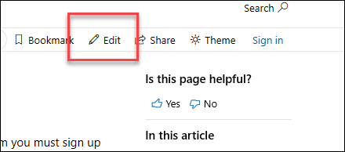
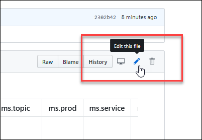
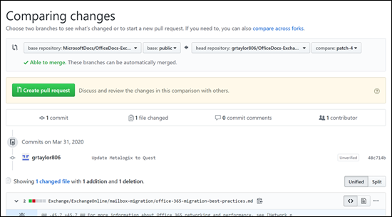

**Short URL: aka.ms/office-powershell**

# Overview

This repository holds reference content of Office PowerShell cmdlets for help purpose. The expert knowledge around Office PowerShell is distributed among customers, MVPs, partners, product teams, support, and other community members. Consumers have various preferences when consuming knowledge such as a website, PowerShell Get-Help, Windows app, iOS app, Android app, and others. The following diagram illustrates the point.

## Learn How To Contribute

Anyone who is interested can contribute to the Microsoft Office PowerShell reference topics. Your contributions will go directly into the Microsoft Office products and show up in Get-Help for the given Office cmdlet.

> [!NOTE]
> If you're interested in contributing to the **PnP PowerShell** cmdlets, their documentation is automatically generated from code, and you should be submitting your change towards the original code at <https://github.com/SharePoint/PnP-powershell>. See, for example, how the attributes are used in code for the [Get-PnPList](https://github.com/SharePoint/PnP-PowerShell/blob/master/Commands/Lists/GetList.cs) cmdlet.

## Quick Start

Contributors who only make infrequent or small updates can edit the file directly on GitHub.com without having to install any additional software. This article shows you how.

This brief video also covers how to contribute:

### Quickly update an article using GitHub.com

1. Make sure you're signed in to GitHub.com with your GitHub account.
2. Go to the page you want to edit on docs.microsoft.com.
3. On the right-hand side of the page, click **Edit** (pencil icon).

   

4. The corresponding topic file on GitHub opens, where you need to click the **Edit this file** pencil icon.

   

5. The topic opens in a line-numbered editing page where you can make changes to the file.

   In this example, we'll add a link to the **Related Links** section of a topic. To add the link, scroll down to the **Related Links** section and add the link in the correct format.

   

   **Notes**:

   - Files in GitHub are written and edited using Markdown language. For help on using Markdown, see [Mastering Markdown](https://guides.github.com/features/mastering-markdown/).

   - In cmdlet reference topics, the layout of headings and subheadings must follow a required schema for PowerShell Get-Help. Any deviation will throw errors in the Pull Request. For more information, see <https://github.com/PowerShell/platyPS/blob/master/platyPS.schema.md>.

   - Since you are likely not a maintainer of the Git repository, GitHub will automatically 'Fork' the project into your personal GitHub account. A fork is a copy of the repository in your git account. By forking, you can freely make edits without affecting the original repository. You can always find it again by looking at your GitHub Repositories in your GitHub Profile (drop-down from your name in the top right).

     

6. You can click the **Preview changes** tab to see what the changes will look like.

7. When you're finished making changes, go to the **Propose file change** section at the bottom of the page:

   - A brief title is required. By default, the title is the name of the file, but you can change it.
   - Optionally, you can enter more details in the **Add an optional extended description** box.

   When you're ready, click the green **Propose file change** button.

   

8. On the **Comparing changes** page that appears, click the green **Create pull request** button.

   

9. On the **Open a pull request** page that appears, click the green **Create pull request** button.

   

> [!NOTE]
> Your permissions in the repo determine what you see in the last several steps. People with no special privileges will see the **Propose file change** section and subsequent confirmation pages as described. People with permissions to create and approve their own pull requests will see a similar **Commit changes** section with extra options for creating a new branch and fewer confirmation pages.  The point is: click any green buttons that are presented to you until there are no more.

Looking for more in-depth content? Check out the following topics:

- [Frequently Asked Questions (FAQ)](repo_docs/FAQ.md)
- [Using more advanced tools with the PowerShell GitHub repo](repo_docs/ADVANCED.md)
- [Creating content for brand new cmdlets](repo_docs/NEW_CMDLETS.md)

## Microsoft Open Source Code of Conduct

This project has adopted the [Microsoft Open Source Code of Conduct](https://opensource.microsoft.com/codeofconduct/).

For more information see the [Code of Conduct FAQ](https://opensource.microsoft.com/codeofconduct/faq/) or contact [opencode@microsoft.com](mailto:opencode@microsoft.com) with any additional questions or comments.

### Contributing

This project welcomes contributions and suggestions. Most contributions require you to agree to a Contributor License Agreement (CLA) declaring that you have the right to, and actually do, grant us the rights to use your contribution. For details, visit <https://cla.microsoft.com>.

When you submit a pull request, a CLA-bot will automatically determine whether you need to provide a CLA and decorate the PR appropriately (e.g., label, comment). Simply follow the instructions provided by the bot. You will only need to do this once across all repos using our CLA.

## Legal Notices

Microsoft and any contributors grant you a license to the Microsoft documentation and other content in this repository under the [Creative Commons Attribution 4.0 International Public License](https://creativecommons.org/licenses/by/4.0/legalcode), see the [LICENSE](LICENSE) file, and grant you a license to any code in the repository under the [MIT License](https://opensource.org/licenses/MIT), see the [LICENSE-CODE](LICENSE-CODE) file.

Microsoft, Windows, Microsoft Azure and/or other Microsoft products and services referenced in the documentation may be either trademarks or registered trademarks of Microsoft in the United States and/or other countries. The licenses for this project do not grant you rights to use any Microsoft names, logos, or trademarks. Microsoft's general trademark guidelines can be found at <https://go.microsoft.com/fwlink/p/?LinkID=254653>.

Privacy information can be found at <https://privacy.microsoft.com/>

Microsoft and any contributors reserve all others rights, whether under their respective copyrights, patents, or trademarks, whether by implication, estoppel or otherwise.
