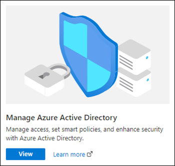
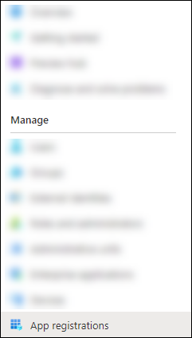
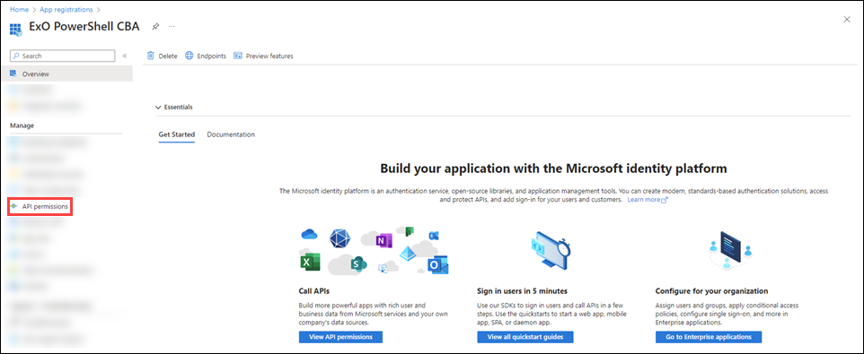

# App-only authentication for unattended scripts in the EXO V2 module

> [!NOTE]
> The features and procedures described in this article require the following versions of the EXO V2 module:
>
> - **Exchange Online PowerShell (Connect-ExchangeOnline)**: Version 2.0.3 or later.
> - **Security & Compliance Center PowerShell (Connect-IPPSSession)**: Version 2.0.6 Preview5 or later.
>
> For instructions on how to install or update the module, see [Install and maintain the EXO V2 module](exchange-online-powershell-v2.md#install-and-maintain-the-exo-v2-module).
>
> You can't use the procedures in this article to modify Microsoft 365 Groups ([Set-UnifiedGroup](/powershell/module/exchange/set-unifiedgroup)). To use Microsoft Graph instead, see [Update group](/graph/api/group-update).

Auditing and reporting scenarios in Microsoft 365 often involve unattended scripts in Exchange Online PowerShell and Security & Compliance Center PowerShell. In the past, unattended sign in required you to store the username and password in a local file or in a secret vault that's accessed at run-time. But, as we all know, storing user credentials locally is not a good security practice.

Certificate based authentication (CBA) or app-only authentication as described in this article supports unattended script and automation scenarios by using Azure AD apps and self-signed certificates.

The following examples show how to use the Exchange Online PowerShell V2 module with app-only authentication:

> [!IMPORTANT]
> In the **Connect-** commands, be sure to use an `.onmicrosoft.com` domain for the _Organization_ parameter value. Otherwise, you might encounter cryptic permission issues when you run commands in the app context.

- Connect using a local certificate:

  - **Exchange Online PowerShell**:

    ```powershell
    Connect-ExchangeOnline -CertificateFilePath "C:\Users\johndoe\Desktop\automation-cert.pfx" -CertificatePassword (ConvertTo-SecureString -String "<MyPassword>" -AsPlainText -Force) -AppID "36ee4c6c-0812-40a2-b820-b22ebd02bce3" -Organization "contosoelectronics.onmicrosoft.com"
    ```

  - **Security & Compliance Center PowerShell**:

     ```powershell
    Connect-IPPSSession -CertificateFilePath "C:\Users\johndoe\Desktop\automation-cert.pfx" -CertificatePassword (ConvertTo-SecureString -String "<MyPassword>" -AsPlainText -Force) -AppID "36ee4c6c-0812-40a2-b820-b22ebd02bce3" -Organization "contosoelectronics.onmicrosoft.com"
    ```

- Connect using a certificate thumbprint:

  - **Exchange Online PowerShell**:

    ```powershell
    Connect-ExchangeOnline -CertificateThumbPrint "012THISISADEMOTHUMBPRINT" -AppID "36ee4c6c-0812-40a2-b820-b22ebd02bce3" -Organization "contosoelectronics.onmicrosoft.com"
    ```

  - **Security & Compliance Center PowerShell**:

    ```powershell
    Connect-IPPSSession -CertificateThumbPrint "012THISISADEMOTHUMBPRINT" -AppID "36ee4c6c-0812-40a2-b820-b22ebd02bce3" -Organization "contosoelectronics.onmicrosoft.com"
    ```

  When you use the _CertificateThumbPrint_ parameter, the certificate needs to be installed on the computer where you are running the command. The certificate should be installed in the user certificate store.

- Connect using a certificate object:

  - **Exchange Online PowerShell**:

    ```powershell
    Connect-ExchangeOnline -Certificate <%X509Certificate2 Object%> -AppID "36ee4c6c-0812-40a2-b820-b22ebd02bce3" -Organization "contosoelectronics.onmicrosoft.com"
    ```

  - **Security & Compliance Center PowerShell**:

    ```powershell
    Connect-IPPSSession -Certificate <%X509Certificate2 Object%> -AppID "36ee4c6c-0812-40a2-b820-b22ebd02bce3" -Organization "contosoelectronics.onmicrosoft.com"
    ```

  When you use the _Certificate_ parameter, the certificate does not need to be installed on the computer where you are running the command. This parameter is applicable for scenarios where the certificate object is stored remotely and fetched at runtime during script execution.

> [!TIP]
> App-only authentication does not support delegation. Unattended scripting in delegation scenarios is supported with the Secure App Model. For more information, go [here](/powershell/partnercenter/multi-factor-auth#exchange).

## How does it work?

The EXO V2 module uses the Active Directory Authentication Library to fetch an app-only token using the application Id, tenant Id (organization), and certificate thumbprint. The application object provisioned inside Azure AD has a Directory Role assigned to it, which is returned in the access token. The session's role based access control (RBAC) is configured using the directory role information that's available in the token.

## Set up app-only authentication

An initial onboarding is required for authentication using application objects. Application and service principal are used interchangeably, but an application is like a class object while a service principal is like an instance of the class. You can learn more about this at [Application and service principal objects in Azure Active Directory](/azure/active-directory/develop/app-objects-and-service-principals).

For a detailed visual flow about creating applications in Azure AD, see <https://aka.ms/azuread-app>.

1. [Register the application in Azure AD](#step-1-register-the-application-in-azure-ad).

2. [Assign API permissions to the application](#step-2-assign-api-permissions-to-the-application).

   An application object has the default permission `User.Read`. For the application object to access resources, it needs to have the Application permission `Exchange.ManageAsApp`.

3. [Generate a self-signed certificate](#step-3-generate-a-self-signed-certificate)

   - For app-only authentication in Azure AD,  you typically use a certificate to request access. Anyone who has the certificate and its private key can use the app, and the permissions granted to the app.

   - Create and configure a self-signed X.509 certificate, which will be used to authenticate your Application against Azure AD, while requesting the app-only access token.

   - This is similar to generating a password for user accounts. The certificate can be self-signed as well. See the [Appendix](#step-3-generate-a-self-signed-certificate) section later in this article for instructions for generating certificates in PowerShell.

     > [!NOTE]
     > Cryptography: Next Generation (CNG) certificates are not supported for app-only authentication with Exchange. CNG certificates are created by default in modern Windows versions. You must use a certificate from a CSP key provider. The [Appendix](#step-3-generate-a-self-signed-certificate) section covers two supported methods to create a CSP certificate.

4. [Attach the certificate to the Azure AD application](#step-4-attach-the-certificate-to-the-azure-ad-application)

5. [Assign Azure AD roles to the application](#step-5-assign-azure-ad-roles-to-the-application)

   The application needs to have the appropriate RBAC roles assigned. Because the apps are provisioned in Azure AD, you can use any of the supported built-in roles.

## Appendix

## Step 1: Register the application in Azure AD

> [!NOTE]
> If you encounter problems, check the [required permissions](/azure/active-directory/develop/howto-create-service-principal-portal#required-permissions) to verify that your account can create the identity.

1. Open the Azure AD portal at <https://portal.azure.com/>.

2. Under **Manage Azure Active Directory**, click **View**.

   

3. On the **Overview** page that opens, under **Manage**, select **App registrations**.

   

4. On the **App registrations** page that opens, click **New registration**.

   

   On the **Register an application** page that opens, configure the following settings:

   - **Name**: Enter something descriptive. For example, ExO PowerShell CBA.

   - **Supported account types**: Verify that **Accounts in this organizational directory only (\<YourOrganizationName\> only - Single tenant)** is selected.

   - **Redirect URI (optional)**: In the first box, verify that **Web** is selected. In the second box, enter the URI where the access token is sent.

     Note that you can't create credentials for [native applications](/azure/active-directory/manage-apps/application-proxy-configure-native-client-application), because you can't use that type for automated applications.

     

   When you're finished, click **Register**.

5. Leave the app page that you return to open. You'll use it in the next step.

## Step 2: Assign API permissions to the application

> [!NOTE]
> The procedures in this section replace any default permissions that were automatically configured for the new app. The app doesn't need the default permissions that were replaced.

1. On the app page under **Management**, select **Manifest**.

   

2. On the **Manifest** page that opens, find the `requiredResourceAccess` entry (on or about line 44).

   Modify the `resourceAppId`, `resourceAccess`, `id`, and `type` values as shown in the following code snippet:

   ```json
   "requiredResourceAccess": [
      {
         "resourceAppId": "00000002-0000-0ff1-ce00-000000000000",
         "resourceAccess": [
            {
               "id": "dc50a0fb-09a3-484d-be87-e023b12c6440",
               "type": "Role"
            }
         ]
      }
   ],
   ```

   When you're finished, click **Save**.

3. Still on the **Manifest** page, under **Management**, select **API permissions**.

   

   On the **API permissions** page that opens, do the following steps:

   - **API / Permissions name**: Verify the value **Exchange.ManageAsApp** is shown.

   - **Status**: The current incorrect value is **Not granted for \<Organization\>**, and this value needs to be changed.

     

     Select **Grant admin consent for \<Organization\>**, read the confirmation dialog that opens, and then click **Yes**.

     The **Status** value should now be **Granted for \<Organization\>**.

     

4. Close the current **API permissions** page (not the browser tab) to return to the **App registrations** page. You'll use it in an upcoming step.

## Step 3: Generate a self-signed certificate

Create a self-signed x.509 certificate using one of the following methods:

- (Recommended) Use the [New-SelfSignedCertificate](/powershell/module/pki/new-selfsignedcertificate), [Export-Certificate](/powershell/module/pki/export-certificate) and [Export-PfxCertificate](/powershell/module/pki/export-pfxcertificate) cmdlets in an elevated (run as administrator) Windows PowerShell session to request a self-signed certificate and export it to `.cer` and `.pfx` (SHA1 by default). For example:

  ```powershell
  # Create certificate
  $mycert = New-SelfSignedCertificate -DnsName "contoso.org" -CertStoreLocation "cert:\CurrentUser\My" -NotAfter (Get-Date).AddYears(1) -KeySpec KeyExchange

  # Export certificate to .pfx file
  $mycert | Export-PfxCertificate -FilePath mycert.pfx -Password $(ConvertTo-SecureString -String "P@ssw0Rd1234" -AsPlainText -Force)

  # Export certificate to .cer file
  $mycert | Export-Certificate -FilePath mycert.cer
  ```

- Use the [Create-SelfSignedCertificate script](https://github.com/SharePoint/PnP-Partner-Pack/blob/master/scripts/Create-SelfSignedCertificate.ps1) script to generate SHA1 certificates.

  ```powershell
  .\Create-SelfSignedCertificate.ps1 -CommonName "MyCompanyName" -StartDate 2021-01-06 -EndDate 2022-01-06
  ```

## Step 4: Attach the certificate to the Azure AD application

After you register the certificate with your application, you can use the private key (`.pfx` file) or the thumbprint for authentication.

1. On the **Apps registration** page from the end of [Step 2](#step-2-assign-api-permissions-to-the-application), select your application.

   If you need to get back to **Apps registration** page, do the following steps:

   1. Open the Azure AD portal at <https://portal.azure.com/>.
   2. Under **Manage Azure Active Directory**, click **View**.
   3. Under **Manage**, select **App registrations**.

   

2. On the application page that opens, under **Manage**, select **Certificates & secrets**.

   

3. On the **Certificates & secrets** page that opens, click **Upload certificate**.

   

   In the dialog that opens, browse to the self-signed certificate (`.cer` file) that you created in [Step 3](#step-3-generate-a-self-signed-certificate).

   

   When you're finished, click **Add**.

   The certificate is now shown in the **Certificates** section.

   

4. Close the current **Certificates & secrets** page, and then the **App registrations** page to return to the main <https://portal.azure.com/> page. You'll use it in the next step.

## Step 5: Assign Azure AD roles to the application

Azure AD has more than 50 admin roles available. The supported roles are described in the following table:

|Role|Exchange Online PowerShell|Security & Compliance Center PowerShell|
|---|:---:|:---:|
|Compliance Administrator|||
|Exchange Administrator<sup>\*</sup>|||
|Global Administrator<sup>\*</sup>|||
|Global Reader|||
|Helpdesk Administrator|||
|Security Administrator<sup>\*</sup>|||
|Security Reader|||

<sup>\*</sup> The Global Administrator and Exchange Administrator roles provide the required permissions for any task in Exchange Online PowerShell. For example:

- Recipient management.
- Security and protection features. For example, anti-spam, anti-malware, anti-phishing, and the associated reports.

The Security Administrator role does not have the necessary permissions for those same tasks.

For general instructions about assigning roles in Azure AD, see [View and assign administrator roles in Azure Active Directory](/azure/active-directory/roles/manage-roles-portal).

> [!NOTE]
> The following steps are slightly different for Exchange Online PowerShell vs. Security & Compliance Center PowerShell. The steps for both environments are shown. To configure roles for both environments, repeat the steps in this section.

1. On the Azure AD portal at <https://portal.azure.com/>, under **Manage Azure Active Directory**, click **View**.

   

2. On the **Overview** page that opens, under **Manage**, select **Roles and administrators**.

   

3. On the **Roles and administrators** page that opens, find and select one of the supported roles by _clicking on the name of the role_ (not the check box) in the results.

   - **Exchange Online PowerShell**:

     

   - **Security & Compliance Center PowerShell**:

     

4. On the **Assignments** page that opens, click **Add assignments**.

   - **Exchange Online PowerShell**:

     

   - **Security & Compliance Center PowerShell**:

     

5. In the **Add assignments** flyout that opens, find and select the app that you created in [Step 1](#step-1-register-the-application-in-azure-ad).

   

   When you're finished, click **Add**.

6. Back on the **Assignments** page, verify that the app has been assigned to the role.

   - **Exchange Online PowerShell**:

     

   - **Security & Compliance Center PowerShell**:

     
