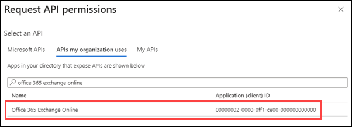
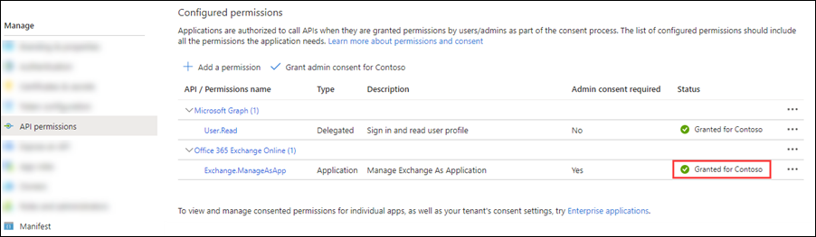
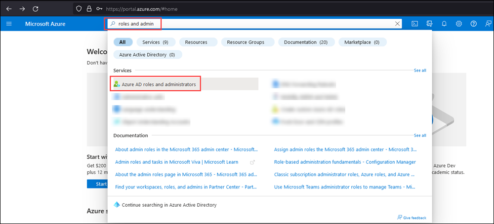
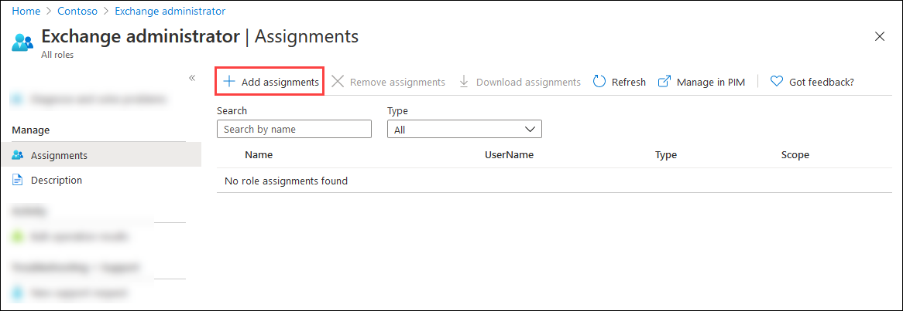

# App-only authentication for unattended scripts in Exchange Online PowerShell and Security & Compliance PowerShell

Auditing and reporting scenarios in Microsoft 365 often involve unattended scripts in Exchange Online PowerShell and Security & Compliance PowerShell. In the past, unattended sign in required you to store the username and password in a local file or in a secret vault that's accessed at run-time. But, as we all know, storing user credentials locally isn't a good security practice.

Certificate based authentication (CBA) or app-only authentication as described in this article supports unattended script and automation scenarios by using Microsoft Entra apps and self-signed certificates.

> [!NOTE]
> - Did you know that you can connect to Exchange Online PowerShell using managed identities in Azure? Check out [Use Azure managed identities to connect to Exchange Online PowerShell](connect-exo-powershell-managed-identity.md).
>
> - The features and procedures described in this article require the following versions of the Exchange Online PowerShell module:
> - **Exchange Online PowerShell (Connect-ExchangeOnline)**: Version 2.0.3 or later.
> - **Security & Compliance PowerShell (Connect-IPPSSession)**: Version 3.0.0 or later.
>
> For instructions on how to install or update the module, see [Install and maintain the Exchange Online PowerShell module](exchange-online-powershell-v2.md#install-and-maintain-the-exchange-online-powershell-module). For instructions on how to use the module in Azure automation, see [Manage modules in Azure Automation](/azure/automation/shared-resources/modules).
>
> - CBA or app-only authentication is available in Office 365 operated by 21Vianet in China.
>
> - REST API connections in the Exchange Online PowerShell V3 module require the PowerShellGet and PackageManagement modules. For more information, see [PowerShellGet for REST-based connections in Windows](exchange-online-powershell-v2.md#powershellget-for-rest-api-connections-in-windows).
>
>   If the procedures in this article don't work for you, verify that you don't have Beta versions of the PackageManagement or PowerShellGet modules installed by running the following command: `Get-InstalledModule PackageManagement -AllVersions; Get-InstalledModule PowerShellGet -AllVersions`.
>
> - In Exchange Online PowerShell, you can't use the procedures in this article with the following Microsoft 365 Group cmdlets:
>   - [New-UnifiedGroup](/powershell/module/exchangepowershell/new-unifiedgroup)
>   - [Remove-UnifiedGroup](/powershell/module/exchangepowershell/remove-unifiedgroup)
>   - [Remove-UnifiedGroupLinks](/powershell/module/exchangepowershell/remove-unifiedgrouplinks)
>   - [Add-UnifiedGroupLinks](/powershell/module/exchangepowershell/add-unifiedgrouplinks)
>
>   You can use Microsoft Graph to replace most of the functionality from those cmdlets. For more information, see [Working with groups in Microsoft Graph](/graph/api/resources/groups-overview).
>
> - In Security & Compliance PowerShell, you can't use the procedures in this article with the following Microsoft Purview cmdlets:
> - [Get-ComplianceSearchAction](/powershell/module/exchangepowershell/get-compliancesearchaction)
> - [New-ComplianceSearch](/powershell/module/exchangepowershell/new-compliancesearch)
> - [Start-ComplianceSearch](/powershell/module/exchangepowershell/start-compliancesearch)
> - [New-ComplianceSearchAction](/powershell/module/exchangepowershell/new-compliancesearchaction?view=exchange-ps)
>
> - Delegated scenarios are supported in Exchange Online. The recommended method for connecting with delegation is using GDAP and App Consent. For more information, see [Use the Exchange Online PowerShell v3 Module with GDAP and App Consent](/powershell/partnercenter/exchange-online-gdap-app). You can also use multi-tenant applications when CSP relationships are not created with the customer. The required steps for using multi-tenant applications are called out within the regular instructions in this article.
>
> - Use the _SkipLoadingFormatData_ switch on the **Connect-ExchangeOnline** cmdlet if you get the following error when using the Windows PowerShell SDK to connect: `The term 'Update-ModuleManifest' is not recognized as a name of a cmdlet, function, script file, or executable program. Check the spelling of the name, or if a path was included, verify that the path is correct and try again.`

## How does it work?

The Exchange Online PowerShell module uses the Active Directory Authentication Library to fetch an app-only token using the application ID, tenant ID (organization), and certificate thumbprint. The application object provisioned inside Microsoft Entra ID has a Directory Role assigned to it, which is returned in the access token. The session's role based access control (RBAC) is configured using the directory role information that's available in the token.

## Connection examples

The following examples show how to use the Exchange Online PowerShell module with app-only authentication:

> [!IMPORTANT]
> In the following connection commands, use the primary `.onmicrosoft.com` domain for your organization as the value of the _Organization_ parameter.
>
> The following connection commands have many of the same options available as described in [Connect to Exchange Online PowerShell](connect-to-exchange-online-powershell.md) and [Connect to Security & Compliance PowerShell](connect-to-scc-powershell.md). For example:
>
> - Microsoft 365 GCC High, Microsoft 365 DoD or Microsoft 365 China (operated by 21Vianet) environments require the following additional parameters and values:
> - **Microsoft 365 GCC High**
>   - `Connect-ExchangeOnline -ExchangeEnvironmentName O365USGovGCCHigh`
>   - `Connect-IPPSSession -ConnectionUri https://ps.compliance.protection.office365.us/powershell-liveid/ -AzureADAuthorizationEndpointUri https://login.microsoftonline.us`
>
> - **Microsoft 365 DoD**
>   - `Connect-ExchangeOnline -ExchangeEnvironmentName O365USGovDoD`
>   - `Connect-IPPSSession -ConnectionUri https://compliance.dod.microsoft.com/powershell-liveid -AzureADAuthorizationEndpointUri https://login.microsoftonline.us`
>
> - **Microsoft 365 operated by 21Vianet (China)**
>   - `Connect-ExchangeOnline -ExchangeEnvironmentName O365China`
>   - `Connect-IPPSSession -ConnectionUri https://ps.compliance.protection.partner.outlook.cn/powershell-liveid -AzureADAuthorizationEndpointUri https://login.chinacloudapi.cn/common`
>
> - If a **Connect-IPPSSession** command presents a login prompt, run the command: `$Global:IsWindows = $true` before the **Connect-IPPSSession** command.

- **Connect using a certificate thumbprint**:

  > [!NOTE]
  > The CertificateThumbprint parameter is supported only in Microsoft Windows.

  The certificate needs to be installed on the computer where you're running the command. The certificate should be installed in the user certificate store.

  - <u>Exchange Online PowerShell</u>:

    ```powershell
    Connect-ExchangeOnline -CertificateThumbPrint "012THISISADEMOTHUMBPRINT" -AppID "36ee4c6c-0812-40a2-b820-b22ebd02bce3" -Organization "contosoelectronics.onmicrosoft.com"
    ```

  - <u>Security & Compliance PowerShell</u>:

    ```powershell
    Connect-IPPSSession -CertificateThumbPrint "012THISISADEMOTHUMBPRINT" -AppID "36ee4c6c-0812-40a2-b820-b22ebd02bce3" -Organization "contosoelectronics.onmicrosoft.com"
    ```

- **Connect using a certificate object**:

  The certificate doesn't need to be installed on the computer where you're running the command. You can store the certificate object remotely. The certificate is fetched when the script is run.

  - <u>Exchange Online PowerShell</u>:

    ```powershell
    Connect-ExchangeOnline -Certificate <%X509Certificate2 Object%> -AppID "36ee4c6c-0812-40a2-b820-b22ebd02bce3" -Organization "contosoelectronics.onmicrosoft.com"
    ```

  - <u>Security & Compliance PowerShell</u>:

    ```powershell
    Connect-IPPSSession -Certificate <%X509Certificate2 Object%> -AppID "36ee4c6c-0812-40a2-b820-b22ebd02bce3" -Organization "contosoelectronics.onmicrosoft.com"
    ```

- **Connect using a local certificate**:

  > [!NOTE]
  > Using a **ConvertTo-SecureString** command to store the password of the certificate locally defeats the purpose of a secure connection method for automation scenarios. Using a **Get-Credential** command to prompt you for the password of the certificate securely isn't ideal for automation scenarios. In other words, there's really no automated _and_ secure way to connect using a local certificate.

  - <u>Exchange Online PowerShell</u>:

    ```powershell
    Connect-ExchangeOnline -CertificateFilePath "C:\Users\navin\Desktop\automation-cert.pfx" -CertificatePassword (Get-Credential).password -AppID "36ee4c6c-0812-40a2-b820-b22ebd02bce3" -Organization "contosoelectronics.onmicrosoft.com"
    ```

  - <u>Security & Compliance PowerShell</u>:

     ```powershell
    Connect-IPPSSession -CertificateFilePath "C:\Users\navin\Desktop\automation-cert.pfx" -CertificatePassword (Get-Credential).password -AppID "36ee4c6c-0812-40a2-b820-b22ebd02bce3" -Organization "contosoelectronics.onmicrosoft.com"
    ```

## Set up app-only authentication

An initial onboarding is required for authentication using application objects. Application and service principal are used interchangeably, but an application is like a class object while a service principal is like an instance of the class. For more information, see [Application and service principal objects in Microsoft Entra ID](/entra/identity-platform/app-objects-and-service-principals).

For a detailed visual flow about creating applications in Microsoft Entra ID, see <https://aka.ms/azuread-app>.

1. [Register the application in Microsoft Entra ID](#step-1-register-the-application-in-microsoft-entra-id).

2. [Assign API permissions to the application](#step-2-assign-api-permissions-to-the-application).

   An application object has the **Delegated** API permission **Microsoft Graph** \> **User.Read** by default. For the application object to access resources in Exchange, it needs the **Application** API permission **Office 365 Exchange Online** \> **Exchange.ManageAsApp**.

3. [Generate a self-signed certificate](#step-3-generate-a-self-signed-certificate)

   - For app-only authentication in Microsoft Entra ID, you typically use a certificate to request access. Anyone who has the certificate and its private key can use the app with the permissions granted to the app.

   - Create and configure a self-signed X.509 certificate, which is used to authenticate your Application against Microsoft Entra ID, while requesting the app-only access token.

   - This procedure is similar to generating a password for user accounts. The certificate can be self-signed as well. See [this section](#step-3-generate-a-self-signed-certificate) later in this article for instructions to generate certificates in PowerShell.

     > [!NOTE]
     > Cryptography: Next Generation (CNG) certificates aren't supported for app-only authentication with Exchange. CNG certificates are created by default in modern versions of Windows. You must use a certificate from a CSP key provider. [This section](#step-3-generate-a-self-signed-certificate) section covers two supported methods to create a CSP certificate.

4. [Attach the certificate to the Microsoft Entra application](#step-4-attach-the-certificate-to-the-microsoft-entra-application)

5. [Assign Microsoft Entra roles to the application](#step-5-assign-microsoft-entra-roles-to-the-application)

   The application needs to have the appropriate RBAC roles assigned. Because the apps are provisioned in Microsoft Entra ID, you can use any of the supported built-in roles.

### Step 1: Register the application in Microsoft Entra ID

> [!NOTE]
> If you encounter problems, check the [required permissions](/entra/identity-platform/howto-create-service-principal-portal#permissions-required-for-registering-an-app) to verify that your account can create the identity.

1. Open the Microsoft Entra admin center at <https://portal.azure.com/>.

2. In the **Search** box at the top of the page, start typing **App registrations**, and then select **App registrations** from the results in the **Services** section.

   

   Or, to go directly to the **App registrations** page, use <https://portal.azure.com/#view/Microsoft_AAD_RegisteredApps/ApplicationsListBlade>.

3. On the **App registrations** page, select **New registration**.

   

4. On the **Register an application** page that opens, configure the following settings:
   - **Name**: Enter something descriptive. For example, ExO PowerShell CBA.
   - **Supported account types**: Verify that **Accounts in this organizational directory only (\<YourOrganizationName\> only - Single tenant)** is selected.

     > [!TIP]
     > To make the application multi-tenant for **Exchange Online** delegated scenarios, select the value **Accounts in any organizational directory (Any Microsoft Entra directory - Multitenant)**.

   - **Redirect URI (optional)**: This setting is optional. If you need to use it, configure the following settings:
     - **Platform**: Select **Web**.
     - **URI**: Enter the URI where the access token is sent.

     > [!TIP]
     > You can't create credentials for [native applications](/entra/identity/app-proxy/application-proxy-configure-native-client-application), because you can't use native applications for automated applications.

   

   When you're finished on the **App registrations** page, select **Register**.

5. You're taken to the **Overview** page of the app you just registered. Leave this page open. You use it in the next step.

### Step 2: Assign API permissions to the application

Choose **one** of the following methods in this section to assign API permissions to the app:

- Select and assign the API permissions from the portal.
- Modify the app manifest to assign API permissions. (Microsoft 365 GCC High and DoD organizations should use this method)

#### Select and assign the API permissions from the portal

1. On the app **Overview** page, select **API permissions** from the **Manage** section.

   

2. On the app **API Permissions** page, select **Add a permission**.

   

3. In the **Request API permissions** flyout that opens, select the **APIs my organization uses** tab, start typing **Office 365 Exchange Online** in the **Search** box, and then select it from the results.

   

4. On the **What type of permissions does your application require?** flyout that appears, select **Application permissions**.

5. In the permissions list that appears, expand **Exchange**, select **Exchange.ManageAsApp**, and then select **Add permissions**.

   

6. Back on the app **API permissions** page, verify **Office 365 Exchange Online** \> **Exchange.ManageAsApp** is listed and contains the following values:
   - **Type**: **Application**.
   - **Admin consent required**: **Yes**.
   - **Status**: The current incorrect value is **Not granted for <Organization>**.

     Change this value by selecting **Grant admin consent for \<Organization\>**, read the confirmation dialog that opens, and then select **Yes**.

     

     The **Status** value is now **Granted for \<Organization\>**.

     

7. For the default **Microsoft Graph** \> **User.Read** entry, select **...** \> **Revoke admin consent**, and then select **Yes** in the confirmation dialog that opens to return **Status** back to the default blank value.

   

8. Close the current **API permissions** page (not the browser tab) to return to the **App registrations** page. You use the **App registrations** page in an upcoming step.

#### Modify the app manifest to assign API permissions

> [!NOTE]
> The procedures in this section _append_ the existing default permissions on the app (delegated **User.Read** permissions in **Microsoft Graph**) with the required application **Exchange.ManageAsApp** permissions in **Office 365 Exchange Online**.

1. On the app **Overview** page, select **Manifest** from the **Manage** section.

   

2. On the app **Manifest** page, find the `requiredResourceAccess` entry (on or about line 42), and make the entry look like the following code snippet:

   ```json
   "requiredResourceAccess": [
       {
           "resourceAppId": "00000002-0000-0ff1-ce00-000000000000",
           "resourceAccess": [
               {
                   "id": "dc50a0fb-09a3-484d-be87-e023b12c6440",
                   "type": "Role"
               }
           ]
       },
       {
           "resourceAppId": "00000003-0000-0000-c000-000000000000",
           "resourceAccess": [
               {
                   "id": "e1fe6dd8-ba31-4d61-89e7-88639da4683d",
                   "type": "Scope"
               }
           ]
       }
   ],
   ```

   > [!NOTE]
   > Microsoft 365 GCC High or DoD environments have access to Security & Compliance PowerShell only. Use the following values for the `requiredResourceAccess` entry:
   >
   > ```json
   > "requiredResourceAccess": [
   >     {
   >         "resourceAppId": "00000007-0000-0ff1-ce00-000000000000",
   >         "resourceAccess": [
   >             {
   >                 "id": "455e5cd2-84e8-4751-8344-5672145dfa17",
   >                 "type": "Role"
   >             }
   >         ]
   >     },
   >     {
   >         "resourceAppId": "00000003-0000-0000-c000-000000000000",
   >         "resourceAccess": [
   >             {
   >                 "id": "e1fe6dd8-ba31-4d61-89e7-88639da4683d",
   >                 "type": "Scope"
   >             }
   >         ]
   >     }
   > ],
   > ```

   When you're finished on the **Manifest** page, select **Save**.

3. Still on the **Manifest** page, select **API permissions** from the **Manage** section.

   

4. On the **API permissions** page, verify **Office 365 Exchange Online** \> **Exchange.ManageAsApp** is listed and contains the following values:
   - **Type**: **Application**.
   - **Admin consent required**: **Yes**.
   - **Status**: The current incorrect value is **Not granted for \<Organization\>** for the **Office 365 Exchange Online** \> **Exchange.ManageAsApp** entry.

     Change the **Status** value by selecting **Grant admin consent for \<Organization\>**, reading the confirmation dialog that opens, and then selecting **Yes**.

     

     The **Status** value is now **Granted for \<Organization\>**.

     

5. For the default **Microsoft Graph** \> **User.Read** entry, select **...** \> **Revoke admin consent**, and then select **Yes** in the confirmation dialog that opens to return **Status** back to the default blank value.

   

6. Close the current **API permissions** page (not the browser tab) to return to the **App registrations** page. You use the **App registrations** page in an upcoming step.

### Step 3: Generate a self-signed certificate

Create a self-signed x.509 certificate using one of the following methods:

- (Recommended) Use the [New-SelfSignedCertificate](/powershell/module/pki/new-selfsignedcertificate), [Export-Certificate](/powershell/module/pki/export-certificate) and [Export-PfxCertificate](/powershell/module/pki/export-pfxcertificate) cmdlets in an elevated (run as administrator) Windows PowerShell session to request a self-signed certificate and export it to `.cer` and `.pfx` (SHA1 by default). For example:

  ```powershell
  # Create certificate
  $mycert = New-SelfSignedCertificate -DnsName "contoso.org" -CertStoreLocation "cert:\CurrentUser\My" -NotAfter (Get-Date).AddYears(1) -KeySpec KeyExchange

  # Export certificate to .pfx file
  $mycert | Export-PfxCertificate -FilePath mycert.pfx -Password (Get-Credential).password

  # Export certificate to .cer file
  $mycert | Export-Certificate -FilePath mycert.cer
  ```

- Use the [Create-SelfSignedCertificate script](https://github.com/SharePoint/PnP-Partner-Pack/blob/master/scripts/Create-SelfSignedCertificate.ps1) script to generate SHA1 certificates.

  ```powershell
  .\Create-SelfSignedCertificate.ps1 -CommonName "MyCompanyName" -StartDate 2021-01-06 -EndDate 2022-01-06
  ```

### Step 4: Attach the certificate to the Microsoft Entra application

After you register the certificate with your application, you can use the private key (`.pfx` file) or the thumbprint for authentication.

1. On the **Owned applications** tab on the **Apps registration** page from the end of [Step 2](#step-2-assign-api-permissions-to-the-application), select your application.

   If you need to get back to **Apps registration** page, use <https://portal.azure.com/#view/Microsoft_AAD_IAM/ActiveDirectoryMenuBlade/~/RegisteredApps>, verify the **Owned applications** tab is selected, and then select your application.

   

2. On the application page that opens, select **Certificates & secrets** from the **Manage** section.

   

3. On the **Certificates & secrets** page, select **Upload certificate**.

   

   In the dialog that opens, browse to the self-signed certificate (`.cer` file) that you created in [Step 3](#step-3-generate-a-self-signed-certificate).

   

   When you're finished, select **Add**.

   The certificate is now shown in the **Certificates** section.

   

4. Close the current **Certificates & secrets** page, and then the **App registrations** page to return to the main <https://portal.azure.com/> page. You'll use it in the next step.

### Step 4b: Exchange Online delegated scenarios only: Grant admin consent for the multi-tenant app

If you made the application multi-tenant for **Exchange Online** delegated scenarios in [Step 1](#step-1-register-the-application-in-microsoft-entra-id), you need to grant admin consent to the Exchange.ManageAsApp permission so the application can run cmdlets in Exchange Online **in each tenant organization**. To do this, generate an admin consent URL for each customer tenant. Before anyone uses the multi-tenant application to connect to Exchange Online in the tenant organization, an admin in the customer tenant should open the following URL:

`https://login.microsoftonline.com/<tenant-id>/adminconsent?client_id=<client-id>&scope=https://outlook.office365.com/.default`

- `<tenant-id>` is the customer's tenant ID.
- `<client-id>` is the ID of the multi-tenant application.
- The default scope is used to grant application permissions.

For more information about the URL syntax, see [Request the permissions from a directory admin](/entra/identity-platform/v2-admin-consent#request-the-permissions-from-a-directory-admin).

### Step 5: Assign Microsoft Entra roles to the application

You have two options:

- **Assign Microsoft Entra roles to the application**
- **Assign custom role groups to the application using service principals**: This method is supported only when you connect to Exchange Online PowerShell or Security & Compliance PowerShell in [REST API mode](exchange-online-powershell-v2.md#rest-api-connections-in-the-exo-v3-module). Security & Compliance PowerShell supports REST API mode in v3.2.0 or later.

> [!NOTE]
> You can also combine both methods to assign permissions. For example, you can use Microsoft Entra roles for the "Exchange Recipient Administrator" role and also assign your custom RBAC role to extend the permissions.
>
> For multi-tenant applications in **Exchange Online** delegated scenarios, you need to assign permissions in each customer tenant.

#### Assign Microsoft Entra roles to the application

The supported Microsoft Entra roles are described in the following table:

|Role|Exchange Online<br>PowerShell|Security & Compliance<br>PowerShell|
|---|:---:|:---:|
|[Compliance Administrator](/entra/identity/role-based-access-control/permissions-reference#compliance-administrator)|✔|✔|
|[Exchange Administrator](/entra/identity/role-based-access-control/permissions-reference#exchange-administrator)¹|✔||
|[Exchange Recipient Administrator](/entra/identity/role-based-access-control/permissions-reference#exchange-recipient-administrator)|✔||
|[Global Administrator](/entra/identity/role-based-access-control/permissions-reference#global-administrator)¹ ²|✔|✔|
|[Global Reader](/entra/identity/role-based-access-control/permissions-reference#global-reader)|✔|✔|
|[Helpdesk Administrator](/entra/identity/role-based-access-control/permissions-reference#helpdesk-administrator)|✔||
|[Security Administrator](/entra/identity/role-based-access-control/permissions-reference#security-administrator)¹|✔|✔|
|[Security Reader](/entra/identity/role-based-access-control/permissions-reference#security-reader)|✔|✔|

¹ The Global Administrator and Exchange Administrator roles provide the required permissions for any task in Exchange Online PowerShell. For example:

- Recipient management.
- Security and protection features. For example, anti-spam, anti-malware, anti-phishing, and the associated reports.

The Security Administrator role does not have the necessary permissions for those same tasks.

² Microsoft recommends that you use roles with the fewest permissions. Using lower permissioned accounts helps improve security for your organization. Global Administrator is a highly privileged role that should be limited to emergency scenarios when you can't use an existing role.

For general instructions about assigning roles in Microsoft Entra ID, see [Assign Microsoft Entra roles to users](/entra/identity/role-based-access-control/manage-roles-portal).

> [!NOTE]
> The following steps are slightly different for Exchange Online PowerShell vs. Security & Compliance PowerShell. The steps for both environments are shown. To configure roles for both environments, repeat the steps in this section.

1. In Microsoft Entra admin center at <https://portal.azure.com/>, start typing **roles and administrators** in the **Search** box at the top of the page, and then select **Microsoft Entra roles and administrators** from the results in the **Services** section.

   

   Or, to go directly to the **Microsoft Entra roles and administrators** page, use <https://portal.azure.com/#view/Microsoft_AAD_IAM/AllRolesBlade>.

2. On the **Roles and administrators** page that opens, find and select one of the supported roles by _clicking on the name of the role_ (not the check box) in the results.

   - **Exchange Online PowerShell**: For example, find and select the **Exchange administrator** role.

     

   - **Security & Compliance PowerShell**: For example, find and select the **Compliance Administrator** role.

     

3. On the **Assignments** page that opens, select **Add assignments**.
   - **Exchange Online PowerShell**:

     

   - **Security & Compliance PowerShell**:

     

4. In the **Add assignments** flyout that opens, find and select the app that you created in [Step 1](#step-1-register-the-application-in-microsoft-entra-id).

   

   When you're finished in the **Add assignments** flyout, select **Add**.

5. Back on the **Assignments** page, verify that the role has been assigned to the app.

   - **Exchange Online PowerShell**:

     

   - **Security & Compliance PowerShell**:

     

#### Assign custom role groups to the application using service principals

> [!NOTE]
> You need to connect to Exchange Online PowerShell or Security & Compliance PowerShell _before_ completing steps to create a new service principal. Creating a new service principal without connecting to PowerShell won't work (your Azure App ID and Object ID are needed to create the new service principal).
>
>  This method is supported only when you connect to Exchange Online PowerShell or Security & Compliance PowerShell in [REST API mode](exchange-online-powershell-v2.md#rest-api-connections-in-the-exo-v3-module). Security & Compliance PowerShell supports REST API mode in v3.2.0 or later.

For information about creating custom role groups, see [Create role groups in Exchange Online](/exchange/permissions-exo/role-groups#create-role-groups) and [Create Email & collaboration role groups in the Microsoft Defender portal](/defender-office-365/mdo-portal-permissions#create-email--collaboration-role-groups-in-the-microsoft-defender-portal). The custom role group that you assign to the application can contain any combination of built-in and custom roles.

To assign custom role groups to the application using service principals, do the following steps:

1. In [Microsoft Graph PowerShell](/powershell/microsoftgraph/installation), run the following commands to store the details of the Microsoft Entra application that you registered in [Step 1](#step-1-register-the-application-in-microsoft-entra-id) in a variable:

   ```powershell
   Connect-MgGraph -Scopes AppRoleAssignment.ReadWrite.All,Application.Read.All

   $<VariableName1> = Get-MgServicePrincipal -Filter "DisplayName eq '<AppName>'"
   ```

   For example:

   ```powershell
   Connect-MgGraph -Scopes AppRoleAssignment.ReadWrite.All,Application.Read.All

   $AzureADApp = Get-MgServicePrincipal -Filter "DisplayName eq 'ExO PowerShell CBA'"
   ```

   For detailed syntax and parameter information, see [Get-MgServicePrincipal](/powershell/module/microsoft.graph.applications/get-mgserviceprincipal).

2. In the same PowerShell window, connect to [Exchange Online PowerShell](connect-to-exchange-online-powershell.md) or [Security & Compliance PowerShell](connect-to-scc-powershell.md) and run the following commands to:
   - Create a service principal object for the Microsoft Entra application.
   - Store the details of the service principal in a variable to use in the next step.

   ```powershell
   New-ServicePrincipal -AppId $<VariableName1>.AppId -ObjectId $<VariableName1>.Id -DisplayName "<Descriptive Name>"

   $<VariableName2> = Get-ServicePrincipal -Identity "<Descriptive Name>"
   ```

   For example:

   ```powershell
   New-ServicePrincipal -AppId $AzureADApp.AppId -ObjectId $AzureADApp.Id -DisplayName "SP for Azure AD App ExO PowerShell CBA"

   $SP = Get-ServicePrincipal -Identity "SP for Azure AD App ExO PowerShell CBA"
   ```

   For detailed syntax and parameter information, see [New-ServicePrincipal](/powershell/module/exchangepowershell/new-serviceprincipal).

3. In Exchange Online PowerShell or Security & Compliance PowerShell, run the following command to add the service principal as a member of the custom role group:

   ```powershell
   Add-RoleGroupMember -Identity "<CustomRoleGroupName>" -Member <$<VariableName2>.Identity | $<VariableName2>.ObjectId | $<VariableName2>.Id>
   ```

   For example:

   ```powershell
   Add-RoleGroupMember -Identity "Contoso View-Only Recipients" -Member $SP.Identity
   ```

   For detailed syntax and parameter information, see [Add-RoleGroupMember](/powershell/module/exchangepowershell/add-rolegroupmember).
