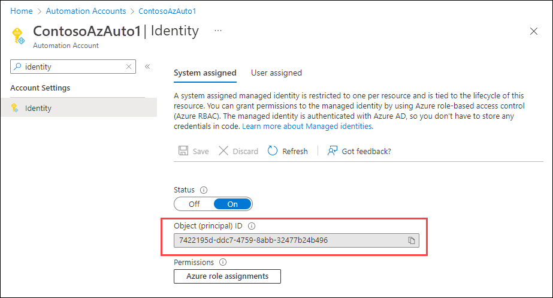

# Use Azure managed identities to connect to Exchange Online PowerShell

## System-assigned managed identity

1. Create an Azure Automation account. For instructions, see [Quickstart: Create an Automation account using the Azure portal](/azure/automation/quickstarts/create-azure-automation-account-portal).

   - By default when you create the Automation account, system-assigned managed identity is selected on the **[Advanced](/azure/automation/quickstarts/create-azure-automation-account-portal#advanced)** tab. To enable system-assigned managed identity on an existing Automation account, see [Enable system-assigned managed identity](/azure/automation/quickstarts/enable-managed-identity#enable-system-assigned-managed-identity).

   To create the Automation account in [Azure PowerShell](https:///powershell/azure/what-is-azure-powershell) (the Az.Accounts module), use the following syntax:

   ```powershell
   New-AzAutomationAccount -Name "<Automation account name>" -ResourceGroupName "<Existing resource group>" -Location "<Location>" -AssignSystemIdentity
   ```

   For example:

   ```powershell
   New-AzAutomationAccount -Name "ContosoAzAuto1" -ResourceGroupName "Contoso RG" -Location "Western US" -AssignSystemIdentity
   ```

   For detailed syntax and parameter information, see [New-AzAutomationAccount](/powershell/module/az.automation/new-azautomationaccount).

2. Add the Exchange Online PowerShell V3 module to the Automation account.

   1. On the **Automation accounts** page at <https://portal.azure.com/#view/HubsExtension/BrowseResource/resourceType/Microsoft.Automation%2FAutomationAccounts>, select the Automation account.
   2. In the details flyout that opens, type "Modules" in the  **Search** box, and then select **Modules** from results.
   3. On the **Modules** flyout that opens, click  **Add a module**.
   4. On the **Add a module** page that opens, configure the following settings:

      - **Upload a module file**: Select **Browse from gallery**.
      - **PowerShell module file**: Select **Click here to browse from gallery**.
        1. In the **Browse Gallery** page that opens, type "ExchangeOnlineManagement" in the  **Search** box, press Enter, and then select **ExchangeOnlineManagement** from the results.
        2. On the details page that opens, click **Select** to return to the **Add a module** page.
      - **Runtime versions**: Select **5.1** or **7.1 (Preview)**. To add both versions, repeat the steps to add the module again.

      When you're finished, click **Import**.

   

   Back on the **Modules** flyout, type "ExchangeOnlineManagement" in the  **Search** box to see the **Status** value. When the module import is complete, the value is **Available**.

   To add the module to the Automation account in Azure PowerShell, use the following syntax:

   ```powershell
   New-AzAutomationModule -AutomationAccountName "<Automation account name>" -Name ExchangeOnlineManagement -ContentLinkUri https://www.powershellgallery.com/packages/ExchangeOnlineManagement/3.0.0 -ResourceGroupName "<Existing resource group>"
   ```

   For example:

   ```powershell
   New-AzAutomationModule -AutomationAccountName "ContosoAzAuto1" -Name ExchangeOnlineManagement -ContentLinkUri https://www.powershellgallery.com/packages/ExchangeOnlineManagement/3.0.0 -ResourceGroupName "Contoso RG"
   ```

   For detailed syntax and parameter information, see [New-AzAutomationAccount](/powershell/module/az.automation/new-azautomationmodue).

3. Assign AppRoleAssignment.ReadWrite.All to the Azure automation account in the Microsoft Graph API.

   1. Find the GUID value of the Azure automation account by using either of the following methods:

      - **Azure portal**:
        1. On the **Automation accounts** page at <https://portal.azure.com/#view/HubsExtension/BrowseResource/resourceType/Microsoft.Automation%2FAutomationAccounts>, select the Automation account.
        2. In the details flyout, type "Identity" in the  **Search** box, and then select **Identity** in the results.
        3. In the **Identity** flyout that opens, verify the **System assigned** tab is selected, and note or cpy the value of the **Object (principal) ID** property.

        

     - **Azure PowerShell**:

       ```powershell
       Get-AzADServicePrincipal -DisplayName "<Automation account name>" | Format-Table Id
       ```

       For example:

       ```powershell
       Get-AzADServicePrincipal -DisplayName "ContosoAzAuto1" | Format-Table Id
       ```

4. Find the GUID value of your organization.

   In the following URL, replace <TenantDomain> with the value for your organization, and then open the URL in a web browser:

   `https://login.microsoftonline.com/<TenantDomain>/.well-known/openid-configuration`

   For example:

   `https://login.microsoftonline.com/contoso.onmicrosoft.com/.well-known/openid-configuration`

   The GUID value you see is your organization's GUID value.

5. Grant Permission for MSI to call EXO (from below)

   ```powershell
   $MsiId = "6a74a312-032c-411d-9c40-794227248b99"
   $ResourceID = "ID of the Resource in the tenant"

   New-MgServicePrincipalAppRoleAssignment -ServicePrincipalId $MsiId -PrincipalId $MsiId -AppRoleId dc50a0fb-09a3-484d-be87-e023b12c6440 -ResourceId $ResourceID


1. Assign the SP for the MSI the Exchange Administrator Role

## User-assigned managed identity

1. Create an Azure Automation Account
2. Create a user assigned managed identity
3. Specify using user assigned Managed Identity
4. Once Created, add the ExchangeOnlineManagement PowerShell Module from Gallery
5. Grant Permission for MSI to call EXO (from below)
6. Assign the SP for the MSI the Exchange Administrator Role