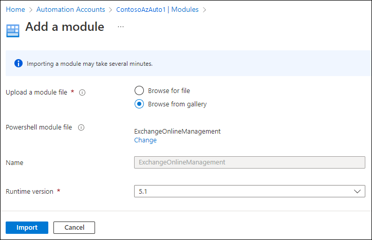

# Use Azure managed identities to connect to Exchange Online PowerShell

Using the [Exchange Online PowerShell V3 module](exchange-online-powershell-v2.md#rest-api-connections-in-the-exo-v3-module), you can connect to Exchange Online PowerShell using a user-assigned or system assigned Azure managed identity. For more information about managed identities, see [What are managed identities for Azure resources?](/entra/identity/managed-identities-azure-resources/overview).

Unlike other connection methods using the Exchange Online PowerShell module, you can't run the connection commands in a Windows PowerShell session on your local computer. Instead, you connect in the context of the Azure resource that's associated with the managed identity (for example, an Azure automation account or an Azure Virtual Machine).

The rest of this article explains how to connect using managed identity, and the requirements for creating and configuring the proper resources with managed identities in Azure.

> [!NOTE]
> In Exchange Online PowerShell, you can't use the procedures in this article with the following Microsoft 365 Group cmdlets:
>
> - [New-UnifiedGroup](/powershell/module/exchangepowershell/new-unifiedgroup)
> - [Remove-UnifiedGroup](/powershell/module/exchangepowershell/remove-unifiedgroup)
> - [Remove-UnifiedGroupLinks](/powershell/module/exchangepowershell/remove-unifiedgrouplinks)
> - [Add-UnifiedGroupLinks](/powershell/module/exchangepowershell/add-unifiedgrouplinks)
>
> You can use Microsoft Graph to replace most of the functionality from those cmdlets. For more information, see [Working with groups in Microsoft Graph](/graph/api/resources/groups-overview).
>
> REST API connections in the V3 module require the PowerShellGet and PackageManagement modules. For more information, see [PowerShellGet for REST-based connections in Windows](exchange-online-powershell-v2.md#powershellget-for-rest-api-connections-in-windows).

## Connect to Exchange Online PowerShell using system-assigned managed identity

After you've [Created and configured a system-assigned managed identity](#create-and-configure-a-system-assigned-managed-identity), use the following syntax to connect to Exchange Online PowerShell:

```powershell
Connect-ExchangeOnline -ManagedIdentity -Organization <YourDomain>.onmicrosoft.com
```

For example:

```powershell
Connect-ExchangeOnline -ManagedIdentity -Organization contoso.onmicrosoft.com
```

The rest of this section explains how to connect using supported Azure resources. For example:

- A PowerShell runbook on the Azure Automation account with system-assigned managed identity.
- An Azure VM with a system-assigned managed identity.

After the resource is connected, the Exchange Online PowerShell cmdlets and parameters are available based on the RBAC role you assigned in [Step 5: Assign Microsoft Entra roles to the managed identity](#step-5-assign-microsoft-entra-roles-to-the-managed-identity)

### Connect to Exchange Online PowerShell using Azure Automation accounts with system-assigned managed identity

Create a PowerShell runbook on the automation account. For instructions, see [Manage runbooks in Azure Automation](/azure/automation/manage-runbooks).

The first command in the PowerShell runbook must be the `Connect-ExchangeOnline...` command as described in the beginning of this section. For example:

```powershell
Connect-ExchangeOnline -ManagedIdentity -Organization contoso.onmicrosoft.com
```

After that, as a test, you can start with as simple, low risk command in the runbook before moving on to more complex commands or scripts. For example:

```powershell
Get-AcceptedDomain | Format-Table Name
```

After you've successfully created, saved, and published the PowerShell runbook, do the following steps to run it in the future:

1. On the **Automation accounts** page at <https://portal.azure.com/#view/HubsExtension/BrowseResource/resourceType/Microsoft.Automation%2FAutomationAccounts>, select the Automation account.
2. In the details flyout that opens, start typing "Runbooks" in the  **Search** box, and then select **Runbooks** from results.
3. On the **Runbooks** flyout that opens, select the runbook.
4. On the details page of the runbook, select **Start**.

### Connect to Exchange Online PowerShell using Azure VMs with system-assigned managed identity

In a Windows PowerShell window in the Azure VM, use the command as described in the beginning of this section. For example:

```powershell
Connect-ExchangeOnline -ManagedIdentity -Organization contoso.onmicrosoft.com
```

## Connect to Exchange Online PowerShell using user-assigned managed identity

After you've [created and configured a user-assigned managed identity](#create-and-configure-a-user-assigned-managed-identity), use the following syntax to connect to Exchange Online PowerShell:

```powershell
Connect-ExchangeOnline -ManagedIdentity -Organization <YourDomain>.onmicrosoft.com -ManagedIdentityAccountId <UserAssignedManagedIdentityClientIdValue>
```

You get the \<UserAssignedManagedIdentityClientIdValue\> value from [Step 3: Store the user-assigned managed identity in a variable](#step-3-store-the-user-assigned-managed-identity-in-a-variable).

The rest of this section explains how to connect using supported Azure resources. For example:

- A PowerShell runbook on the Azure Automation account with user-assigned managed identity.
- An Azure VM with a user-assigned managed identity.

After the resource is connected, the Exchange Online PowerShell cmdlets and parameters are available based on the RBAC role you assigned in [Step 6: Assign Microsoft Entra roles to the managed identity](#step-6-assign-microsoft-entra-roles-to-the-managed-identity).

### Connect to Exchange Online PowerShell using Azure Automation accounts with user-assigned managed identities

Create a PowerShell runbook on the automation account. For instructions, see [Manage runbooks in Azure Automation](/azure/automation/manage-runbooks).

The first command in the PowerShell runbook must be the `Connect-ExchangeOnline...` command as described in the beginning of this section. For example:

```powershell
Connect-ExchangeOnline -ManagedIdentity -Organization contoso.onmicrosoft.com -ManagedIdentityAccountId bf6dcc76-4331-4942-8d50-87ea41d6e8a1
```

You get the ManagedIdentityAccount value from [Step 3: Store the user-assigned managed identity in a variable](#step-3-store-the-user-assigned-managed-identity-in-a-variable).

After that, as a test, you can start with as simple, low risk command in the runbook before moving on to more complex commands or scripts. For example:

```powershell
Get-AcceptedDomain | Format-Table Name
```

After you've successfully created the PowerShell runbook, do the following steps to run it in the future:

1. On the **Automation accounts** page at <https://portal.azure.com/#view/HubsExtension/BrowseResource/resourceType/Microsoft.Automation%2FAutomationAccounts>, select the Automation account.
2. In the details flyout that opens, start typing "Runbooks" in the  **Search** box, and then select **Runbooks** from results.
3. On the **Runbooks** flyout that opens, select the runbook.
4. On the details page of the runbook, select **Start**.

### Connect to Exchange Online PowerShell using Azure VMs with user-assigned managed identities

In a Windows PowerShell window in the Azure VM, use the command as described in the beginning of this section. For example:

```powershell
$MI_ID = (Get-AzUserAssignedIdentity -Name "ContosoMI1" -ResourceGroupName "ContosoRG2").ClientId

Connect-ExchangeOnline -ManagedIdentity -Organization contoso.onmicrosoft.com -ManagedIdentityAccountId $MI_ID
```

## Create and configure a system-assigned managed identity

The steps are:

1. [(Optional) Create a resource with system-assigned managed identity](#step-1-create-a-resource-with-system-assigned-managed-identity)
2. [Store the system-assigned managed identity in a variable](#step-2-store-the-system-assigned-managed-identity-in-a-variable)
3. [Add the Exchange Online PowerShell module to the managed identity](#step-3-add-the-exchange-online-powershell-module-to-the-managed-identity)
4. [Grant the Exchange.ManageAsApp API permission for the managed identity to call Exchange Online](#step-4-grant-the-exchangemanageasapp-api-permission-for-the-managed-identity-to-call-exchange-online)
5. [Assign Microsoft Entra roles to the managed identity](#step-5-assign-microsoft-entra-roles-to-the-managed-identity)

After you complete the steps, you're ready to [Connect to Exchange Online PowerShell using system-assigned managed identity](#connect-to-exchange-online-powershell-using-system-assigned-managed-identity).

### Step 1: Create a resource with system-assigned managed identity

If you're going to use an existing resource that's already configured with system-assigned managed identity, you can skip to the [next step](#step-2-store-the-system-assigned-managed-identity-in-a-variable). The following resource types are supported:

- Azure Automation accounts
- Azure virtual machines (VMs)

#### Create Azure Automation accounts with system-assigned managed identities

Create an Automation account that's configured for system-assigned managed identity by using the instructions at [Quickstart: Create an Automation account using the Azure portal](/azure/automation/quickstarts/create-azure-automation-account-portal).

- Automation accounts are available on the **Automation accounts** page at <https://portal.azure.com/#view/HubsExtension/BrowseResource/resourceType/Microsoft.Automation%2FAutomationAccounts>.

- When you create the Automation account, system-assigned managed identity is selected by default on the **[Advanced](/azure/automation/quickstarts/create-azure-automation-account-portal#advanced)** tab of the details of the Automation account.

- To enable the system-assigned managed identity on an existing Automation account, see [Enable system-assigned managed identity](/azure/automation/quickstarts/enable-managed-identity#enable-system-assigned-managed-identity).

To create the Automation account with system-assigned managed identity in [Azure PowerShell](/powershell/azure/what-is-azure-powershell), do the following steps:

1. Connect to [Azure Az PowerShell](/powershell/azure/install-az-ps) by running the following command:

   ```powershell
   Connect-AzAccount
   ```

2. If necessary, create an Azure resource group to use with the Automation account by running the following command:

   ```powershell
   New-AzResourceGroup -Name "<ResourceGroupName>" -Location "<Location>"
   ```

   - \<ResourceGroupName\> is the unique name for the new resource group.
   - \<Location\> is a valid value from the command: `Get-AzLocation | Format-Table Name`.

   For example:

   ```powershell
   New-AzResourceGroup -Name "ContosoRG" -Location "West US"
   ```

   For complete instructions, see [Create resource groups](/azure/azure-resource-manager/management/manage-resource-groups-powershell#create-resource-groups).

3. Use the following syntax to create an Automation account with system-assigned managed identity:

   ```powershell
   New-AzAutomationAccount -Name "<AutomationAccountName>" -ResourceGroupName "<ResourceGroupName>" -Location "<Location>" -AssignSystemIdentity
   ```

   - \<AutomationAccountName\> is the unique name for the new Automation account.
   - \<ResourceGroupName\> is the name of the existing resource group that you want to use. Valid values are visible in the output of the command: `Get-AzResourceGroup`.
   - \<Location\> is a valid value from the command: `Get-AzLocation | Format-Table Name`.

   For example:

   ```powershell
   New-AzAutomationAccount -Name "ContosoAzAuto1" -ResourceGroupName "ContosoRG" -Location "West US" -AssignSystemIdentity
   ```

   For detailed syntax and parameter information, see [New-AzAutomationAccount](/powershell/module/az.automation/new-azautomationaccount).

#### Configure Azure VMs with system-assigned managed identities

For instructions, see the following articles:

- [System-assigned managed identity in the Azure portal](/entra/identity/managed-identities-azure-resources/qs-configure-portal-windows-vm#system-assigned-managed-identity)

- [System-assigned managed identity in PowerShell](/entra/identity/managed-identities-azure-resources/qs-configure-powershell-windows-vm#system-assigned-managed-identity)

### Step 2: Store the system-assigned managed identity in a variable

Use the following syntax to store the Id (GUID) value of the managed identity in a variable that you'll use in the upcoming steps in [Azure Az PowerShell](/powershell/azure/install-az-ps).

```powershell
$MI_ID = (Get-AzADServicePrincipal -DisplayName "<ResourceName>").Id
```

Where \<ResourceName\> is the name of the Azure Automation account or the Azure VM. For example:

```powershell
$MI_ID = (Get-AzADServicePrincipal -DisplayName "ContosoAzAuto1").Id
```

To verify that the variable was captured successfully, run the command `$MI_ID`. The output should be a GUID value (for example, 9f164909-3007-466e-a1fe-28d20b16e2c2).

For detailed syntax and parameter information, see [Get-AzADServicePrincipal](/powershell/module/az.resources/get-azadserviceprincipal).

### Step 3: Add the Exchange Online PowerShell module to the managed identity

#### Add the Exchange Online PowerShell module to Azure Automation accounts with system-assigned managed identities

> [!TIP]
> If the following procedure in the Azure portal doesn't work for you, try the **New-AzAutomationModule** command in Azure PowerShell that's described after the Azure portal procedure.

1. On the **Automation accounts** page at <https://portal.azure.com/#view/HubsExtension/BrowseResource/resourceType/Microsoft.Automation%2FAutomationAccounts>, select the Automation account.
2. In the details flyout that opens, start typing "Modules" in the  **Search** box, and then select **Modules** from results.
3. On the **Modules** flyout that opens, select  **Add a module**.
4. On the **Add a module** page that opens, configure the following settings:
   - **Upload a module file**: Select **Browse from gallery**.
   - **PowerShell module file**: Select **Click here to browse from gallery**:
     1. In the **Browse Gallery** page that opens, start typing "ExchangeOnlineManagement" in the  **Search** box, press Enter, and then select **ExchangeOnlineManagement** from the results.
     2. On the details page that opens, select **Select** to return to the **Add a module** page.
   - **Runtime version**: Select **5.1** or **7.1 (Preview)**. To add both versions, repeat the steps in this section to add and select the other runtime version for the module.

   When you're finished, select **Import**.

   

5. Back on the **Modules** flyout, start typing "ExchangeOnlineManagement" in the  **Search** box to see the **Status** value. When the module import is complete, the value is **Available**.

To add the module to the Automation account in Azure PowerShell, use the following syntax:

```powershell
New-AzAutomationModule -ResourceGroupName "<ResourceGroupName>" -AutomationAccountName "<AutomationAccountName>" -Name ExchangeOnlineManagement -ContentLinkUri https://www.powershellgallery.com/packages/ExchangeOnlineManagement/<LatestModuleVersion>
```

- \<ResourceGroupName\> is the name of the resource group that's already assigned to the Automation account.
- \<AutomationAccountName\> is the name of the Automation account.
- \<LatestModuleVersion\> is the current version of the ExchangeOnlineManagement module. To see the latest General Availability (GA; non-Preview) version of the module, run the following command in Windows PowerShell: `Find-Module ExchangeOnlineManagement`. To see the latest Preview release, run the following command: `Find-Module ExchangeOnlineManagement -AllowPrerelease`.
- Currently, the PowerShell procedures don't give you a choice for the runtime version (it's 5.1).

For example:

```powershell
New-AzAutomationModule -ResourceGroupName "ContosoRG" -AutomationAccountName "ContosoAzAuto1" -Name ExchangeOnlineManagement -ContentLinkUri https://www.powershellgallery.com/packages/ExchangeOnlineManagement/3.1.0
```

To verify that the module imported successfully, run the following command:

```powershell
Get-AzAutomationModule -ResourceGroupName ContosoRG -AutomationAccountName ContosoAzAuto1 -Name ExchangeOnlineManagement
```

During the import, the ProvisioningState property has the value Creating. When the module import is complete, the value changes to Succeeded.

For detailed syntax and parameter information, see [New-AzAutomationModule](/powershell/module/az.automation/new-azautomationmodule).

#### Add the Exchange Online PowerShell module to Azure VMs with system-assigned managed identities

Install the Exchange Online PowerShell module in the Azure VM. For instructions, see [Install and maintain the Exchange Online PowerShell module](exchange-online-powershell-v2.md#install-and-maintain-the-exchange-online-powershell-module).

### Step 4: Grant the Exchange.ManageAsApp API permission for the managed identity to call Exchange Online

The procedures in this step require the Microsoft Graph PowerShell SDK. For installation instructions, see [Install the Microsoft Graph PowerShell SDK](/powershell/microsoftgraph/installation).

1. Run the following command to connect to Microsoft Graph PowerShell with the required permissions:

   ```powershell
   Connect-MgGraph -Scopes AppRoleAssignment.ReadWrite.All,Application.Read.All
   ```

   If a **Permissions requested** dialog opens, select **Consent on behalf of your organization**, and then click **Accept**.

2. Run the following command to verify that the Office 365 Exchange Online resource is available in Microsoft Entra ID:

   ```powershell
   Get-MgServicePrincipal -Filter "AppId eq '00000002-0000-0ff1-ce00-000000000000'"
   ```

   If the command returns no results, the next step won't work. See the subsection at the end of this section to fix the issue before you continue.

3. Run the following commands to grant the Exchange.ManageAsApp API permission for the managed identity to call Exchange Online:

   ```powershell
   $AppRoleID = "dc50a0fb-09a3-484d-be87-e023b12c6440"

   $ResourceID = (Get-MgServicePrincipal -Filter "AppId eq '00000002-0000-0ff1-ce00-000000000000'").Id

   New-MgServicePrincipalAppRoleAssignment -ServicePrincipalId $MI_ID -PrincipalId $MI_ID -AppRoleId $AppRoleID -ResourceId $ResourceID
   ```

   - `$MI_ID` is the Id (GUID) value of the managed identity that you stored in a variable in [Step 2](#step-2-store-the-system-assigned-managed-identity-in-a-variable).
   - `$AppRoleID` is the Id (GUID) value of the **Exchange.ManageAsApp** API permission that's the same in every organization.
   - `$ResourceID` is the Id (GUID) value of the **Office 365 Exchange Online** resource in Microsoft Entra ID. The AppId value is the same in every organization, but the Id value is different in every organization.

For detailed syntax and parameter information, see the following articles:

- [Connect-MgGraph](/powershell/module/microsoft.graph.applications/new-mgserviceprincipalapproleassignment)
- [Get-MgServicePrincipal](/powershell/module/microsoft.graph.applications/get-mgserviceprincipal)
- [New-MgServicePrincipalAppRoleAssignment](/powershell/module/microsoft.graph.applications/new-mgserviceprincipalapproleassignment)

#### What to do if the Office 365 Exchange Online resource is not available in Microsoft Entra ID

If the following command returns no results:

```powershell
Get-MgServicePrincipal -Filter "AppId eq '00000002-0000-0ff1-ce00-000000000000'"
```

Do the following steps:

1. Register an application in Microsoft Entra ID as described in [Step 1: Register the application in Microsoft Entra ID](app-only-auth-powershell-v2.md#step-1-register-the-application-in-microsoft-entra-id).
2. Assign the Office 365 Exchange Online \> Exchange.ManageAsApp API permission to the application using the "Modify the app manifest" method as described in [Step 2: Assign API permissions to the application](app-only-auth-powershell-v2.md#step-2-assign-api-permissions-to-the-application).

After you do these steps, run the **Get-MgServicePrincipal** command again to confirm that the Office 365 Exchange Online resource is available in Microsoft Entra ID.

For even more information, run the following command to verify that the Exchange.ManageAsApp API permission (`dc50a0fb-09a3-484d-be87-e023b12c6440`) is available in the Office 365 Exchange Online resource:

```powershell
Get-MgServicePrincipal -Filter "AppId eq '00000002-0000-0ff1-ce00-000000000000'" | Select-Object -ExpandProperty AppRoles | Format-Table Value,Id
```

Now that the Office 365 Exchange Online resource is available, return to Step 4.3 in this section.

### Step 5: Assign Microsoft Entra roles to the managed identity

The supported Microsoft Entra roles are described in the following list:

- [Compliance Administrator](/entra/identity/role-based-access-control/permissions-reference#compliance-administrator)
- [Exchange Administrator](/entra/identity/role-based-access-control/permissions-reference#exchange-administrator)¹
- [Exchange Recipient Administrator](/entra/identity/role-based-access-control/permissions-reference#exchange-recipient-administrator)
- [Global Administrator](/entra/identity/role-based-access-control/permissions-reference#global-administrator)¹ ²
- [Global Reader](/entra/identity/role-based-access-control/permissions-reference#global-reader)
- [Helpdesk Administrator](/entra/identity/role-based-access-control/permissions-reference#helpdesk-administrator)
- [Security Administrator](/entra/identity/role-based-access-control/permissions-reference#security-administrator)¹
- [Security Reader](/entra/identity/role-based-access-control/permissions-reference#security-reader)

¹ The Global Administrator and Exchange Administrator roles provide the required permissions for any task in Exchange Online PowerShell. For example:

- Recipient management.
- Security and protection features. For example, anti-spam, anti-malware, anti-phishing, and the associated reports.

The Security Administrator role does not have the necessary permissions for those same tasks.

² Microsoft recommends that you use roles with the fewest permissions. Using lower permissioned accounts helps improve security for your organization. Global Administrator is a highly privileged role that should be limited to emergency scenarios when you can't use an existing role.

For general instructions about assigning roles in Microsoft Entra ID, see [Assign Microsoft Entra roles to users](/entra/identity/role-based-access-control/manage-roles-portal).

1. In Microsoft Entra admin center at <https://portal.azure.com/>, start typing **roles and administrators** in the **Search** box at the top of the page, and then select **Microsoft Entra roles and administrators** from the results in the **Services** section.

   

   Or, to go directly to the **Microsoft Entra roles and administrators** page, use <https://portal.azure.com/#view/Microsoft_AAD_IAM/AllRolesBlade>.

2. On the **Roles and administrators** page, find and select one of the supported roles by _clicking on the name of the role_ (not the check box) in the results. For example, find and select the **Exchange administrator** role.

   

3. On the **Assignments** page that opens, select **Add assignments**.

   

4. In the **Add assignments** flyout that opens, find and select the managed identity you created or identified in [Step 1](#step-1-create-a-resource-with-system-assigned-managed-identity).

   When you're finished, select **Add**.

5. Back on the **Assignments** page, verify that the role has been assigned to the managed identity.

To assign a role to the managed identity in Microsoft Graph PowerShell, do the following steps:

1. Run the following command to connect to Microsoft Graph PowerShell with the required permissions:

   ```powershell
   Connect-MgGraph -Scopes RoleManagement.ReadWrite.Directory
   ```

   If a **Permissions requested** dialog opens, select **Consent on behalf of your organization**, and then click **Accept**.

2. Use the following syntax to assign the required Microsoft Entra role to the managed identity:

   ```powershell
   $RoleID = (Get-MgRoleManagementDirectoryRoleDefinition -Filter "DisplayName eq '<Role Name>'").Id

   New-MgRoleManagementDirectoryRoleAssignment -PrincipalId $MI_ID -RoleDefinitionId $RoleID -DirectoryScopeId "/"
   ```

   - \<Role Name\> is the name of the Microsoft Entra role as listed earlier in this section.
   - `$MI_ID` is the Id (GUID) value of the managed identity that you stored in a variable in [Step 2](#step-2-store-the-system-assigned-managed-identity-in-a-variable).

   For example:

   ```powershell
   $RoleID = (Get-MgRoleManagementDirectoryRoleDefinition -Filter "DisplayName eq 'Exchange Administrator'").Id

   New-MgRoleManagementDirectoryRoleAssignment -PrincipalId $MI_ID -RoleDefinitionId $RoleID -DirectoryScopeId "/"
   ```

For detailed syntax and parameter information, see the following articles:

- [Connect-MgGraph](/powershell/module/microsoft.graph.applications/new-mgserviceprincipalapproleassignment).
- [New-MgRoleManagementDirectoryRoleAssignment](/powershell/module/microsoft.graph.identity.governance/new-mgrolemanagementdirectoryroleassignment)

## Create and configure a user-assigned managed identity

The steps are:

1. [(Optional) Create a user-assigned managed identity](#step-1-create-a-user-assigned-managed-identity)
2. [(Optional) Create a resource with user-assigned managed identity](#step-2-create-a-resource-with-user-assigned-managed-identity)
3. [Store the user-assigned managed identity in a variable](#step-3-store-the-user-assigned-managed-identity-in-a-variable)
4. [Add the Exchange Online PowerShell module to the managed identity](#step-4-add-the-exchange-online-powershell-module-to-the-managed-identity)
5. [Grant the Exchange.ManageAsApp API permission for the managed identity to call Exchange Online](#step-5-grant-the-exchangemanageasapp-api-permission-for-the-managed-identity-to-call-exchange-online)
6. [Assign Microsoft Entra roles to the managed identity](#step-6-assign-microsoft-entra-roles-to-the-managed-identity)

After you complete the steps, you're ready to [Connect to Exchange Online PowerShell using user-assigned managed identity](#connect-to-exchange-online-powershell-using-user-assigned-managed-identity).

### Step 1: Create a user-assigned managed identity

If you already have an existing user-assigned managed identity that you're going to use, you can skip to the [next step](#step-2-create-a-resource-with-user-assigned-managed-identity) to create a resource with the user-assigned managed identity.

Otherwise, create the user-assigned managed identity in the Azure portal by using the instructions at [Create a user-assigned managed identity](/entra/identity/managed-identities-azure-resources/how-manage-user-assigned-managed-identities?pivots=identity-mi-methods-azp#create-a-user-assigned-managed-identity).

To create the user-assigned managed identity in [Azure PowerShell](/powershell/azure/what-is-azure-powershell), do the following steps:

1. Connect to [Azure Az PowerShell](/powershell/azure/install-az-ps) by running the following command:

   ```powershell
   Connect-AzAccount
   ```

2. If necessary, create an Azure resource group to use with the user-assigned managed identity by running the following command:

   ```powershell
   New-AzResourceGroup -Name "<ResourceGroupName>" -Location "<Location>"
   ```

   - \<ResourceGroupName\> is the unique name for the new resource group.
   - \<Location\> is a valid value from the command: `Get-AzLocation | Format-Table Name`.

   For example:

   ```powershell
   New-AzResourceGroup -Name "ContosoRG2" -Location "West US"
   ```

   For complete instructions, see [Create resource groups](/azure/azure-resource-manager/management/manage-resource-groups-powershell#create-resource-groups).

3. Use the following syntax to create a user-assigned managed identity:

   ```powershell
   New-AzUserAssignedIdentity -Name "<UserAssignedManagedIdentityName>" -ResourceGroupName "<ResourceGroupName>" -Location "<Location>"
   ```

   - \<UserAssignedManagedIdentityName\> is the unique name for the user-assigned managed identity.
   - \<ResourceGroupName\> is the name of the existing resource group that you want to use. Valid values are visible in the output of the command: `Get-AzResourceGroup`.
   - \<Location\> is a valid value from the command: `Get-AzLocation | Format-Table Name`.

   For example:

   ```powershell
   New-AzUserAssignedIdentity -Name "ContosoMI1" -ResourceGroupName "ContosoRG2" -Location "West US"
   ```

   For detailed syntax and parameter information, see [New-AzUserAssignedIdentity](/powershell/module/az.managedserviceidentity/new-azuserassignedidentity).

### Step 2: Create a resource with user-assigned managed identity

If you're going to use an existing resource that's already configured with user-assigned managed identity, you can skip to the [next step](#step-3-store-the-user-assigned-managed-identity-in-a-variable). The following resource types are supported:

- Azure Automation accounts
- Azure Virtual Machines (VMs)

#### Create Azure Automation accounts with user-assigned managed identities

Create an Automation account that's configured for user-assigned managed identity by using the instructions at [Quickstart: Create an Automation account using the Azure portal](/azure/automation/quickstarts/create-azure-automation-account-portal).

- Automation accounts are available on the **Automation accounts** page at <https://portal.azure.com/#view/HubsExtension/BrowseResource/resourceType/Microsoft.Automation%2FAutomationAccounts>.

- Be sure to change the managed identity selection on the **[Advanced](/azure/automation/quickstarts/create-azure-automation-account-portal#advanced)** tab to **User assigned**.

- To enable the user-assigned managed identity on an existing Automation account, see [Add user-assigned managed identity](/azure/automation/quickstarts/enable-managed-identity#add-user-assigned-managed-identity).

To create the Automation account with user-assigned managed identity in [Azure PowerShell](/powershell/azure/what-is-azure-powershell), do the following steps:

1. Connect to [Azure Az PowerShell](/powershell/azure/install-az-ps) by running the following command:

   ```powershell
   Connect-AzAccount
   ```

2. Use the following syntax to create an Automation account with user-assigned managed identity:

   ```powershell
   $UAMI = (Get-AzUserAssignedIdentity -Name "<UserAssignedMI>" -ResourceGroupName "<MIResourceGroupName>").Id

   New-AzAutomationAccount -Name "<AutomationAccountName>" -ResourceGroupName "<ResourceGroupName>" -Location "<Location>" -AssignUserIdentity $UAMI
   ```

   - \<UserAssignedMI\> is the name of the user-assigned managed identity that you want to use.
   - \<MIResourceGroupName\> is the name of the resource group that's assigned to the user-assigned managed identity. Valid values are visible in the output of the command: `Get-AzResourceGroup`.
   - \<AutomationAccountName\> is the unique name for the new Automation account.
   - \<ResourceGroupName\> is the name of the resource group that you want to use, which could be the same value as \<MIResourceGroupName\>.
   - \<Location\> is a valid value from the command: `Get-AzLocation | Format-Table Name`.

   For example:

   ```powershell
   $UAMI = (Get-AzUserAssignedIdentity -Name "ContosoMI1" -ResourceGroupName "ContosoRG2").Id

   New-AzAutomationAccount -Name "ContosoAzAuto2" -ResourceGroupName "ContosoRG2" -Location "West US" -AssignUserIdentity $UAMI
   ```

   For detailed syntax and parameter information, see [New-AzAutomationAccount](/powershell/module/az.automation/new-azautomationaccount).

#### Configure Azure VMs with user-assigned managed identities

For instructions, see the following articles:

- [User-assigned managed identity in the Azure portal](/entra/identity/managed-identities-azure-resources/qs-configure-portal-windows-vm#user-assigned-managed-identity)
- [User-assigned managed identity in PowerShell](/entra/identity/managed-identities-azure-resources/qs-configure-powershell-windows-vm#user-assigned-managed-identity)

### Step 3: Store the user-assigned managed identity in a variable

Use the following syntax in [Azure Az PowerShell](/powershell/azure/install-az-ps) to store the ClientId value of the user-assigned managed identity in variable that you'll use in the upcoming steps:

```powershell
$MI_ID = (Get-AzUserAssignedIdentity -Name "<UserAssignedMI>" -ResourceGroupName "<MIResourceGroupName>").ClientId
```

- \<UserAssignedMI\> is the name of the user-assigned managed identity.
- \<MIResourceGroupName\> is the name of the resource group that's associated with the user-assigned managed identity.

For example:

```powershell
$MI_ID = (Get-AzUserAssignedIdentity -Name "ContosoMI1" -ResourceGroupName "ContosoRG2").ClientId
```

To verify that the variable was captured successfully, run the command `$MI_ID`. The output should be a GUID value (for example, bf6dcc76-4331-4942-8d50-87ea41d6e8a1).

For detailed syntax and parameter information, see [Get-AzUserAssignedIdentity](/powershell/module/az.managedserviceidentity/get-azuserassignedidentity).

### Step 4: Add the Exchange Online PowerShell module to the managed identity

The steps for user-assigned managed identity are the same as in [System-assigned managed identity Step 3](#step-3-add-the-exchange-online-powershell-module-to-the-managed-identity).

> [!NOTE]
> Be sure to use the correct values for the resource group name and automation account name!

### Step 5: Grant the Exchange.ManageAsApp API permission for the managed identity to call Exchange Online

The steps for user-assigned managed identity are the same as in [System-assigned managed identity Step 4](#step-4-grant-the-exchangemanageasapp-api-permission-for-the-managed-identity-to-call-exchange-online).

Although the managed identity values were obtained differently for user-assigned vs. system-assigned, we're using the same variable name in the command (`$MI_ID`), so the command works for both types of managed identities.

### Step 6: Assign Microsoft Entra roles to the managed identity

The steps for user-assigned managed identity are basically the same as in [System-assigned managed identity Step 5](#step-5-assign-microsoft-entra-roles-to-the-managed-identity).

In the Azure portal, be sure to select the [user-assigned managed identity](#step-2-create-a-resource-with-user-assigned-managed-identity) as the managed identity to assign the Microsoft Entra role to (not the automation account itself).

The PowerShell command works for both user-assigned and system-assigned managed identities. Although the managed identity values were obtained differently for user-assigned vs. system-assigned, we're using the same variable name in the command (`$MI_ID`).
