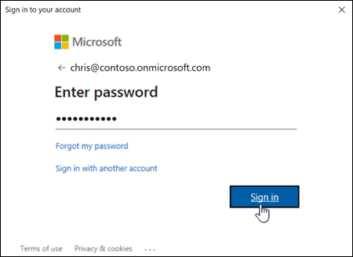
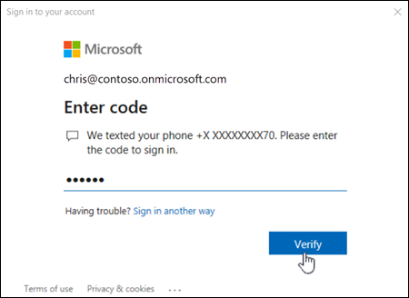

# Connect to Exchange Online PowerShell

The Exchange Online PowerShell V2 module (abbreviated as the EXO V2 module) uses modern authentication and works with multi-factor authentication (MFA) for connecting to all Exchange-related PowerShell environments in Microsoft 365: Exchange Online PowerShell, Security & Compliance PowerShell, and standalone Exchange Online Protection (EOP) PowerShell. For more information about the EXO V2 module, see [About the Exchange Online PowerShell V2 module](exchange-online-powershell-v2.md).

This article contains instructions for how to connect to Exchange Online PowerShell using the EXO V2 module with or without MFA.

To use the older, less secure remote PowerShell connection instructions that [will eventually be deprecated](https://techcommunity.microsoft.com/t5/exchange-team-blog/basic-authentication-and-exchange-online-july-update/ba-p/1530163), see [Basic auth - Connect to Exchange Online PowerShell](basic-auth-connect-to-exo-powershell.md).

To use the older Exchange Online Remote PowerShell Module to connect to Exchange Online PowerShell using MFA, see [V1 module - Connect to Exchange Online PowerShell using MFA](v1-module-mfa-connect-to-exo-powershell.md). Note that this older version of the module will eventually be retired.

## What do you need to know before you begin?

- The requirements for installing and using the EXO V2 module are described in [Install and maintain the EXO V2 module](exchange-online-powershell-v2.md#install-and-maintain-the-exo-v2-module).

  > [!NOTE]
  > The rest of the instructions in the article assume that you've already installed the module.
  >
  > If you're using version 2.0.6 of the module, you must use the _UseRPSSession_ switch in the **Connect-ExchangeOnline** command for access to all cmdlets. Otherwise, you'll only get the 250 REST API backed cmdlets. For more information, see [Updates for version 2.0.6](exchange-online-powershell-v2.md#updates-for-version-206).

- After you connect, the cmdlets and parameters that you have or don't have access to is controlled by role-based access control (RBAC). For more information, see [Permissions in Exchange Online](/exchange/permissions-exo/permissions-exo).

  To find the permissions that are required to run specific Exchange Online cmdlets, see [Find the permissions required to run any Exchange cmdlet](find-exchange-cmdlet-permissions.md).

- If your organization is on-premises Exchange, and you have Exchange Enterprise CAL with Services licenses for Exchange Online Protection (EOP), your EOP PowerShell connection instructions are the same as Exchange Online PowerShell as described in this article.

> [!TIP]
> Having problems? Ask in the [Exchange Online](https://go.microsoft.com/fwlink/p/?linkId=267542) forum.

## Connect to Exchange Online PowerShell using modern authentication with or without MFA

These connection instructions use modern authentication and work with or without multi-factor authentication (MFA).

For other sign in methods that are available in PowerShell 7, see the [PowerShell 7 log in experiences](#powershell-7-log-in-experiences) section later in this topic.

1. In a PowerShell window, load the EXO V2 module by running the following command:

   ```powershell
   Import-Module ExchangeOnlineManagement
   ```

   **Notes**:

   - If you've already [installed the EXO V2 module](exchange-online-powershell-v2.md#install-and-maintain-the-exo-v2-module), the previous command will work as written.
   - You might be able to skip this step and run **Connect-ExchangeOnline** without loading the module first.

2. The command that you need to run uses the following syntax:

   ```powershell
   Connect-ExchangeOnline -UserPrincipalName <UPN> [-ShowBanner:$false] [-ExchangeEnvironmentName <Value>] [-DelegatedOrganization <String>] [-PSSessionOption $ProxyOptions]
   ```

   - _\<UPN\>_ is your account in user principal name format (for example, `navin@contoso.com`).
   - When you use the _ExchangeEnvironmentName_ parameter, you don't need use the _ConnectionUri_ or _AzureADAuthorizationEndPointUrl_ parameters. For more information, see the parameter descriptions in [Connect-ExchangeOnline](/powershell/module/exchange/connect-exchangeonline).
   - The _DelegatedOrganization_ parameter specifies the customer organization that you want to manage as an authorized Microsoft Partner. For more information, see [Partners](/office365/servicedescriptions/office-365-platform-service-description/partners).
   - If you're behind a proxy server, run this command first: `$ProxyOptions = New-PSSessionOption -ProxyAccessType <Value>`, where \<Value\> is `IEConfig`, `WinHttpConfig`, or `AutoDetect`. Then, use the _PSSessionOption_ parameter with the value `$ProxyOptions`. For more information, see [New-PSSessionOption](/powershell/module/microsoft.powershell.core/new-pssessionoption).
   - Depending on the nature of your organization, you might be able to omit the _UserPrincipalName_ parameter in the next step. Instead, you enter the username and password or select stored credentials after you run the **Connect-ExchangeOnline** command. If it doesn't work, then you need to use the _UserPrincipalName_ parameter.
   - If you aren't using MFA, you should be able to use the _Credential_ parameter instead of the _UserPrincipalName_ parameter. First, run the command `$Credential = Get-Credential`, enter your username and password, and then use the variable name for the _Credential_ parameter (`-Credential $Credential`). If it doesn't work, then you need to use the _UserPrincipalName_ parameter.

   **This example connects to Exchange Online PowerShell in a Microsoft 365 or Microsoft 365 GCC organization**:

   ```powershell
   Connect-ExchangeOnline -UserPrincipalName navin@contoso.com
   ```

   **This example connects to Exchange Online PowerShell in an Office 365 Germany organization**:

   ```powershell
   Connect-ExchangeOnline -UserPrincipalName lukas@fabrikam.de -ExchangeEnvironmentName O365GermanyCloud
   ```

   **This example connects to Exchange Online PowerShell in a Microsoft GCC High organization**:

   ```powershell
   Connect-ExchangeOnline -UserPrincipalName laura@blueyonderairlines.us -ExchangeEnvironmentName O365USGovGCCHigh
   ```

   **This example connects to Exchange Online PowerShell in a Microsoft 365 DoD organization**:

   ```powershell
   Connect-ExchangeOnline -UserPrincipalName julia@adatum.mil -ExchangeEnvironmentName O365USGovDoD
   ```

   **This example connects to Exchange Online PowerShell to manage another tenant**:

   ```powershell
   Connect-ExchangeOnline -UserPrincipalName navin@contoso.com -DelegatedOrganization adatum.onmicrosoft.com
   ```

3. In the sign-in window that opens, enter your password, and then click **Sign in**.

   

4. **MFA only**: A verification code is generated and delivered based on the response option that's configured for your account (for example, a text message or the Microsoft Authenticator app on your device).

   In the verification window that opens, enter the verification code, and then click **Verify**.

   

For detailed syntax and parameter information, see [Connect-ExchangeOnline](/powershell/module/exchange/connect-exchangeonline).

> [!NOTE]
> Be sure to disconnect the remote PowerShell session when you're finished. If you close the PowerShell window without disconnecting the session, you could use up all the remote PowerShell sessions available to you, and you'll need to wait for the sessions to expire. To disconnect the remote PowerShell session, run the following command.

```powershell
Disconnect-ExchangeOnline
```

## PowerShell 7 log in experiences

This section describes the log in experiences that are available in version 2.0.4 or later of the EXO V2 module in PowerShell 7.

For more information about the operating systems that are supported by the EXO V2 module in PowerShell 7, see [Supported operating systems for the EXO V2 module](exchange-online-powershell-v2.md#supported-operating-systems-for-the-exo-v2-module).

For detailed syntax and parameter information, see [Connect-ExchangeOnline](/powershell/module/exchange/connect-exchangeonline).

### Interactive scripting using browser-based single sign-on

Browser-based single sign-on (SSO) is the default log in method in PowerShell 7. The **Connect-ExchangeOnline** command opens the Azure AD login page in the default browser. After you enter your credentials, older Exchange Online cmdlets and EXO V2 module cmdlets are available in the resulting PowerShell session.

If you use the _UserPrincipalName_ parameter in the command, the UPN value is used on the login page in the browser.

```powershell
Connect-ExchangeOnline -UserPrincipalName navin@contoso.onmicrosoft.com
```

### Device-based log in

Use device-based log in when no browser is available (and therefore, you can't see the login page):

```powershell
Connect-ExchangeOnline -Device
```

The command returns a URL and unique code that's tied to the session. You need to open the URL in a browser on any computer, and then enter the unique code. After you complete the login in the web browser, the session in the Powershell 7 window is authenticated via the regular Azure AD authentication flow, and the Exchange Online cmdlets are imported after few seconds.

### Inline credentials

You can enter your credentials directly in the PowerShell window without the need to go to the browser for SSO.

> [!NOTE]
> This method does not work with accounts that use multi-factor authentication.

This method is an improvement on the _Credential_ parameter, because you don't need to store the credentials locally in a script, and you can enter the credentials directly in an interactive PowerShell session.

  ```powershell
  Connect-ExchangeOnline -InlineCredential
  ```

## How do you know this worked?

The Exchange Online cmdlets are imported into your local PowerShell session and tracked by a progress bar. If you don't receive any errors, you connected successfully. A quick test is to run an Exchange Online PowerShell cmdlet, for example, **Get-Mailbox**, and see the results.

If you receive errors, check the following requirements:

- A common problem is an incorrect password. Run the three steps again and pay close attention to the username and password that you use.

- To help prevent denial-of-service (DoS) attacks, you're limited to five open remote PowerShell connections to Exchange Online.

- The account that you use to connect to must be enabled for remote PowerShell. For more information, see [Enable or disable access to Exchange Online PowerShell](disable-access-to-exchange-online-powershell.md).

- TCP port 80 traffic needs to be open between your local computer and Microsoft 365. It's probably open, but it's something to consider if your organization has a restrictive internet access policy.

- If your organization uses federated authentication, and your identity provider (IDP) and/or security token service (STS) isn't publicly available, you can't use a federated account to connect to Exchange Online PowerShell. Instead, create and use a non-federated account in Microsoft 365 to connect to Exchange Online PowerShell.
