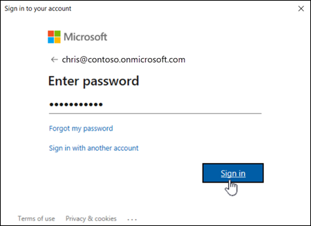
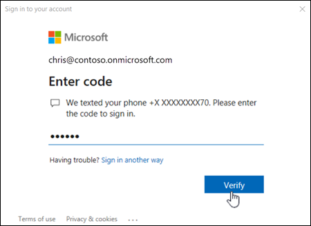

# Connect to Security & Compliance PowerShell

This article contains instructions for how to connect to Security & Compliance PowerShell using the Exchange Online PowerShell module with or without multi-factor authentication (MFA).

The Exchange Online PowerShell module uses modern authentication for connecting to all Exchange-related PowerShell environments in Microsoft 365: Exchange Online PowerShell, Security & Compliance PowerShell, and standalone Exchange Online Protection (EOP) PowerShell. For more information about the Exchange Online PowerShell module, see [About the Exchange Online PowerShell module](exchange-online-powershell-v2.md).

To connect to Security & Compliance PowerShell for automation, see [App-only authentication for unattended scripts](app-only-auth-powershell-v2.md).

## What do you need to know before you begin?

- The requirements for installing and using the module are described in [Install and maintain the Exchange Online PowerShell module](exchange-online-powershell-v2.md#install-and-maintain-the-exchange-online-powershell-module).

  > [!NOTE]
  > Remote PowerShell connections are deprecated in Security & Compliance PowerShell. For more information, see [Deprecation of Remote PowerShell (RPS) Protocol in Security & Compliance PowerShell](https://techcommunity.microsoft.com/t5/exchange-team-blog/deprecation-of-remote-powershell-rps-protocol-in-security-and/ba-p/3815432).
  >
  > REST API connections in the Exchange Online PowerShell V3 module require the PowerShellGet and PackageManagement modules. For more information, see [PowerShellGet for REST-based connections in Windows](exchange-online-powershell-v2.md#powershellget-for-rest-api-connections-in-windows).

- After you connect, the cmdlets and parameters that you have or don't have access to is controlled by role-based access control (RBAC). For more information, see [Permissions in the Microsoft Defender portal](/defender-office-365/mdo-portal-permissions) and [Permissions in the Microsoft Purview compliance portal](/purview/purview-compliance-portal-permissions).

## Step 1: Load the Exchange Online PowerShell module

> [!NOTE]
> If the module is already installed, you can typically skip this step and run **Connect-IPPSSession** without manually loading the module first.

After you've [installed the module](exchange-online-powershell-v2.md#install-and-maintain-the-exchange-online-powershell-module), open a PowerShell window and load the module by running the following command:

```powershell
Import-Module ExchangeOnlineManagement
```

## Step 2: Connect and authenticate

> [!NOTE]
> Connect commands will likely fail if the profile path of the account that you used to connect contains special PowerShell characters (for example, `$`). The workaround is to connect using a different account that doesn't have special characters in the profile path.

The command that you need to run uses the following syntax:

```powershell
Connect-IPPSSession -UserPrincipalName <UPN> [-ConnectionUri <URL>] [-AzureADAuthorizationEndpointUri <URL>] [-DelegatedOrganization <String>] [-PSSessionOption $ProxyOptions]
```

For detailed syntax and parameter information, see [Connect-IPPSSession](/powershell/module/exchange/connect-ippssession).

- _\<UPN\>_ is your account in user principal name format (for example, `navin@contoso.onmicrosoft.com`).

- The required _ConnectionUri_ and _AzureADAuthorizationEndpointUri_ values depend on the nature of your Microsoft 365 organization. Common values are described in the following list:
  - **Microsoft 365 or Microsoft 365 GCC**:
    - _ConnectionUri_: None. The required value `https://ps.compliance.protection.outlook.com/powershell-liveid/` is also the default value, so you don't need to use the _ConnectionUri_ parameter in Microsoft 365 or Microsoft 365 GCC environments.
    - _AzureADAuthorizationEndpointUri_: None. The required value `https://login.microsoftonline.com/common` is also the default value, so you don't need to use the _AzureADAuthorizationEndpointUri_ parameter in Microsoft 365 or Microsoft 365 GCC environments.
  - **Microsoft 365 GCC High**:
    - _ConnectionUri_: `https://ps.compliance.protection.office365.us/powershell-liveid/`
    - _AzureADAuthorizationEndpointUri_: `https://login.microsoftonline.us/common`
  - **Microsoft 365 DoD**:
    - _ConnectionUri_: `https://l5.ps.compliance.protection.office365.us/powershell-liveid/`
    - _AzureADAuthorizationEndpointUri_: `https://login.microsoftonline.us/common`
  - **Office 365 operated by 21Vianet**:
    - _ConnectionUri_: `https://ps.compliance.protection.partner.outlook.cn/powershell-liveid`
    - _AzureADAuthorizationEndpointUri_: `https://login.chinacloudapi.cn/common`

- If you're behind a proxy server, you can use the _PSSessionOption_ parameter in the connection command. First, run this command: `$ProxyOptions = New-PSSessionOption -ProxyAccessType <Value>`, where \<Value\> is `IEConfig`, `WinHttpConfig`, or `AutoDetect`. Then, use the value `$ProxyOptions` for the _PSSessionOption_ parameter. For more information, see [New-PSSessionOption](/powershell/module/microsoft.powershell.core/new-pssessionoption).

- Depending on the nature of your organization, you might be able to omit the _UserPrincipalName_ parameter in the next step. Instead, you enter the username and password or select stored credentials after you run the **Connect-IPPSSession** command. If it doesn't work, then you need to use the _UserPrincipalName_ parameter.

- If you aren't using MFA, you should be able to use the _Credential_ parameter instead of the _UserPrincipalName_ parameter. First, run the command `$Credential = Get-Credential`, enter your username and password, and then use the variable name for the _Credential_ parameter (`-Credential $Credential`). If it doesn't work, then you need to use the _UserPrincipalName_ parameter.

### Connect to Security & Compliance PowerShell with an interactive login prompt

1. The following examples work in Windows PowerShell 5.1 and PowerShell 7 for accounts with or without MFA:

   - **This example connects to Security & Compliance PowerShell in a Microsoft 365 or Microsoft 365 GCC organization**:

     ```powershell
     Connect-IPPSSession -UserPrincipalName navin@contoso.onmicrosoft.com
     ```

   - **This example connects to Security & Compliance PowerShell in a Microsoft GCC High organization**:

     ```powershell
     Connect-IPPSSession -UserPrincipalName chris@govt.us -ConnectionUri https://ps.compliance.protection.office365.us/powershell-liveid/ -AzureADAuthorizationEndpointUri https://login.microsoftonline.us/common
     ```

   - **This example connects to Security & Compliance PowerShell in a Microsoft 365 DoD organization**:

     ```powershell
     Connect-IPPSSession -UserPrincipalName michelle@govt.mil -ConnectionUri https://l5.ps.compliance.protection.office365.us/powershell-liveid/ -AzureADAuthorizationEndpointUri https://login.microsoftonline.us/common
     ```

   - **This example connects to Security & Compliance PowerShell in an Office 365 operated by 21Vianet organization**:

     ```powershell
     Connect-IPPSSession -UserPrincipalName li@fabrikam.cn -ConnectionUri https://ps.compliance.protection.partner.outlook.cn/powershell-liveid -AzureADAuthorizationEndpointUri https://login.chinacloudapi.cn/common
     ```

2. In the sign-in window that opens, enter your password, and then click **Sign in**.

   

   > [!NOTE]
   > In PowerShell 7, browser-based single sign-on (SSO) is used by default, so the sign in prompt opens in your default web browser instead of a standalone dialog.

3. **MFA only**: A verification code is generated and delivered based on the response option that's configured for your account (for example, a text message or the Microsoft Authenticator app on your device).

   In the verification window that opens, enter the verification code, and then click **Verify**.

   

### Connect to Security & Compliance PowerShell without a login prompt (unattended scripts)

For complete instructions, see [App-only authentication for unattended scripts in Exchange Online PowerShell and Security & Compliance PowerShell](app-only-auth-powershell-v2.md).

### Connect to Security & Compliance PowerShell in customer organizations

The procedures in this section require version 3.0.0 or later of the module.

In Security & Compliance PowerShell, you need to use the _AzureADAuthorizationEndpointUri_ with the _DelegatedOrganization_ parameter.

For more information, about partners and customer organizations, see the following topics:

- [What is the Cloud Solution Provider (CSP) program?](/partner-center/csp-overview).
- [Introduction to granular delegated admin privileges (GDAP)](/partner-center/gdap-introduction)

This example connects to customer organizations in the following scenarios:

- Connect to a customer organization using a CSP account.
- Connect to a customer organization using a GDAP.
- Connect to a customer organization as a guest user.

  ```powershell
  Connect-IPPSSession -UserPrincipalName navin@contoso.onmicrosoft.com -DelegatedOrganization adatum.onmicrosoft.com -AzureADAuthorizationEndpointUri https://login.microsoftonline.com/adatum.onmicrosoft.com
  ```

## Step 3: Disconnect when you're finished

Be sure to disconnect the session when you're finished. If you close the PowerShell window without disconnecting the session, you could use up all the sessions available to you, and you need to wait for the sessions to expire. To disconnect the session, run the following command:

```powershell
Disconnect-ExchangeOnline
```

To silently disconnect without a confirmation prompt, run the following command:

```powershell
Disconnect-ExchangeOnline -Confirm:$false
```

> [!NOTE]
> The disconnect command will likely fail if the profile path of the account that you used to connect contains special PowerShell characters (for example, `$`). The workaround is to connect using a different account that doesn't have special characters in the profile path.

## How do you know you've connected successfully?

The Security & Compliance PowerShell cmdlets are imported into your local Windows PowerShell session and tracked by a progress bar. If you don't receive any errors, you've connected successfully. A quick test is to run a Security & Compliance PowerShell cmdlet, for example, **Get-RetentionCompliancePolicy**, and see the results.

If you receive errors, check the following requirements:

- A common problem is an incorrect password. Run the three steps again and pay close attention to the username and password that you use.

- The account that you use to connect must be enabled for PowerShell. For more information, see [Enable or disable access to Exchange Online PowerShell](disable-access-to-exchange-online-powershell.md).

- TCP port 80 traffic needs to be open between your local computer and Microsoft 365. It's probably open, but it's something to consider if your organization has a restrictive internet access policy.

- REST-based connections to Security & Compliance PowerShell require the PowerShellGet module, and by dependency, the PackageManagement module, so you'll receive errors if you try to connect without having them installed. For example, you might see the following error:

  > The term 'Update-ModuleManifest' is not recognized as the name of a cmdlet, function, script file, or operable program. Check the spelling of the name, or if a path was included, verify that the path is correct and try again.

  For more information about the PowerShellGet and PackageManagement module requirements, see [PowerShellGet for REST-based connections in Windows](exchange-online-powershell-v2.md#powershellget-for-rest-api-connections-in-windows).

- You might fail to connect if your client IP address changes during the connection request. This can happen if your organization uses a source network address translation (SNAT) pool that contains multiple IP addresses. The connection error looks like this:

  > The request for the Windows Remote Shell with ShellId \<ID\> failed because the shell was not found on the server. Possible causes are: the specified ShellId is incorrect or the shell no longer exists on the server. Provide the correct ShellId or create a new shell and retry the operation.

  To fix the issue, use an SNAT pool that contains a single IP address, or force the use of a specific IP address for connections to the Security & Compliance PowerShell endpoint.
