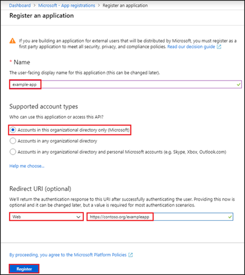
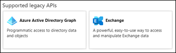
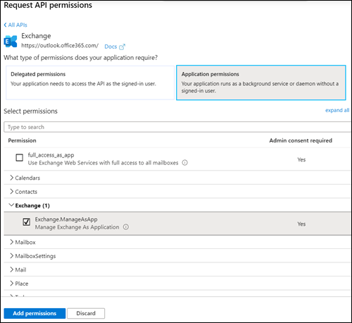
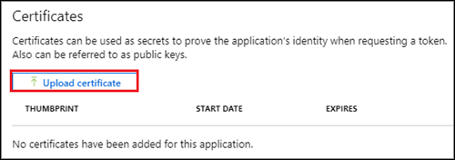
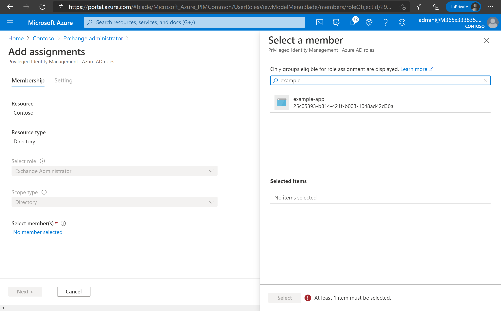

# App-only authentication in Exchange Online PowerShell (Preview)

> [!NOTE]
> The features described in this topic are in Preview, are not available to everyone, and are subject to change.

Auditing and reporting scenarios in Exchange Online often involve scripts that run unattended. In most cases, these unattended scripts access Exchange Online PowerShell using Basic authentication (a username and password). Even when the connection to Exchange Online PowerShell uses Modern authentication, the credentials are stored in a local file or a secret vault that's access at run-time.

Because storing user credentials locally is not a good security practice, we're releasing this feature to support authentication for app-only scenarios using AzureAD applications and self-signed certificates.

The following examples show how to use the Exchange Online PowerShell V2 module with app-only authentication

- Connect using a local certificate:

  ```powershell
  Connect-ExchangeOnline -CertificateFilePath "C:\Users\johndoe\Desktop\automation-cert.pfx" -AppID "alpha-beta-gamma-123456" -TenantID "contosoelectronics.onmicrosoft.com" -RoutingHintUPN "admin_exo@contosoelectronics.com"
  ```
In the above syntax, RoutingHintUPN takes the email of admin in the tenant for efficient routing of requests. Email ID of any admin in the organization works for app-only authentication scenarios.

- Connect using a certificate thumbprint:

  ```powershell
  Connect-ExchangeOnline -CertificateThumbPrint "012THISISADEMOTHUMBPRINT" -AppID "alpha-beta-gamma-123456" -TenantID "contosoelectronics.onmicrosoft.com" -RoutingHintUPN "admin_exo@contosoelectronics.com"
  ```

- Connect using an existing service principal and client-secret:

  1. Get an OAuth access token using Active Directory Authentication Library (ADAL) PowerShell.

  2. Use the access token and username to create a PSCredential object:

     ```powershell
     $AppCredential = New-Object System.Management.Automation.PSCredential(<UPN>,<Token>)
     ```

  3. Silently pass the PSCredential object to the EXO V2 module:

     ```powershell
     Connect-ExchangeOnline -Credential $AppCredential
     ```

## How does it work?

The EXO V2 module uses the Active Directory Authentication Library to fetch an app-only token using the application Id, tenant Id & certificate thumbprint. The application object provisioned inside Azure AD has a Directory Role assigned to it, which is returned in the access token. Exchange Online configures the session RBAC using the directory role information that's available in the token.

## Setup app-only authentication

An initial onboarding is required for authentication using application objects. Application and service principal are used interchangeably, but an application is like a class object while a service principal is like an instance of the class. You can learn more about this at [Application and service principal objects in Azure Active Directory](https://docs.microsoft.com/azure/active-directory/develop/app-objects-and-service-principals).

For a detailed visual flow bout creating applications in Azure AD, see <https://aka.ms/azuread-app>.

1. Register the application in Azure AD at <https://portal.azure.com>.

2. Assign permissions to access Exchange Online.

   An application object has the default permission `User.Read`. For the application object to access Exchange Online resources, it needs to have the Application permission `Exchange.ManageAsApp`.

3. Attach a certificate.

   - For app-only authentication in Azure AD,  you typically use a certificate to request access. Anyone who has the certificate and its private key can use the app, and the permissions granted to the app.

   - Create and configure a self-signed X.509 certificate, which will be used to authenticate your Application against Azure AD, while requesting the app-only access token.

   - This is similar to generating a password for user accounts. The certificate can be self-signed as well. See the [Appendix](#appendix) section later in this topic for instructions for generating certificates in PowerShell.

4. Assign RBAC roles

   The application needs to have the appropriate RBAC roles assigned. Because the apps are provisioned in Azure AD, you can use any of the built-in roles. The following roles are supported:

   - Global administrator
   - Compliance administrator
   - Security reader
   - Security administrator
   - Helpdesk administrator

## Roadmap

App-only authentication is currently supported for the legacy remote PowerShell cmdlets that you access by using the **Connect-ExchangeOnline** cmdlet in the EXO V2 module. It doesn't work with the 9 new EXO V2 cmdlets in the module (for example, Get-EXOMailbox), nor does it work with Office 365 Security & Compliance Center PowerShell cmdlets that you access by using the **ConnectIPPSSession** cmdlet.

The following list describes other items that we're working on:

- Support for passing the certificate as a byte array.
- Support for more built-in RBAC roles (Exchange Service Admin, Global Reader, Recipient Admin)
- Custom RBAC and mailbox scoping using Azure AD administrative units.
- Delegation support in app-only scenarios


## Appendix

## Step 1: Application registration in Azure AD

If you encounter problems, check the [required permssions](https://docs.microsoft.com/azure/active-directory/develop/howto-create-service-principal-portal#required-permissions) to verify that your account can create the identity.

1. Go to the Azure AD portal at <https://portal.azure.com/> and sign in with your Azure AD account.

2. Under **Manage Azure Active Directory**, click **View**.

3. Under **Manage**, select **App registrations** and then click **New registration**.

4. In the **Register an application** page that appears, configure the following settings:

   - **Name**: Enter something descriptive.

   - **Supported account types**: Select **Accounts in this organizational directory only (Microsoft)**.

   - **Redirect URI (optional)**: In the first box, select **Web**. In the second box, enter the URI where the access token is sent.

     Note that you can't create credentials for [native applications](https://docs.microsoft.com/azure/active-directory/manage-apps/application-proxy-configure-native-client-application), because you can't use that type for automated applications.

   

   When you're finished, click **Register**.

   Leave the page that appears open. You'll use it in the next step.

## Step 2: Assign API permissions to the application

You need to assign the API permission `Exchange.ManageAsApp` so the application can manage Exchange Online. API permissions are required because they have consent flow enabled, which allows auditing (directory roles don't have consent flow).

1. Select **API permissions**.

2. In the **Configured permissions** page that appears, click **Add permission**.

3. In the flyout that appears, select **Exchange**.

   

4. In the flyout that appears, click **Application permissions**.

5. In the **Select permissions** section that appears on the page, expand **Exchange** and select **Exchange.ManageAsApp**

   

   When you're finished, click **Add permissions**.

6. Back on the **Configured permissions** page that appears, click **Grant admin consent for <\tenant name\>**, and select **Yes** in the dialog that appears.

7. Close the flyout when you're finished.

## Step 3: Generate a self-signed certificate

Create a self-signed x.509 certificate using one of the following methods:

- Use the [Create-SelfSignedCertificate script](https://github.com/SharePoint/PnP-Partner-Pack/blob/master/scripts/Create-SelfSignedCertificate.ps1):

  ```powershell
  .\Create-SelfSignedCertificate.ps1 -CommonName "MyCompanyName" -StartDate 2020-04-01 -EndDate 2022-04-01
  ```

- Use the **makecert.exe** tool from the Windows SDK.

## Step 4: Attach the certificate to the Azure AD application

After you register the certificate with your application, you can use the public key (.pfx file) or the thumbprint for authentication.

1. In the Azure AD portal under **Manage Azure Active Directory**, click **View**.

2. Under **Manage**, select **App registrations**.

3. On the **App registrations** page that appears, select your application.

4. Under **Manage**, select **Certificates & secrets**.

5. On the **Certificates & secrets** page that opens, click **Upload certificate**.

   

6. In the dialog that appears, browse to the self-signed certificate you created in the previous Step, and then click **Add**.

## Step 5: Assign a role to the application

Azure AD has more than 50 admin roles available. For app-only authentication in Exchange Online, we currently support the previously mentioned roles:

- Global administrator
- Compliance administrator
- Security reader
- Security administrator
- Helpdesk administrator

1. In the Azure AD portal under **Manage Azure Active Directory**, click **View**.

2. Under **Manage**, select **Roles and administrators**.

3. Select one of the supported roles. On the **Assignments** page that appears, click **Add assignments**

4. In the **Add assignments** flyout that appears, find and select the application, and then click **Add**.

   
