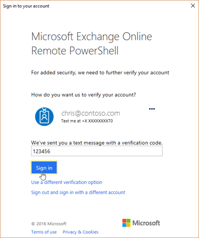

# Connect to Office 365 Security & Compliance Center PowerShell using multi-factor authentication

If your account uses multi-factor authentication (MFA) or federated authentication, you can't use the instructions at [Connect to Office 365 Security & Compliance Center PowerShell](connect-to-scc-powershell.md) to use remote PowerShell to connect to the Office 365 Security & Compliance Center. Instead, you need to install the Exchange Online Remote PowerShell Module, and use the **Connect-IPPSSession** cmdlet to connect to Security & Compliance Center PowerShell.

> [!NOTE]
> Delegated Access Permission (DAP) partners can't use the procedures in this topic to connect to their customer tenant organizations in Security & Compliance Center PowerShell. MFA and the Exchange Online Remote PowerShell Module don't work with delegated authentication. <br/><br/> The Exchange Online Remote PowerShell Module is not supported in PowerShell Core (macOS, Linux, or Windows Nano Server). As a workaround, you can install the module on a computer that's running a supported version of Windows (physical or virtual), and use remote desktop software to connect.

## What do you need to know before you begin?

- Estimated time to complete: 5 minutes

- You can use the following versions of Windows:

  - Windows 10

  - Windows 8.1

  - Windows Server 2019

  - Windows Server 2016

  - Windows Server 2012 or Windows Server 2012 R2

  - Windows 7 Service Pack 1 (SP1)<sup>*</sup>

  - Windows Server 2008 R2 SP1<sup>*</sup>

  <sup>\*</sup> This version of windows has reached end of support, and is now only supported when running in Azure virtual machines. To use this version of Windows, you need to install the Microsoft .NET Framework 4.5 or later and then an updated version of the Windows Management Framework: 3.0, 4.0, or 5.1 (only one). For more information, see [Installing the .NET Framework](https://go.microsoft.com/fwlink/p/?LinkId=257868), [Windows Management Framework 3.0](https://go.microsoft.com/fwlink/p/?LinkId=272757), [Windows Management Framework 4.0](https://go.microsoft.com/fwlink/p/?LinkId=391344), and [Windows Management Framework 5.1](https://aka.ms/wmf5download).

- WinRM needs to allow Basic authentication (it's enabled by default). We don't send the username and password combination, but the Basic authentication header is required to transport the session's OAuth token, since the client-side WinRM implementation has no support for OAuth.

  To verify that Basic authentication is enabled for WinRM, run this command **in a Command Prompt**:
  
  > [!NOTE]
  > You must temporarily enable WinRM to run the following commands. You can enable it by running "winrm quickconfig".

  ```dos
  winrm get winrm/config/client/auth
  ```

  If you don't see the value `Basic = true`, you need to run this command to enable Basic authentication for WinRM:

  ```dos
  winrm set winrm/config/client/auth @{Basic="true"}
  ```

  If Basic authentication for WinRM is disabled, you'll get this error when you try to connect:

  > The WinRM client cannot process the request. Basic authentication is currently disabled in the client configuration. Change the client configuration and try the request again.

## Install the Exchange Online Remote PowerShell Module

> [!NOTE]
> The Exchange Online Remote PowerShell Module is not supported in PowerShell Core (macOS, Linux, or Windows Nano Server). As a workaround, you can install the module on a computer that's running a supported version of Windows (physical or virtual), and use remote desktop software to connect. <br/><br/> If your installed version of the Exchange Online Remote PowerShell Module doesn't have the **Connect-IPPSSession** cmdlet, you need to install the latest version of the module.

You need to do the following steps in a browser that supports ClickOnce (for example, Internet Explorer or Edge):

**Note**: ClickOnce support is available in the Chromium-based version of Edge at <edge://flags/#edge-click-once>, and might not be enabled by default.

1. Open the Exchange admin center (EAC). For instructions, see [Exchange admin center in Exchange Online](https://docs.microsoft.com/exchange/exchange-admin-center).

2. In the EAC, go to **Hybrid** > **Setup** and click the appropriate **Configure** button to download the Exchange Online Remote PowerShell Module for multi-factor authentication.

   

3. In the **Application Install** window that opens, click **Install**.

   

## Connect to Security & Compliance Center PowerShell by using MFA or federated authentication

1. On your local computer, open the **Exchange Online Remote PowerShell Module** (**Microsoft Corporation** > **Microsoft Exchange Online Remote PowerShell Module**).

2. The command that you need to run uses the following syntax:

   ```PowerShell
   Connect-IPPSSession -UserPrincipalName <UPN> [-ConnectionUri <ConnectionUri> -AzureADAuthorizationEndPointUri <AzureADUri>]
   ```

   - _\<UPN\>_ is your Office 365 work or school account.

   - The _\<ConnectionUri\>_ and _\<AzureADUri\>_ values depend on the location of your Office 365 organization as described in the following table:

   |**Microsoft 365 offering**|**_ConnectionUri_ parameter value**|**_AzureADAuthorizationEndPointUri_ parameter value**|
   |:-----|:-----|:-----|
   |Microsoft 365|Not used |Not used|
   |Office 365 Germany|`https://ps.compliance.protection.outlook.de/PowerShell-LiveID`|`https://login.microsoftonline.de/common`|

   This example connects to Security & Compliance Center PowerShell in Microsoft 365 using the account chris@contoso.com.

   ```PowerShell
   Connect-IPPSSession -UserPrincipalName chris@contoso.com
   ```

   This example connects to Security & Compliance Center PowerShell in Office 365 Germany using the account lukas@fabrikam.com.

   ```PowerShell
   Connect-IPPSSession -UserPrincipalName lukas@fabrikam.com -ConnectionUri https://ps.compliance.protection.outlook.de/PowerShell-LiveID -AzureADAuthorizationEndPointUri https://login.microsoftonline.de/common
   ```

3. In the sign-in window that opens, enter your password, and then click **Sign in**.

   

   For MFA, a verification code is generated and delivered based on the verification response option that's configured for your account (for example, a text message or the Azure Authenticator app on your mobile phone).

4. **(MFA only)**: In the verification window that opens, enter the verification code, and then click **Sign in**.

   

5. **(Optional)**: If you want to connect to an Exchange Online PowerShell module session in the same window, you need to run

   ```PowerShell
   $EXOSession=New-ExoPSSession -UserPrincipalName <UPN> [-ConnectionUri <ConnectionUri> -AzureADAuthorizationEndPointUri <AzureADUri>]
   ```

   and then import the Exchange Online session into the current one using an specific prefix

   ```PowerShell
   Import-PSSession $EXOSession -Prefix EXO
   ```

## How do you know this worked?

After you sign in, the Security & Compliance Center cmdlets are imported into your Exchange Online Remote PowerShell Module session and tracked by a progress bar. If you don't receive any errors, you connected successfully. A quick test is to run an Security & Compliance Center cmdlet, for example, **Get-RetentionCompliancePolicy**, and see the results.

If you receive errors, check the following requirements:

- To help prevent denial-of-service (DoS) attacks, you're limited to three open remote PowerShell connections to the Security & Compliance Center.

- The account you use to connect to the Security & Compliance Center must be enabled for remote PowerShell. For more information, see [Enable or disable access to Exchange Online PowerShell](../../exchange-online/disable-access-to-exchange-online-powershell.md).

- TCP port 80 traffic needs to be open between your local computer and Office 365. It's probably open, but it's something to consider if your organization has a restrictive Internet access policy.

- The **Connect-IPPSSession** command (Step 2) might fail to connect if your client IP address changes during the connection request. This can happen if your organization uses a source network address translation (SNAT) pool that contains multiple IP addresses. The connection error looks like this:

  `The request for the Windows Remote Shell with ShellId <ID> failed because the shell was not found on the server. Possible causes are: the specified ShellId is incorrect or the shell no longer exists on the server. Provide the correct ShellId or create a new shell and retry the operation.`

  To fix the issue, use an SNAT pool that contains a single IP address, or force the use of a specific IP address for connections to the Security & Compliance PowerShell endpoint.
