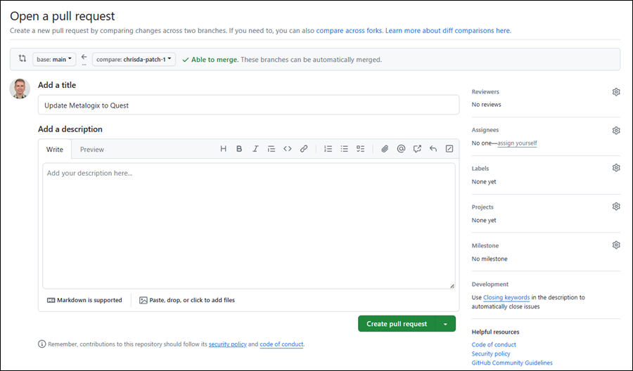

# Create new cmdlet topics

Cmdlet reference topics follow a very strict schema that's difficult to duplicate manually (remember, the topics on the web are also used for `Get-Help` from the command line). Instead, you use the open-source [platyPS](https://github.com/PowerShell/platyPS) tool to export the cmdlet and all of its properties to a markdown (.md) file from your PowerShell connection to the server or service.

## Step 1: Install platyPS

On Windows 10, Windows Server 2016, or later, run the following command in an elevated Windows PowerShell window (a Windows PowerShell window you open by selecting **Run as administrator**):

```powershell
Install-Module -Name platyPS -Scope CurrentUser
```

If you need to install platyPS on old versions of Windows (Windows 8.1 or Windows 2012 R2 or earlier), you need to install Windows PowerShell 5.1 before you can install platyPS. For instructions, see the [Install platyPS on older versions of Windows](#install-platyps-on-older-versions-of-windows) section at the end of this article.

If you need to install platyPS on really old versions of Windows (a server running a product that lacks support for WMF 5.1 or its requirements), see the [Install platyPS on really old versions of Windows](#install-platyps-on-older-versions-of-windows) section at the end of this article.

You need platyPS v0.14.0 or later (released April 2019). If you have an earlier version of platyPS installed, close all open Windows PowerShell windows where the platyPS module is currently loaded and then run `Update-Module platyPS` from a new elevated Windows PowerShell window. Or, run the command `Remove-Module platyPS` and then run `Install-Module -Name platyPS -Scope CurrentUser` to get the current version.

## Step 2: Connect to the PowerShell environment that has the cmdlet

You probably know how to do this already, but the available workloads and connection methods are:

- Microsoft Teams: [Install Microsoft Teams PowerShell](https://learn.microsoft.com/MicrosoftTeams/teams-powershell-install)

  > [!TIP]
  > Use `Upgrade-Module` and also `Uninstall-Module` depending on the module version you have installed.

- Exchange:
  - Exchange Online PowerShell: [Connect to Exchange Online PowerShell](https://learn.microsoft.com/powershell/exchange/connect-to-exchange-online-powershell)
  - Security & Compliance PowerShell: [Connect to Security & Compliance PowerShell](https://learn.microsoft.com/powershell/exchange/connect-to-scc-powershell)
  - Exchange Online Protection PowerShell: [Connect to Exchange Online Protection PowerShell](https://learn.microsoft.com/powershell/exchange/connect-to-exchange-online-protection-powershell)
  - Exchange Server PowerShell: [Connect to Exchange servers using remote PowerShell](https://learn.microsoft.com/powershell/exchange/connect-to-exchange-servers-using-remote-powershell)

> [!TIP]
> You might need to connect to the service in an elevated Windows PowerShell prompt (Teams and Exchange environments don't require an elevated Windows PowerShell prompt). The connection instructions article should plainly state this and other connection requirements.
>
> In Exchange and Security & Compliance PowerShell environments, the cmdlets that are available to you are controlled by role-based access control (RBAC). Most cmdlets and parameters are available to administrators by default, but some aren't (for example, the "Mailbox Search" and "Mailbox Import Export" roles.
>
> Remote PowerShell connections are deprecated in Exchange Online PowerShell and Security & Compliance PowerShell in favor of REST API connections. For more information, see the following articles:
>
> - [REST API connections in the EXO V3 module](https://learn.microsoft.com/powershell/exchange/exchange-online-powershell-v2#rest-api-connections-in-the-exo-v3-module).
> - [Deprecation of Remote PowerShell in Exchange Online](https://techcommunity.microsoft.com/t5/exchange-team-blog/deprecation-of-remote-powershell-in-exchange-online-re-enabling/ba-p/3779692).
> - [Deprecation of Remote PowerShell (RPS) Protocol in Security & Compliance PowerShell](https://techcommunity.microsoft.com/t5/exchange-team-blog/deprecation-of-remote-powershell-rps-protocol-in-security-and/ba-p/3815432).
>
> REST API connections in the Exchange Online PowerShell V3 module incorrectly identify many parameter **Type** values as `Object` or `Object[]`. The true parameter type values are visible in product code.

## Step 3: Load platyPS in the PowerShell environment

After you've connected in PowerShell to the server or service (either in a regular Windows PowerShell window or from a specific PowerShell console shortcut), you likely don't need to do anything to make the platyPS cmdlets available to you in your session. However, it you're having issues, run the following command to manually load the platyPS module:

```powershell
Import-Module platyPS
```

### Step 4: Find your module name

> [!NOTE]
> This step is required only if you're interested in creating cmdlet reference articles for **all** available cmdlets in the product (using the _Module_ parameter in `New-MarkdownHelp`). If you're going to manually specify the cmdlet names (using the _Command_ parameter in `New-MarkdownHelp`), you can skip this step.

platyPS needs the name of the loaded PowerShell module or snap-in that contains the cmdlets you want to update. To find the name, run the following command:

```powershell
Get-Module | Format-Table -Auto
```

The command returns all of the currently loaded modules or snap-ins, and the output will resemble this:

```powershell
ModuleType Version    Name                                ExportedCommands
---------- -------    ----                                ----------------
Manifest   3.1.0.0    Microsoft.PowerShell.Management     {Add-Computer, Add-Content, Checkpoint-Computer, Clear-Con...
Manifest   3.0.0.0    Microsoft.PowerShell.Security       {ConvertFrom-SecureString, ConvertTo-SecureString, Get-Acl...
Manifest   3.1.0.0    Microsoft.PowerShell.Utility        {Add-Member, Add-Type, Clear-Variable, Compare-Object...}
Binary     1.0.0.1    PackageManagement                   {Find-Package, Find-PackageProvider, Get-Package, Get-Pack...
Script     2.2.5      PowerShellGet                       {Find-Command, Find-DscResource, Find-Module, Find-RoleCap...
Script     2.0.0      PSReadline                          {Get-PSReadlineKeyHandler, Get-PSReadlineOption, Remove-PS...
Script     1.0        tmp_byivwzpq.e1k                    {Add-AvailabilityAddressSpace, Add-DistributionGroupMember...
```

or this:

```powershell
ModuleType Version     Name                                   ExportedCommands
---------- -------     ----                                   ----------------
Manifest   3.1.0.0    Microsoft.PowerShell.Management     {Add-Computer, Add-Content, Checkpoint-Computer, Clear-Content...}
Manifest   3.1.0.0    Microsoft.PowerShell.Utility        {Add-Member, Add-Type, Clear-Variable, Compare-Object...}
Script     4.2.0      MicrosoftTeams                      {Add-TeamChannelUser, Add-TeamUser, Connect-MicrosoftTeams, Disconnect-Microso...
Script     1.4.7      PackageManagement                   {Find-Package, Find-PackageProvider, Get-Package, Get-PackageProvider...}
Script     2.2.5      PowerShellGet                       {Find-Command, Find-DscResource, Find-Module, Find-RoleCapability...}
Script     2.0.0      PSReadline                          {Get-PSReadLineKeyHandler, Get-PSReadLineOption, Remove-PSReadLineKeyHandler, ...
```

For services that use remote connections (Exchange), the module name is a temporary value that changes every time you connect. In the example output, the module name is `tmp_byivwzpq.e1k`, but yours will be different.

For Microsoft Teams, the module name is always `MicrosoftTeams`.

Either way, take note of your module name. You'll need it in the next steps.

### Step 5: Run platyPS to generate topic files

You have two choices:

- **Dump _all_ cmdlets in the module/snap-in to files**: This is simple but could take a while, and you'll end up with dozens or possibly hundreds of cmdlet files you don't need. The basic syntax is:

  ```powershell
  New-MarkdownHelp -Module <ModuleName> -OutputFolder "<Path">
  ```

- **Dump specific cmdlets to files**: This is a bit harder to set up, but the output is much quicker, and there are no extra topic files created. The basic syntax is:
  
  ```powershell
  New-MarkdownHelp -Command <Cmdlet> -OutputFolder "<Path">
  ```

  or

  ```powershell
  $x = "<Cmdlet1>","<Cmdlet2>",..."<CmdletN>"

  New-MarkdownHelp -Command $x -OutputFolder "<Path">
  ```

**Notes**:

- \<ModuleName\> is the value you found in [Step 4](#step-4-find-your-module-name) (for example, `tmp_byivwzpq.e1k` or `MicrosoftTeams`).

- If the \<Path\> location doesn't exist, it's created for you.

#### Dump all cmdlets in the module/snap-in to files

This example creates topic files for all available cmdlets in the Microsoft Teams module `MicrosoftTeams` in the folder C:\My Docs\Teams.

```powershell
New-MarkdownHelp -Module MicrosoftTeams -OutputFolder "C:\My Docs\Teams"
```

#### Dump specific cmdlets to files

This example creates a topic file for the cmdlet named **Get-CoolFeature** in the Exchange Online PowerShell session in the folder "C:\My Docs\ExO".

```powershell
New-MarkdownHelp -Command "Get-CoolFeature" -OutputFolder "C:\My Docs\ExO"
```

This example creates topic files for the **Get-CoolFeature**, **New-CoolFeature**, **Remove-CoolFeature**, and **Set-CoolFeature** cmdlets from the Exchange Online session in the folder C:\My Docs\ExO.

The first command stores the cmdlet names in a variable. The second command uses that variable to identify the cmdlets and write the output files.

```powershell
$NewCmdlets = "Get-CoolFeature","New-CoolFeature","Remove-CoolFeature","Set-CoolFeature"

New-MarkdownHelp -Command $NewCmdlets -OutputFolder "C:\My Docs\ExO"
```

### Step 6: Document the new cmdlet

Now that you have topic files for the new cmdlets, you can actually document them. The topics are plain text UTF-8 files that are formatted using [markdown](https://guides.github.com/features/mastering-markdown/). Office writers use [Visual Studio Code](https://code.visualstudio.com/) to edit topic files, but you can use Notepad or your favorite text editor.

These are the basic topic elements that require your attention, regardless of the product or service:

- **The SYNOPSIS section**: Be brief. Use the DESCRIPTION section for less critical information.
- **The DESCRIPTION section**: More details (for example, permissions required to run the cmdlet)
- **One or more code examples in the EXAMPLES section**: The code block (only one code block) goes first, then the description text.
- **A description for every parameter in each parameter section**

We highly encourage you to plagiarize existing content and formatting from other cmdlet topics in the product or service. Many parameters are common across a wide variety of cmdlets.

#### Metadata in the new cmdlet

Less obvious but still important information that's often manually required in every topic is **cmdlet metadata** at the top of the topic and **parameter metadata** in every parameter section.

##### Cmdlet metadata

Every cmdlet reference topic needs (at a minimum) the following properties in the metadata field at the top of the reference article:

```text
external help file: Microsoft.OutlookApps.StaffHub.PowershellCmdlets.dll-Help.xml
Module Name: Microsoft.OutlookApps.StaffHub.PowershellCmdlets
online version: https://learn.microsoft.com/powershell/module/skype/add-cssladelegates
applicable: Skype for Business Server 2015
title: Add-CsSlaDelegates
author:
ms.author:
ms.reviewer:
manager:
schema: 2.0.0
```

- **external help file**: Defines which MAML/XML file the cmdlet help topic goes in for `Get-Help` at the command line. This value very product-specific, and the location is specified somewhere in product code. Some products (Skype) use only one XML file that's well-known and the same for all cmdlets; others (Exchange) use multiple XML files. See other topics for available values. Don't guess; a wrong value here will affect the availability of the help topic at the command line.

- **Module Name**: In Exchange topics, this value is `ExchangeOnlineManagement` for those few cmdlets that are [baked into the Exchange Online PowerShell V3 module itself](https://learn.microsoft.com/powershell/exchange/exchange-online-powershell-v2#cmdlets-in-the-exchange-online-powershell-module). For other products, this is the module name of the product.

- **online version**: This is the URL of the topic. This URL value is what makes the `Get-Help <Cmdlet> -Online` command work, so it's very important.

- **applicable**: You need to add this attribute and value yourself. Notice that it starts with a lowercase 'a'. See other topics for available values. Don't invent new values here. The value **must** come from the list of predefined values.

- **title**: You need to add this attribute and value yourself. This is simply the name of the cmdlet.

- **schema**: This value is always 2.0.0 in all products.

- **author**: The GitHub alias of the person that owns this topic. Usually the PM or sometimes a dev that owns the cmdlet.

- **ms.author**: The Microsoft alias of the same author.

- **ms.reviewer**: The Microsoft alias of someone that can approve any technical changes (if different than the author).

- **manager**: The Microsoft alias of a manager for the team that owns the cmdlet. This is useful if the person that owns the cmdlet leaves the company. The manager will be reached to in order to find the new author.

##### Parameter metadata

Here's an example of the parameter metadata that's present in every parameter section:

```text
Type: String
Parameter Sets: (All)
Aliases:
Applicable: Microsoft StaffHub

Required: False
Position: 1
Default value: None
Accept pipeline input: False
Accept wildcard characters: False
```

Most of the attributes and values are generated automatically by platyPS. The ones that require manual intervention are:

- **Type**: In any environment, the values `Object` or `Object[]` are wrong. As previously described, REST API connections in the Exchange Online PowerShell V3 module incorrectly identify many parameter **Type** values as `Object` or `Object[]`. Other values like `String`, `Boolean`, and `DateTime` are detected correctly. The true parameter type values are visible in product code.

- **Applicable**: You need to add this attribute and value yourself. Notice the capital 'A'. See other topics for available values (same available values as the **applicable** attribute at the top of the topic). Don't invent new values here. The value **must** come from the list of predefined values.

- **Default value** and **Accept wildcard characters**: These attributes are present, but the values are never truthfully populated by platyPS **or any other PowerShell utility** (they're always None and False, respectively). You can correct the values if you think it's important. Otherwise, leave them as is.

### Step 8: Add the new cmdlet topic files to the repository

When you're done editing the topics, upload them to GitHub. Note that you need to fork the repo, upload your files to your fork, and then submit a Pull Request.

1. Go to the correct location in the appropriate GitHub repository:

   - Exchange: <https://github.com/MicrosoftDocs/office-docs-powershell/tree/master/exchange/exchange-ps/exchange>
   - Office Web Apps: <https://github.com/MicrosoftDocs/office-docs-powershell/tree/master/officewebapps/officewebapps-ps/officewebapps>
   - Skype: <https://github.com/MicrosoftDocs/office-docs-powershell/tree/master/skype/skype-ps/skype>
   - StaffHub: <https://github.com/MicrosoftDocs/office-docs-powershell/tree/master/staffhub/staffhub-ps/staffhub>
   - Teams: <https://github.com/MicrosoftDocs/office-docs-powershell/tree/master/teams/teams-ps/teams>
   - Whiteboard: <https://github.com/MicrosoftDocs/office-docs-powershell/tree/master/whiteboard/whiteboard-ps/whiteboard>
   - SharePoint / OneDrive: <https://github.com/MicrosoftDocs/OfficeDocs-SharePoint-PowerShell>

2. Select **Add file** \> **Upload files**

   

3. After you're done adding files, go to the **Propose changes** section at the bottom of the page:

   - A brief title is required. By default, the title is the name of the file, but you can change it.
   - Optionally, you can enter more details in the **Add an optional extended description** box. You should @ include the GitHub alias of someone who can review and approve your upload.

   When you're ready, click the green **Propose changes** button.

   

4. On the **Open a pull request** page that appears, click the green **Create pull request** button.

   

5. That's it. There's nothing more for you to do.

### Step 9: Add the new cmdlets to the TOC file

Add the cmdlet to Table of Contents (TOC) file in the GitHub repo. TOC file is the name of the module. For example:

- Exchange <https://github.com/MicrosoftDocs/office-docs-powershell/blob/master/exchange/exchange-ps/exchange/exchange.md>

  > [!TIP]
  > Exchange also uses pseudo folders to organize cmdlets. You need to add any new cmdlets in the proper location in the file: <https://github.com/MicrosoftDocs/office-docs-powershell/blob/master/exchange/mapping/serviceMapping.json>.

- Office Web Apps: <https://github.com/MicrosoftDocs/office-docs-powershell/blob/master/officewebapps/officewebapps-ps/officewebapps/officewebapps.md>

- Skype: <https://github.com/MicrosoftDocs/office-docs-powershell/blob/master/skype/skype-ps/skype/skype.md>

- StaffHub: <https://github.com/MicrosoftDocs/office-docs-powershell/blob/master/staffhub/staffhub-ps/staffhub/staffhub.md>

- Teams: <https://github.com/MicrosoftDocs/office-docs-powershell/blob/master/teams/teams-ps/teams/teams.md>

- Whiteboard: <https://github.com/MicrosoftDocs/office-docs-powershell/blob/master/whiteboard/whiteboard-ps/whiteboard/whiteboard.md>

In the TOC file, you can fill in a description or remove the template text line. However, if you leave the template text line make sure it's in _exactly_ the right format so it won't render as a template text.

The steps to edit and publish the TOC file are identical to modifying any existing topic. The instructions are [here](https://github.com/MicrosoftDocs/office-docs-powershell/blob/main/README.md) (you're starting at Step 4).

## Appendix

### Reference

- <https://learn.microsoft.com/powershell/module/powershellget/install-module>

- <https://learn.microsoft.com/powershell/module/powershellget/update-module>

- <https://github.com/PowerShell/platyPS>

- <https://learn.microsoft.com/powershell/module/microsoft.powershell.core/get-module>

### Install platyPS on older versions of Windows

> [!NOTE]
> The procedures in this section aren't required in current versions of Windows (Windows 10, Windows Server 2016, or later) or other versions of Windows where the WMF 5.1 is already installed.

The following older versions of Windows don't automatically include Windows PowerShell 5.1, but they support it. You need to download and install the Windows Management Framework (WMF) 5.1 from <https://aka.ms/wmf5download> on these versions of Windows:

- Windows 8.1
- Windows Server 2012 or Windows Server 2012 R2
- Windows 7 Service Pack 1 (SP1)<sup>1,</sup><sup>2</sup>
- Windows Server 2008 R2 SP1<sup>1,</sup><sup>2</sup>

- <sup>1</sup> This version of Windows has reached its end of support, and is now supported only in Azure virtual machines.
- <sup>2</sup> Windows PowerShell 5.1 on this version of Windows requires the .NET Framework 4.5 or later. For more information, see [Windows Management Framework 5.1](https://aka.ms/wmf5download).

### Install platyPS on really old versions of Windows (WMF 3.0 or 4.0)

> [!NOTE]
> The procedures in this section aren't required in current versions of Windows (Windows 10, Windows Server 2016, or later) or other versions of Windows where the WMF 5.1 is already installed.

To install platyPS for use with products that require PowerShell 3.0 or 4.0 and don't initially have access to the **Install-Module** cmdlet, do the steps in this section.

1. Download and install PowerShellGet. The steps are described in [Installing PowerShellGet](https://learn.microsoft.com/powershell/scripting/gallery/installing-psget) and are summarized here as follows:

   a. **PowerShell 3.0 only**: On the target computer, run the following command in an elevated Windows PowerShell window:

      ```powershell
      [Environment]::SetEnvironmentVariable(
        'PSModulePath',
        ((([Environment]::GetEnvironmentVariable('PSModulePath', 'Machine') -split ';') + "$env:ProgramFiles\WindowsPowerShell\Modules") -join ';'), 'Machine'
      )
      ```

   b. On another computer running PowerShell 5.1 or later where PowerShellGet is installed and working, open an elevated Windows PowerShell window and run the following command:

      ```powershell
      Save-Module PowerShellGet -Path "<ExistingPath>"
      ```

      Where \<ExistingPath\> is **an existing** folder/path that's easy to find (for example, `C:\Temp\PSG`).

   c. The command will create two new folders in the target path:

      - `PackageManagement\<VersionFolder>\<FilesAndFolders>`
      - `PowerShellGet\<VersionFolder>\<FilesAndFolders>`

   d. Move the \<FilesAndFolders\> out from under the \<VersionFolder\> and delete the now empty \<VersionFolder\> so the contents of the folders look like this:

      - `PackageManagement\<FilesAndFolders>`
      - `PowerShellGet\<FilesAndFolders>`

2. On the target computer, delete the following folders or move them to a remote location for safekeeping:

   - `C:\Program Files\WindowsPowerShell\Modules\PackageManagement`
   - `C:\Program Files\WindowsPowerShell\Modules\PowerShellGet`

3. Copy the `PackageManagement` and `PowerShellGet` folders that you downloaded and fixed in Step 1b to `C:\Program Files\WindowsPowerShell\Modules` on the target computer.

   You should have the following folders on the target computer:

   - `C:\Program Files\WindowsPowerShell\Modules\PackageManagement`
   - `C:\Program Files\WindowsPowerShell\Modules\PowerShellGet`

4. From an elevated Windows PowerShell window on the target computer, run the following command:

   ```powershell
   Set-PSRepository -Name PSGallery -InstallationPolicy Trusted
   ```

5. Now you can finally install platyPS on the target computer by running the usual command:

   ```powershell
   Install-Module -Name platyPS -Scope CurrentUser
   ```
