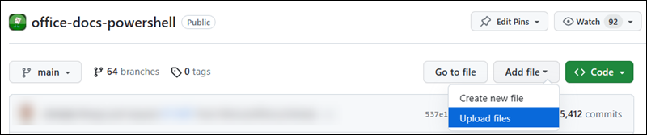

# Create new cmdlet topics
Cmdlet reference topics follow a very strict schema that's difficult to duplicate manually (remember, the topics on the web are also used for `Get-Help` from the command line). Instead, you use the open-source [platyPS](https://github.com/PowerShell/platyPS) tool to export the cmdlet and all of its properties to a markdown (.md) file from your PowerShell connection to the server or service.

## Step 1: Install platyPS
If you're running Windows 10 or Windows Server 2016, you already have Windows PowerShell 5.x installed, so installing platyPS is easy.

Run the following command in an elevated Windows PowerShell window (a Windows PowerShell window you open by selecting **Run as administrator**):

```
Install-Module -Name platyPS -Scope CurrentUser
```

**Notes**:

- You need platyPS v0.10.2 or later, which was released on or about June 18, 2018. If you have an earlier version of platyPS installed, run the command `Uninstall-Module platyPS` from an elevated Windows PowerShell window, and then reinstall platyPS.

- Windows PowerShell 5.x is part of the Windows Management Framework (WMF) and can be [downloaded](http://aka.ms/wmf5download) and installed on these versions of Windows:
  
  - Windows Server 2012 R2

  - Windows Server 2012

  - Windows Server 2008 R2 SP1

  - Windows 8.1

  - Windows 7

  If you need to install platyPS on an older version of Windows (for example, a server running a product that lacks support for WMF 5.x or its requirements), see the Install platyPS on older versions of Windows section at the end of this topic.

## Step 2: Connect to the PowerShell environment that has the cmdlet
You probably know how to do this already, but the available workloads and connection methods are:

- Skype for Business Online: [https://technet.microsoft.com/library/dn362795.aspx](https://technet.microsoft.com/library/dn362795.aspx)

- Microsoft Teams: [https://blogs.technet.microsoft.com/skypehybridguy/2017/11/07/microsoft-teams-powershell-support/](https://blogs.technet.microsoft.com/skypehybridguy/2017/11/07/microsoft-teams-powershell-support/)

  **HINT:** Use `Upgrade-Module` and also `Uninstall-Module` depending on the module version you have installed.

- SharePoint Online: [Getting started with SharePoint Online Management Shell](https://docs.microsoft.com/powershell/sharepoint/sharepoint-online/connect-sharepoint-online)

- Exchange:

  - Exchange Online: [Connect to Exchange Online PowerShell](https://docs.microsoft.com/powershell/exchange/exchange-online/connect-to-exchange-online-powershell/connect-to-exchange-online-powershell)

  - Office 365 Security & Compliance Center Power: [Connect to Office 365 Security & Compliance Center PowerShell](https://docs.microsoft.com/powershell/exchange/office-365-scc/connect-to-scc-powershell/connect-to-scc-powershell)

  - Exchange Online Protection: [Connect to Exchange Online Protection PowerShell](https://docs.microsoft.com/powershell/exchange/exchange-eop/connect-to-exchange-online-protection-powershell)

  - Exchange Server: [Connect to Exchange servers using remote PowerShell](https://docs.microsoft.com/powershell/exchange/exchange-server/connect-to-exchange-servers-using-remote-powershell)

**Notes**:

- You might need to connect to the service in an elevated Windows PowerShell prompt (required for Skype for Business Online and Teams, but not Exchange). The connection instructions topic should contain this and other connection requirements.

- In Exchange environments, the cmdlets available to you are controlled by role-based access control (RBAC). Most cmdlets and parameters are avaialble to administrators by default, but some aren't (for example, the Mailbox Search and Mailbox Import Export roles).

## Step 3: Load platyPS in the PowerShell environment
After you've connected in PowerShell to the server or service \(either in a regular Windows PowerShell window or from a specific PowerShell console shortcut\), run the following command to make the platyPS cmdlets available in your session:

```
Import-Module platyPS
```

### Step 4: Find your module name
platyPS needs the name of the loaded PowerShell module or snap-in that contains the cmdlets you want to update. To find the name, run the following command:

```
Get-Module | Format-Table -Auto
```

The command returns all of the currently loaded modules or snap-ins, and the output will resemble this:

```
ModuleType Version    Name                                ExportedCommands
---------- -------    ----                                ----------------
Manifest   3.1.0.0    Microsoft.PowerShell.Management     {Add-Computer, Add-Content, Checkpoint-Computer, Clear-Con...
Manifest   3.0.0.0    Microsoft.PowerShell.Security       {ConvertFrom-SecureString, ConvertTo-SecureString, Get-Acl...
Manifest   3.1.0.0    Microsoft.PowerShell.Utility        {Add-Member, Add-Type, Clear-Variable, Compare-Object...}
Binary     1.0.0.1    PackageManagement                   {Find-Package, Find-PackageProvider, Get-Package, Get-Pack...
Script     0.10.0     platyps                             {Get-HelpPreview, Get-MarkdownMetadata, Merge-MarkdownHelp...
Script     1.0.0.1    PowerShellGet                       {Find-Command, Find-DscResource, Find-Module, Find-RoleCap...
Script     1.2        PSReadline                          {Get-PSReadlineKeyHandler, Get-PSReadlineOption, Remove-PS...
Script     1.0        tmp_byivwzpq.e1k                    {Add-AvailabilityAddressSpace, Add-DistributionGroupMember...
```

or this:

```
ModuleType Version     Name                                   ExportedCommands
---------- -------     ----                                   ----------------
Binary     16.0.7723.0 Microsoft.Online.SharePoint.PowerShell {Add-SPOGeoAdministrator, Add-SPOHubSiteAssociation, A...
Manifest   3.1.0.0     Microsoft.PowerShell.Management        {Add-Computer, Add-Content, Checkpoint-Computer, Clear...
Manifest   3.0.0.0     Microsoft.PowerShell.Security          {ConvertFrom-SecureString, ConvertTo-SecureString, Get...
Manifest   3.1.0.0     Microsoft.PowerShell.Utility           {Add-Member, Add-Type, Clear-Variable, Compare-Object...}
Script     1.2         PSReadline                             {Get-PSReadlineKeyHandler, Get-PSReadlineOption, Remov...
```

For services that use remote PowerShell (Skype for Business Online, Teams, Exchange Online, Security & Compliance Center, and Exchange Online Protection), the module name is a temporary value that changes every time you connect. In this output, the module name is `tmp_byivwzpq.e1k`.

For SharePoint Online in the SharePoint Online Management Shell, the module name is always `Microsoft.Online.SharePoint.PowerShell`.

Either way, take note of your module name. You'll need it in the next steps.

### Step 5: Verify your your PSSession variable name
**Note**: This step is required in Exchange, Skype for Business Online and other products that use remote PowerShell in their connection instructions (one or more **xxx-xxxSession** commands are present). **If you're using SharePoint, SharePoint Online or another product that doesn't use remote PowerShell, you can skip this step**.

Check the details of your connection instructions, but your session information is stored in a variable. For example, in the Exchange connection instructions, the variable is `$Session`. You'll use this variable name in later steps.

If you connected via a custom script or your remote PowerShell session variable isn't apparent, do the following steps:

1. Run the following command to find your session:
 
    ```
    Get-PSSession | Format-Table -Auto
    ```

    The output will resemble this:

    ```
    Id Name   ComputerName          ComputerType  State  ConfigurationName  Availability
    -- ----   ------------          ------------  -----  -----------------  ------------
     1 WinRM1 outlook.office365.com RemoteMachine Opened Microsoft.Exchange    Available
    ```
    
    or this:
    
    ```
    Id Name   ComputerName            ComputerType  State  ConfigurationName    Availability
    -- ----   ------------            ------------  -----  -----------------    ------------
     1 WinRM1 admin2a.online.lync.com RemoteMachine Opened Microsoft.PowerShell    Available
    ```
 
    **Note**: If you see multiple sessions, either start over in a new PowerShell window or confirm the session you want to use. The first connection is 1, the second is 2, and so on.

2. Use the following syntax to store the session in a variable:
 
    ```
    $<VariableName> = Get-PSSession <SessionID>
    ```
  
    For example, using the sample output in the previous step:

    ```
    $x = Get-PSSession 1
    ```

    The variable name you choose doesn't matter, but you'll use it in later steps.

### Step 6: Run platyPS to generate topic files
You have two choices:

- **Dump _all_ cmdlets in the module/snap-in to files**: This is simple, but could take a while, and you'll end up with dozens or possibly hundreds of cmdlets files you don't need. The basic sytax is:
  ```
  New-MarkdownHelp -Module <ModuleName> -OutputFolder "<Path"> [-Session <PSSessionVariableName>]
  ``` 

- **Dump specific cmdlets to files**: This is a bit harder to setup, but the output is much quicker, and there are no extra topic files created. The basic syntax is:
  
  ```
  New-MarkdownHelp -Command <Cmdlet> -OutputFolder "<Path"> [-Session <PSSessionVariableName>]
  ``` 

  or 
    
  ```
  $x = "<Cmdlet1>","<Cmdlet2>",..."<CmdletN>"
  New-MarkdownHelp -Command $x -OutputFolder "<Path"> [-Session <PSSessionVariableName>]
  ``` 

**Notes**:

- \<ModuleName\> is the value you found in [Step 4](#step-4-find-your-module-name) (for example, `tmp_byivwzpq.e1k` or `Microsoft.Online.SharePoint.PowerShell`).

- \<PSSessionVariableName\> is the remote PowerShell session variable from [Step 5](#step-5-verify-your-your-pssession-variable-name) (for example, `$Session`) *and is required only if the connection instructions used remote PowerShell (one or more **xxx-xxxSession** commands)*.

   Failure to use the _Session_ parameter and value in remote PowerShell environments leads to weird results: multiple syntax blocks/parameter sets aren't recogonized and are collapsed into one big block, the Type value is Object for all parameters, the Required value is False for all parameters, etc.

- If the <Path> location doesn't exist, it's created for you.

#### Dump all cmdlets in the module/snap-in to files
This example creates topic files for all available cmdlets in the Skype for Business Online PowerShell session where the module is `tmp_byivwzpq.e1k` and the session variable is `$Session` in the folder C:\My Docs\SfBO.

```
New-MarkdownHelp -Module tmp_byivwzpq.e1k -OutputFolder "C:\My Docs\SfBO" -Session $Session
```

#### Dump specific cmdlets to files
This example create a topic file for the cmdlet named Get-CoolFeature in the Exchange Online PowerShell session where the session variable is `$Session` in the folder "C:\My Docs\ExO".

```
New-MarkdownHelp -Command "Get-CoolFeature" -OutputFolder "C:\My Docs\ExO" -Session $Session
```

This example creates topic files for the cmdlets Get-CoolFeature, New-CoolFeature, Remove-CoolFeature, and Set-CoolFeature from the Exchange Online session where the session variable is `$Session` in the folder C:\My Docs\ExO. 

The first command stores the cmdlet names in a variable. The second command uses that variable to identify the cmdlets and write the output files.

```
$NewCmdlets = "Get-CoolFeature","New-CoolFeature","Remove-CoolFeature","Set-CoolFeature"
```

```
New-MarkdownHelp -Command $NewCmdlets -OutputFolder "C:\My Docs\ExO" -Session $Session
```

### Step 7: Document the new cmdlet
Now that you have topic files for the new cmdets, you can actually document them. The topics are plain text UTF-8 files that are formatted using [markdown](https://guides.github.com/features/mastering-markdown/). Office writers use [Visual Studio Code](https://code.visualstudio.com/) to edit topic files, but you can use Notepad or your favorite text editor.

These are the basic topic elements that require your attention, regardless of the product or service:

- **The SYNOPSIS section**: Be brief. Use the DESCRIPTION section for less critical information.

- **The DESCRIPTION section**: More details (for example, permissions required to run the cmdlet)

- **One or more code examples in the EXAMPLES section**: The code block (only one code block) goes first, then the description text.

- **A description for every parameter in each parameter section**

We highly enourage you to plagerize existing content and formatting from other cmdlet topics in the product or service. Many parameters are common across a wide variety of cmdlets.

#### Metadata in the new cmdlet
Less obvious but still important information that's often manually required in every topic is **cmdlet metadata** at the top of the topic and **parameter metadata** in every parameter section.

##### Cmdlet metadata
Here's an example of the cmdlet metadata that's required at the top of every topic:

    ```
    external help file: Microsoft.OutlookApps.StaffHub.PowershellCmdlets.dll-Help.xml
    Module Name: Microsoft.OutlookApps.StaffHub.PowershellCmdlets
    online version:
    applicable: Microsoft StaffHub
    title: Get-StaffHubUsersForTenant
    schema: 2.0.0
    ```

- **external help file**: Defines which MAML/XML file the cmdlet help topic goes in for `Get-Help` at the command line. This value very product-specific. Some products (Skype) use only one XML file that's well-known and the same for all cmdlets; others (Exchange, SharePoint) use multiple XML files. See other topics for available values.

- **Module Name**: Not used in Exchange topics (remove it). For other products, this is the module name of the product.

- **online version**: Empty, but needs to be present.

- **applicable**: You need to add this attribute and value yourself. Notice that it starts with a lowercase 'a'. See other topics for available values. Don't invent new values here. The value **must** come from the list of predefined values.

- **title**: You need to add this attribute and value yourself. This is simply the name of the cmdlet.

- **schema**: This value is always 2.0.0 in all products.

##### Parameter metadata
Here's an example of the parameter metadata that's present in every parameter section:

    ```
    Type: String
    Parameter Sets: (All)
    Aliases:
    Applicable: Microsoft StaffHub
    Required: False
    Position: 1
    Default value: None
    Accept pipeline input: False
    Accept wildcard characters: False
    ```

Most of the atrributes and values are generated automatically by platyPS. The ones that require manual intervention are:

- **Applicable**: You need to add this attribute and value yourself. Notice the capital 'A'. See other topics for available values (same available values as the **applicable** attribute at the top of the topic). Don't invent new values here. The value **must** come from the list of predefined values.

- **Default value** and **Accept wildcard characters**: These attributes are present, but the values are never truthfully populated by platyPS (they're always None and False, respectively). You can correct the values if you think it's important. Otherwise, leave them as is.

### Step 8: Add the new cmdlet topic files to the repository
When you're done editing the topics, upload them to GitHub.

1. Go to the correct location in the appropriate GiHub repository:

    - Exchange: [https://github.com/MicrosoftDocs/office-docs-powershell/tree/master/exchange/exchange-ps/exchange](https://github.com/MicrosoftDocs/office-docs-powershell/tree/master/exchange/exchange-ps/exchange)

       For Exchage, you also need to go one level deepter into an appropriate subfolder. Choose wisely based on the surrounding cmdlet topics. Don't create new folders.

    - Office Web Apps: [https://github.com/MicrosoftDocs/office-docs-powershell/tree/master/officewebapps/officewebapps-ps/officewebapps](https://github.com/MicrosoftDocs/office-docs-powershell/tree/master/officewebapps/officewebapps-ps/officewebapps)

    - SharePoint Online: [https://github.com/MicrosoftDocs/office-docs-powershell/tree/master/sharepoint/sharepoint-ps/sharepoint-online](https://github.com/MicrosoftDocs/office-docs-powershell/tree/master/sharepoint/sharepoint-ps/sharepoint-online)

    - SharePoint PNP: [https://github.com/MicrosoftDocs/office-docs-powershell/tree/master/sharepoint/sharepoint-ps/sharepoint-pnp](https://github.com/MicrosoftDocs/office-docs-powershell/tree/master/sharepoint/sharepoint-ps/sharepoint-pnp)

    - SharePoint Server: [https://github.com/MicrosoftDocs/office-docs-powershell/tree/master/sharepoint/sharepoint-ps/sharepoint-server](https://github.com/MicrosoftDocs/office-docs-powershell/tree/master/sharepoint/sharepoint-ps/sharepoint-server)

    - Skype: [https://github.com/MicrosoftDocs/office-docs-powershell/tree/master/skype/skype-ps/skype](https://github.com/MicrosoftDocs/office-docs-powershell/tree/master/skype/skype-ps/skype)

    - StaffHub: [https://github.com/MicrosoftDocs/office-docs-powershell/tree/master/staffhub/staffhub-ps/staffhub](https://github.com/MicrosoftDocs/office-docs-powershell/tree/master/staffhub/staffhub-ps/staffhub)

    - Teams: [https://github.com/MicrosoftDocs/office-docs-powershell/tree/master/teams/teams-ps/teams](https://github.com/MicrosoftDocs/office-docs-powershell/tree/master/teams/teams-ps/teams)

    - Whiteboard: [https://github.com/MicrosoftDocs/office-docs-powershell/tree/master/whiteboard/whiteboard-ps/whiteboard](https://github.com/MicrosoftDocs/office-docs-powershell/tree/master/whiteboard/whiteboard-ps/whiteboard)

2. Click **Upload files**
 
    

3. After you're done adding files, go to the **Propose file change** area at the bottom of the page. Enter a title and optional description informaton and then click **Propose file change**. 

4. On the next screen, click **Create pull request**.

### Step 9: Add the new cmdlets to the TOC file.
**Note**: This step isn't required for Exchange or SharePoint PNP, because there is no TOC file.

Add the cmdlet to Table of Contents (TOC) file in the GitHub repo. TOC file is the name of the module. For example:

- Office Web Apps: [https://github.com/MicrosoftDocs/office-docs-powershell/blob/master/officewebapps/officewebapps-ps/officewebapps/officewebapps.md](https://github.com/MicrosoftDocs/office-docs-powershell/blob/master/officewebapps/officewebapps-ps/officewebapps/officewebapps.md)

- SharePoint Online: [https://github.com/MicrosoftDocs/office-docs-powershell/blob/master/sharepoint/sharepoint-ps/sharepoint-online/sharepoint-online.md](https://github.com/MicrosoftDocs/office-docs-powershell/blob/master/sharepoint/sharepoint-ps/sharepoint-online/sharepoint-online.md)

- SharePoint Server: [https://github.com/MicrosoftDocs/office-docs-powershell/blob/master/sharepoint/sharepoint-ps/sharepoint-server/sharepoint-server.md](https://github.com/MicrosoftDocs/office-docs-powershell/blob/master/sharepoint/sharepoint-ps/sharepoint-server/sharepoint-server.md)

- Skype: [https://github.com/MicrosoftDocs/office-docs-powershell/blob/master/skype/skype-ps/skype/skype.md](https://github.com/MicrosoftDocs/office-docs-powershell/blob/master/skype/skype-ps/skype/skype.md)

- StaffHub: [https://github.com/MicrosoftDocs/office-docs-powershell/blob/master/staffhub/staffhub-ps/staffhub/staffhub.md](https://github.com/MicrosoftDocs/office-docs-powershell/blob/master/staffhub/staffhub-ps/staffhub/staffhub.md)

- Teams: [https://github.com/MicrosoftDocs/office-docs-powershell/blob/master/teams/teams-ps/teams/teams.md](https://github.com/MicrosoftDocs/office-docs-powershell/blob/master/teams/teams-ps/teams/teams.md)

- Whiteboard: [https://github.com/MicrosoftDocs/office-docs-powershell/blob/master/whiteboard/whiteboard-ps/whiteboard/whiteboard.md](https://github.com/MicrosoftDocs/office-docs-powershell/blob/master/whiteboard/whiteboard-ps/whiteboard/whiteboard.md)

In the TOC file, you can fill in a description or remove the template text line. However, if you leave the template text line make sure it is exactly in the right format so it won't render as a template text.

After you're done editing the TOC file:

1. Go to the **Propose file change** area at the bottom of the page. Enter a title and optional description informaton and then click **Propose file change**. 

2. On the next screen, click **Create pull request**.

## Appendix

### References
* https://docs.microsoft.com/en-us/powershell/module/powershellget/install-module?view=powershell-6
* https://docs.microsoft.com/en-us/powershell/module/powershellget/update-module?view=powershell-6
* https://github.com/PowerShell/platyPS
* https://docs.microsoft.com/en-us/powershell/module/microsoft.powershell.core/get-module?view=powershell-6

### Install platyPS on older versions of Windows

**Note**: These procedures aren't required on Windows 10, Windows Server 2016, or other versions of Windows where the WMF 5.x is already installed.

1. Download and install [PowerShellGet](https://www.microsoft.com/download/details.aspx?id=51451).

2. From an elevated Windows PowerShell window, run the following command:

    ```
    Save-Module PowerShellGet -Path "<TargetPath>"
    ```

    Where \<TargetPath\> is a location that's easy to find (for example, C:\Temp\PSG).

    **Notes**:

    - The target folder/path must already exsist.

    - The command will create two new folders in the target path:
    
      - PackageManagement

      - PowerShellGet

3. Delete the following folders from your computer (or move them to a remote location for safekeeping):

    - C:\Program Files\WindowsPowerShell\Modules\PackageManagement

    - C:\Program Files\WindowsPowerShell\Modules\PowerShellGet

4. In Windows Explorer, copy the PackageManagement and PowerShellGet folders FROM \<TargetPath\> TO C:\Program Files\WindowsPowerShell\Modules\ (effectively replacing the folders you deleted in the previous step).

    You should now have the following folders again:

    - C:\Program Files\WindowsPowerShell\Modules\PackageManagement

    - C:\Program Files\WindowsPowerShell\Modules\PowerShellGet

5. From an elevated Windows PowerShell window, run the followinng command:

    ```
    Set-PSRepository -Name PSGallery -InstallationPolicy Trusted
    ```

6. Now you can finally install platyPS by running the following command:
 
    ```
    Install-Module -Name platyPS -Scope CurrentUser
    ```