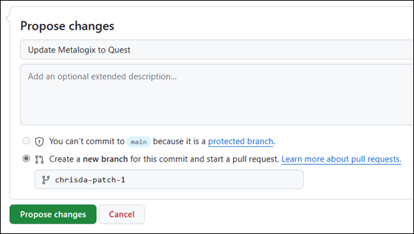
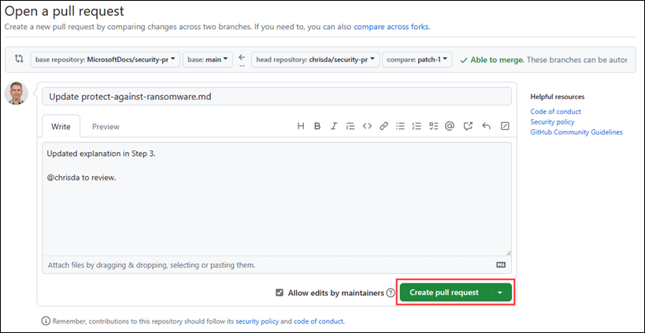

# Create new cmdlet articles

Cmdlet reference articles follow a strict schema that's difficult to duplicate manually. The articles on the web are also used for `Get-Help` from the command line. Instead, you use the open-source [platyPS](https://github.com/PowerShell/platyPS) tool to export the cmdlet and all of its properties to a markdown (.md) file from the required PowerShell module or your PowerShell connection to the server or service.

> [!NOTE]
>
> - In August 2025, the new version of platyPS was released, which changed the cmdlet and parameter metadata requirements of cmdlet reference articles, and also dropped support for single-sourcing cmdlet reference articles (no more **Merge-MarkdownHelp** cmdlet or an equivalent).
> - If you have an older 14.x version of platyPS installed (check by running `Get-InstalledModule`), uninstall it by running the following command in an elevated PowerShell window: `Uninstall-Module -Name platyPS -AllVersions -Force`.
>   - platyPS version 14.x still works, but the markdown files it creates require more manual updates to the cmdlet and parameter metadata. In Exchange and Security & Compliance PowerShell, platyPS 14.x better supports single-sourcing cmdlet reference articles (the **Merge-MarkdownHelp** cmdlet is still available).
>   - To install platyPS v14.2 on older versions of Windows, see the [Install platyPS on older versions of Windows](#install-platyps-on-older-versions-of-windows) section at the end of this article.
>   - To install platyPS v14.2 on really old versions of Windows, see the [Install platyPS on really old versions of Windows](#install-platyps-on-older-versions-of-windows) section at the end of this article.

## Step 1: Install platyPS on current versions of Windows

1. In PowerShell 5.1, do the following steps in an elevated Windows PowerShell window (a Windows PowerShell window you open by selecting **Run as administrator**). If you're using PowerShell 7, you can skip this step.

   Run the command `Get-InstalledModule` to verify you have the following modules installed:

   - `Microsoft.PowerShell.PSResourceGet`
   - `PowerShellGet` v2.2.5 or later (required for `Microsoft.PowerShell.PSResourceGet`).

   If necessary, run the following commands to install `Microsoft.PowerShell.PSResourceGet`:

     ```powershell
     Update-Module -Name PowerShellGet

     Install-Module -Name Microsoft.PowerShell.PSResourceGet
     ```

2. To install the platyPS module, run the following command:

   ```powershell
   Install-PSResource -Name Microsoft.PowerShell.PlatyPS
   ```

   > [!TIP]
   > To prevent the prompt about the PowerShell Gallery not being trusted, run the following command:
   >
   > ```powershell
   > Set-PSRepository -Name PSGallery -InstallationPolicy Trusted
   > ```

## Step 2: Connect to the PowerShell environment that has the cmdlet

You probably know how to connect, but the available workloads and connection methods are:

- Microsoft Teams: [Install Microsoft Teams PowerShell](https://learn.microsoft.com/MicrosoftTeams/teams-powershell-install)

  > [!TIP]
  > Use `Upgrade-Module` and also `Uninstall-Module` depending on the module version you installed.

- Exchange:
  - Exchange Online PowerShell: [Connect to Exchange Online PowerShell](https://learn.microsoft.com/powershell/exchange/connect-to-exchange-online-powershell)
  - Security & Compliance PowerShell: [Connect to Security & Compliance PowerShell](https://learn.microsoft.com/powershell/exchange/connect-to-scc-powershell)
  - PowerShell for [the Built-in security add-on for on-premises mailboxes](/exchange/standalone-eop/standalone-eop): [Connect to Exchange Online PowerShell](https://learn.microsoft.com/powershell/exchange/connect-to-exchange-online-powershell)
  - Exchange Server PowerShell: [Connect to Exchange servers using remote PowerShell](https://learn.microsoft.com/powershell/exchange/connect-to-exchange-servers-using-remote-powershell)

> [!TIP]
> You might need to connect to the service in an elevated Windows PowerShell prompt (not required by Teams and Exchange environments). The corresponding connection instructions article should plainly state this and other connection requirements.
>
> In Exchange and Security & Compliance PowerShell environments, role-based access control (RBAC) controls the available cmdlets. Most cmdlets and parameters are available to administrators by default, but some aren't (for example, the "Mailbox Search" and "Mailbox Import Export" roles).
>
> Remote PowerShell connections are deprecated in Exchange Online PowerShell and Security & Compliance PowerShell in favor of REST API connections. For more information, see the following articles:
>
> - [REST API connections in the EXO V3 module](https://learn.microsoft.com/powershell/exchange/exchange-online-powershell-v2#rest-api-connections-in-the-exo-v3-module).
> - [Deprecation of Remote PowerShell in Exchange Online](https://techcommunity.microsoft.com/t5/exchange-team-blog/deprecation-of-remote-powershell-in-exchange-online-re-enabling/ba-p/3779692).
> - [Deprecation of Remote PowerShell (RPS) Protocol in Security & Compliance PowerShell](https://techcommunity.microsoft.com/t5/exchange-team-blog/deprecation-of-remote-powershell-rps-protocol-in-security-and/ba-p/3815432).
>
> REST API connections in the Exchange Online PowerShell V3 module incorrectly identify many parameter **Type** values as `Object` or `Object[]`. The true parameter type values are visible in product code.

## Step 3: Load platyPS in the PowerShell environment

After you connect in PowerShell to the server or service (either in a regular Windows PowerShell window or from a specific PowerShell console shortcut), you likely don't need to do anything to make the platyPS cmdlets available to you in your session. However, if you have issues, run the following command to manually load the Microsoft.PowerShell.PlatyPS module:

```powershell
Import-Module Microsoft.PowerShell.PlatyPS
```

### Step 4: Find your module name

> [!TIP]
> This step is required only if you're interested in creating cmdlet reference articles for **all** available cmdlets in the product (using the _ModuleInfo_ parameter in **New-MarkdownCommandHelp**). If you're going to manually specify the cmdlet names (using the _CommandInfo_ parameter in **New-MarkdownCommandHelp**), you can skip this step.

platyPS needs the name of the loaded PowerShell module or snap-in that contains the cmdlets you want to update. To find the module name, run the following command:

```powershell
Get-Module | Format-Table -Auto
```

The command returns all of the currently loaded modules or snap-ins as shown in the following example output:

```powershell
ModuleType Version    Name                                ExportedCommands
---------- -------    ----                                ----------------
Manifest   3.1.0.0    Microsoft.PowerShell.Management     {Add-Computer, Add-Content, Checkpoint-Computer, Clear-Con...}
Manifest   3.0.0.0    Microsoft.PowerShell.Security       {ConvertFrom-SecureString, ConvertTo-SecureString, Get-Acl...}
Manifest   3.1.0.0    Microsoft.PowerShell.Utility        {Add-Member, Add-Type, Clear-Variable, Compare-Object...}
Binary     1.0.0.1    PackageManagement                   {Find-Package, Find-PackageProvider, Get-Package, Get-Pack...}
Script     2.2.5      PowerShellGet                       {Find-Command, Find-DscResource, Find-Module, Find-RoleCap...}
Script     2.0.0      PSReadline                          {Get-PSReadlineKeyHandler, Get-PSReadlineOption, Remove-PS...}
Script     1.0        tmp_byivwzpq.e1k                    {Add-AvailabilityAddressSpace, Add-DistributionGroupMember...}
```

Or the following example output:

```powershell
ModuleType Version     Name                                   ExportedCommands
---------- -------     ----                                   ----------------
Manifest   3.1.0.0    Microsoft.PowerShell.Management     {Add-Computer, Add-Content, Checkpoint-Computer, Clear-Content...}
Manifest   3.1.0.0    Microsoft.PowerShell.Utility        {Add-Member, Add-Type, Clear-Variable, Compare-Object...}
Script     4.2.0      MicrosoftTeams                      {Add-TeamChannelUser, Add-TeamUser, Connect-MicrosoftTeams, Disconnect-Microso...}
Script     1.4.7      PackageManagement                   {Find-Package, Find-PackageProvider, Get-Package, Get-PackageProvider...}
Script     2.2.5      PowerShellGet                       {Find-Command, Find-DscResource, Find-Module, Find-RoleCapability...}
Script     2.0.0      PSReadline                          {Get-PSReadLineKeyHandler, Get-PSReadLineOption, Remove-PSReadLineKeyHandler, ...}
```

For services that use remote connections (Exchange), the module name is a temporary value that changes every time you connect. In the example output, the module name for the Exchange Online PowerShell session is `tmp_byivwzpq.e1k`.

For Microsoft Teams, the module name is always `MicrosoftTeams`.

Either way, take note of your module name. You'll need it in the next steps.

### Step 5: Run platyPS to generate article files

You have two choices:

- **Dump _all_ cmdlets in the module/snap-in to files**: This method is simple but could take a while, and you end up with dozens or possibly hundreds of cmdlet files you don't need. The basic syntax is:

  ```powershell
  New-MarkdownCommandHelp -ModuleInfo (Get-Module -Name <ModuleName>) -OutputFolder "<Path>"
  ```

- **Dump specific cmdlets to files**: This method is a bit harder to set up, but the output is quicker, and no extra article files are created. The basic syntax is:
  
  ```powershell
  New-MarkdownCommandHelp -CommandInfo (Get-Command <Cmdlet>) -OutputFolder "<Path>"
  ```

  or

  ```powershell
  $x = Get-Command "<Cmdlet1>","<Cmdlet2>",..."<CmdletN>"

  New-MarkdownCommandHelp -Command $x -OutputFolder "<Path>"
  ```

**Notes**:

- \<ModuleName\> is the value you found in [Step 4](#step-4-find-your-module-name) (for example, `tmp_byivwzpq.e1k` or `MicrosoftTeams`).
- If the \<Path\> location doesn't exist, the folder structure is created for you.
- Regardless of the method you use, the \<ModuleName\> value is automatically appended to the _OutputFolder_ value you specify.

#### Dump all cmdlets in the module/snap-in to files

This example creates article files for all available cmdlets in the Microsoft Teams module `MicrosoftTeams` in the folder C:\My Docs\Teams.

```powershell
New-MarkdownCommandHelp -ModuleInfo (Get-Module -Name MicrosoftTeams) -OutputFolder "C:\My Docs\Teams"
```

#### Dump specific cmdlets to files

- This example creates an article file for the cmdlet named **Get-CoolFeature** in the Exchange Online PowerShell session in the folder "C:\My Docs\ExO".

  ```powershell
  New-MarkdownCommandHelp -CommandInfo (Get-Command "Get-CoolFeature") -OutputFolder "C:\My Docs\ExO"
  ```

- This example creates article files for the **Get-CoolFeature**, **New-CoolFeature**, **Remove-CoolFeature**, and **Set-CoolFeature** cmdlets from the Exchange Online session in the folder C:\My Docs\ExO.

  The first command stores the cmdlet names in a variable. The second command uses that variable to identify the cmdlets and write the output files.

  ```powershell
  $NewCmdlets = Get-Command "Get-CoolFeature","New-CoolFeature","Remove-CoolFeature","Set-CoolFeature"

  New-MarkdownCommandHelp -CommandInfo $NewCmdlets -OutputFolder "C:\My Docs\ExO"
  ```

### Step 6: Document the new cmdlet

Now that you have article files for the new cmdlets, you can actually document them. The articles are plain text UTF-8 files that are formatted using [markdown](https://guides.github.com/features/mastering-markdown/). Writers use [Visual Studio Code](https://code.visualstudio.com/) to edit article files, but you can use Notepad or your favorite text editor.

These basic article elements require your attention, regardless of the product or service:

- **The SYNOPSIS section**: Be brief. Use the DESCRIPTION section for less critical information.
- **The DESCRIPTION section**: More details (for example, permissions required to run the cmdlet)
- **One or more code examples in the EXAMPLES section**: The code block goes first (only one code block per example), then the description text.
- **A description for every parameter in each parameter section**
- **Cmdlet and parameter metadata**

We highly encourage you to plagiarize existing content and formatting from other cmdlet articles in the product or service. Many parameters are common across a wide variety of cmdlets.

#### Cmdlet metadata

platyPS automatically populates the metadata of every cmdlet reference article it creates. Some properties are required, some aren't, and some are missing that you need to add manually. Also, depending on whether the cmdlet is new or previously documented, the property values might be populated, blank, correct, or incorrect.

The following example shows the cmdlet metadata from the default output of a **New-MarkdownCommandHelp** command for a new, undocumented cmdlet:

```yaml
---
document type: cmdlet
external help file: tmpEXO_xaympem4.exn-Help.xml
HelpUri: ''
Locale: en-US
Module Name: tmpEXO_xaympem4.exn
ms.date: 09/18/2025
PlatyPS schema version: 2024-05-01
title: Get-PrivacyManagementComplianceCaseMember
---
```

The following example shows what the cmdlet metadata should look like for publication in <https://learn.microsoft.com/en-us/powershell/module/exchangepowershell/> (other products might use or require different values):

```yaml
---
applicable: Security & Compliance
author: chrisda
external help file: Microsoft.Exchange.RecordsandEdge-Help.xml
Locale: en-US
Module Name: ExchangePowerShell
ms.author: chrisda
online version: https://learn.microsoft.com/powershell/module/exchangepowershell/get-privacymanagementcompliancecasemember
schema: 2.0.0
title: Get-PrivacyManagementComplianceCaseMember
---
```

The properties and values are explained in the following list:

- **applicable (Exchange/Skype/Teams only)**: Notice the property name starts with a lowercase 'a.' You need to manually add this property and value. See other cmdlet reference articles for available values. Don't guess or invent new values. The value must come from the list of predefined values.

- **author**: The GitHub alias of the person who owns the article. You need to manually add this property and value. The value could be a writer, program manager, or developer.

- **external help file**: Defines which MAML XML file the cmdlet help article goes in for `Get-Help` at the command line. If the cmdlet is baked directly into the module, the automatically populated value is likely correct. If the cmdlet is from a remote session (Exchange/Skype/Teams), you need to manually add this value.

  The value is specified somewhere in product code. Some products (Skype) use only one XML file that's well-known and the same for all cmdlets. Other products (Exchange) use multiple XML files. See other articles for available values. Don't guess. An incorrect value affects the availability of the help article at the command line.

- **Locale**: The value is `en-US` and is automatically populated.

- **Module Name**: This value must match the folder name where the cmdlet reference articles live in GitHub and learn.microsoft.com. If that value happens to match the module name, the original value is correct. Otherwise, you need to manually add this value. Don't guess or invent new values. An incorrect/unavailable value causes build error when you try to check in the new article on GitHub.

- **online version**: The live URL of the article when published. This URL value is used by `Get-Help <Cmdlet> -Online`. For new cmdlet articles, this value is blank. You can refer to other published articles to get the correct URL path. The cmdlet name is unique to this article.

- **ms.author**: The Microsoft alias of the author.

- **schema**: This value is always 2.0.0 in all products.

- **title**: This value is the name of the cmdlet and is automatically populated.

#### Parameter metadata

platyPS automatically populates the metadata for every parameter. Here's an example of the parameter metadata that's present in every parameter section:

```yaml
---
Type: String
Parameter Sets: (All)
Aliases:

Required: False
Position: 1
Default value: None
Accept pipeline input: False
Accept wildcard characters: False
---
```

Most autogenerated property values are correct, but the following properties require manual intervention:

- **Type**: In any environment, the values `Object` or `Object[]` are wrong. As previously described, REST API connections in the Exchange Online PowerShell V3 module incorrectly identify many parameter **Type** values as `Object` or `Object[]`. Other values like `String`, `Boolean`, and `DateTime` are detected correctly. The true parameter type values are visible in product code.

- **Default value** and **Accept wildcard characters**: These properties are present, but platyPS or any other PowerShell utility is unable to truthfully populate the values (the values are always None and False, respectively). You can correct the values if you think it's important.

- As of August 2025, parameter metadata no longer supports the **Applicable** property (notice the uppercase 'A'). For Exchange/Skype/Teams cmdlets, you now add the **Applicable** property and value in the description text of the parameter. for example:

  ```text
  ...

  ### -Identity

  > Applicable: Security & Compliance

  ...
  ```

  See other articles for available values (select from the same available values as the **applicable** attribute in the cmdlet metadata). Don't guess or invent new values. The value must come from the list of predefined values.

### Step 8: Add the new cmdlet article files to the repository

When you're done editing the articles, upload them to GitHub. You need to fork the repo, upload your files to your fork, and then submit a Pull Request.

1. Go to the correct location in the appropriate GitHub repository:

   - Exchange: <https://github.com/MicrosoftDocs/office-docs-powershell/blob/main/exchange/exchange-ps/ExchangePowerShell/>
   - Office Web Apps: <https://github.com/MicrosoftDocs/office-docs-powershell/blob/main/officewebapps/officewebapps-ps/officewebapps/>
   - Skype: <https://github.com/MicrosoftDocs/office-docs-powershell/blob/main/skype/skype-ps/SkypeForBusiness/>
   - Teams: <https://github.com/MicrosoftDocs/office-docs-powershell/tree/master/teams/teams-ps/teams>
   - Whiteboard: <https://github.com/MicrosoftDocs/office-docs-powershell/blob/main/teams/teams-ps/MicrosoftTeams/>

2. Select **Add file** \> **Upload files**

   

3. After you're done adding files, go to the **Propose changes** section at the bottom of the page:

   - A brief title is required. By default, the title is the name of the file, but you can change it.
   - Optionally, you can enter more details in the **Add an optional extended description** box. @ include the GitHub alias of someone who can review and approve your upload.

   When you're ready, select the green **Propose changes** button.

   

4. On the **Open a pull request** page that appears, select the green **Create pull request** button.

   

5. That's it. There's nothing more for you to do.

### Step 9: Add the new cmdlets to the TOC file

Add the cmdlet to Table of Contents (TOC) file in the GitHub repo. TOC file is the name of the module. For example:

- Exchange <https://github.com/MicrosoftDocs/office-docs-powershell/blob/main/exchange/exchange-ps/ExchangePowerShell/ExchangePowerShell.md>

  > [!TIP]
  > Exchange also uses pseudo folders to organize cmdlets. You need to add any new cmdlets in the proper location in the file: <https://github.com/MicrosoftDocs/office-docs-powershell/blob/main/exchange/mapping/serviceMapping.json>.

- Office Web Apps: <https://github.com/MicrosoftDocs/office-docs-powershell/blob/main/officewebapps/officewebapps-ps/officewebapps/officewebapps.md>

- Skype: <https://github.com/MicrosoftDocs/office-docs-powershell/blob/main/skype/skype-ps/SkypeForBusiness/SkypeForBusiness.md>

- SharePoint Migration Tool: <https://github.com/MicrosoftDocs/office-docs-powershell/blob/main/spmt/spmt-ps/Microsoft.SharePoint.MigrationTool.PowerShell/Microsoft.SharePoint.MigrationTool.PowerShell.md>

- Teams: <https://github.com/MicrosoftDocs/office-docs-powershell/blob/main/teams/teams-ps/MicrosoftTeams/MicrosoftTeams.md>

- Whiteboard: <https://github.com/MicrosoftDocs/office-docs-powershell/blob/main/whiteboard/whiteboard-ps/WhiteboardAdmin/WhiteboardAdmin.md>

In the TOC file, you can fill in a description or remove the template text line. However, if you leave the template text line make sure it's in _exactly_ the right format so it doesn't render as template text.

The steps to edit and publish the TOC file are identical to modifying an existing article. The instructions are in the [README.md file](https://github.com/MicrosoftDocs/office-docs-powershell/blob/main/README.md) (you're starting at Step 4).

## Appendix

### Reference

- <https://learn.microsoft.com/powershell/module/powershellget/install-module>
- <https://learn.microsoft.com/powershell/module/powershellget/update-module>
- <https://github.com/PowerShell/platyPS>
- <https://learn.microsoft.com/powershell/module/microsoft.powershell.core/get-module>

### Install platyPS on older versions of Windows

> [!NOTE]
> The procedures in this section aren't required in versions of Windows where the WMF 5.1 is included:
>
> - Windows 11
> - Windows 10 Anniversary Update (version 1607 from August 2016) or later
> - Windows Server 2022
> - Windows Server 2019
> - Windows Server 2016

The following older versions of Windows don't automatically include Windows PowerShell 5.1, but they support it. You need to download and install the Windows Management Framework (WMF) 5.1 from <https://www.microsoft.com/download/details.aspx?id=54616&msockid=201bd58f88af6e452dc3c18c89156f04> on these versions of Windows:

- Windows 8.1
- Windows Server 2012 or Windows Server 2012 R2
- Windows 7 Service Pack 1 (SP1)¹ ²
- Windows Server 2008 R2 SP1¹ ²

- ¹ Windows PowerShell 5.1 on this version of Windows requires the .NET Framework 4.5 or later.
- ² You can't use this version of Windows to connect to Exchange Online PowerShell or Security & Compliance PowerShell. Although you can install version 2.0.3 of the ExchangeOnlineManagement module, this version of the module lacks support for REST API connections.

Now you can install platyPS v14.2 on the target computer by running the following command:

```powershell
Install-Module -Name platyPS -Scope CurrentUser
```

### Install platyPS on really old versions of Windows (WMF 3.0 or 4.0)

> [!NOTE]
> The procedures in this section aren't required for the previously described versions of Windows where the WMF 5.1 is included or installable.

To install platyPS 14.x for use with products that require PowerShell 3.0 or 4.0 and don't initially have access to the **Install-Module** cmdlet, do the steps in this section.

1. Download and install PowerShellGet. The steps are described in [Installing PowerShellGet](https://learn.microsoft.com/powershell/scripting/gallery/installing-psget) and are summarized here as follows:

   a. **PowerShell 3.0 only**: On the target computer, run the following command in an elevated Windows PowerShell window:

      ```powershell
      [Environment]::SetEnvironmentVariable(
        'PSModulePath',
        ((([Environment]::GetEnvironmentVariable('PSModulePath', 'Machine') -split ';') + "$env:ProgramFiles\WindowsPowerShell\Modules") -join ';'), 'Machine'
      )
      ```

   b. On another computer running PowerShell 5.1 or later where PowerShellGet is installed and working, run the following command from an elevated Windows PowerShell window:

      ```powershell
      Save-Module PowerShellGet -Path "<ExistingPath>"
      ```

      Where \<ExistingPath\> is **an existing** folder/path that's easy to find (for example, `C:\Temp\PSG`).

   c. The command creates two new folders in the target path:

      - `PackageManagement\<VersionFolder>\<FilesAndFolders>`
      - `PowerShellGet\<VersionFolder>\<FilesAndFolders>`

   d. Move the \<FilesAndFolders\> out from under the \<VersionFolder\> and delete the now empty \<VersionFolder\> so the contents of the folders look like this:

      - `PackageManagement\<FilesAndFolders>`
      - `PowerShellGet\<FilesAndFolders>`

2. On the target computer, delete the following folders or move them to a backup location:

   - `C:\Program Files\WindowsPowerShell\Modules\PackageManagement`
   - `C:\Program Files\WindowsPowerShell\Modules\PowerShellGet`

3. Copy the `PackageManagement` and `PowerShellGet` folders that you downloaded and fixed in Step 1 to `C:\Program Files\WindowsPowerShell\Modules` on the target computer.

   You should have the following folders on the target computer:

   - `C:\Program Files\WindowsPowerShell\Modules\PackageManagement`
   - `C:\Program Files\WindowsPowerShell\Modules\PowerShellGet`

4. From an elevated Windows PowerShell window on the target computer, run the following command:

   ```powershell
   Set-PSRepository -Name PSGallery -InstallationPolicy Trusted
   ```

5. Now you can install platyPS v14.2 on the target computer by running the following command:

   ```powershell
   Install-Module -Name platyPS -Scope CurrentUser
   ```
